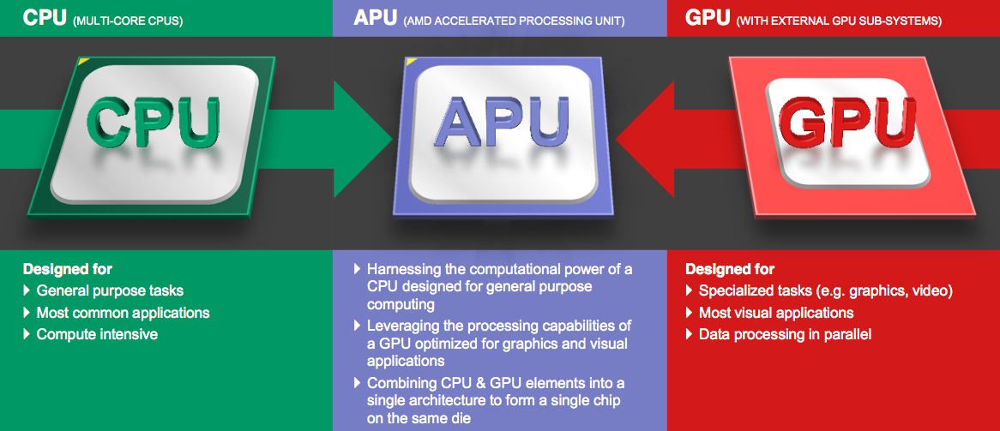
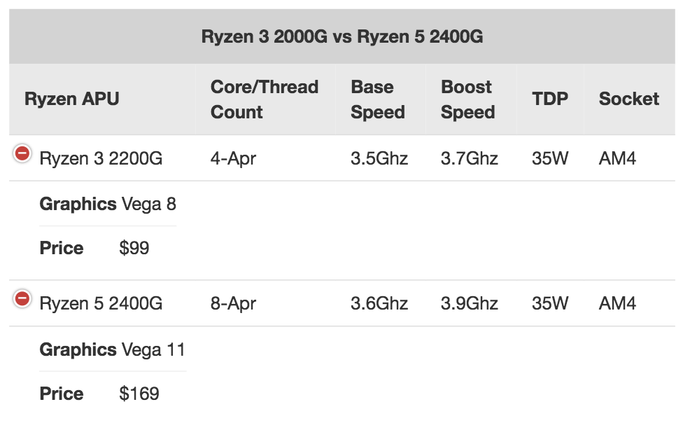

# APU

The AMD **Accelerated Processing Unit** (APU), formerly known as Fusion, is the marketing term for a series of 64-bit microprocessors from **Advanced Micro Devices (AMD)**, designed to act as a central processing unit (CPU) and graphics processing unit (GPU) on a single die.

# vs. Intel's Integrated Graphics

Integrated graphics are most commonly found on Intel processors, and work much the same way that the AMD APU does. The biggest difference being that Intel’s integrated graphics are much weaker than AMD’s APUs.

# Line-up

There are two models in the current Ryzen APU lineup, although more will be released as the line continues to grow and expand. Your two options are the Ryzen 3 2200G with Vega 8 graphics, and the Ryzen 5 2400G with Vega 11 graphics.

The release date of Ryzen 5 2400G is February 12, 2018.

# Caveats

When considering an APU, it’s worth noting that they do not come with dedicated memory for graphics. You can dedicate up to 2GB of system memory to make up for this, so upgrading to more than 8GB of RAM is recommended.

# Reference

[AMD Accelerated Processing Unit - Wikipedia](https://en.wikipedia.org/wiki/AMD_Accelerated_Processing_Unit)

[APU vs CPU vs GPU. Which One is Best for Gaming?](https://www.wepc.com/tips/apu-vs-cpu-gpu/)