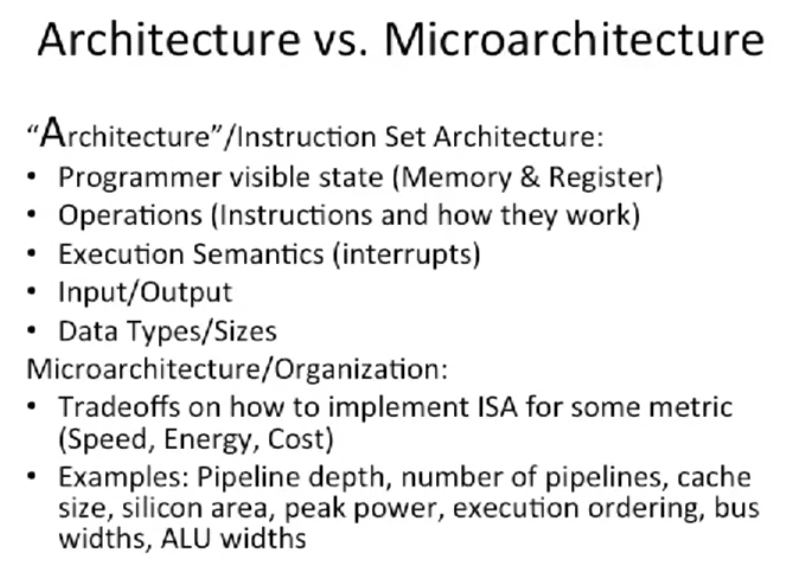
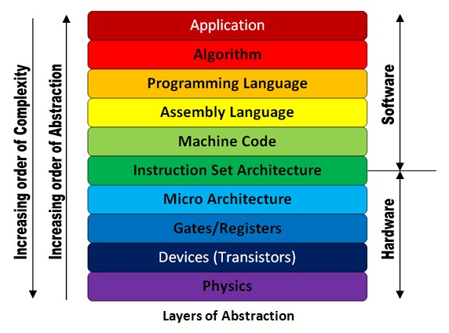

# Architecture vs. Microarchitecture

The term **architecture** is used here to describe the attributes of a system as seen by the programmer, i.e., the conceptual structure and functional behavior. For a CPU, this is also known as **Instruction set architectures (ISA)**. The **microarchitecture** refers to details about implementation of the CPU/processor. The architecture is an abstraction layer above the microarchitecture.

# ***A***rchitecture (ISA, Instruction Set Architecture)

Today we would use the term instruction set architecture to describe the syntax and semantics of the interface of a computer, including the type and size of the operands, programmer visible register state, the memory model, how interrupts and exceptions are handled, the available instructions and the meaning of each instruction. The instruction set architecture is the boundary between software and hardware, and is the contract between the programmer and the hardware designer.

## Examples

The most popular ISA existing now are

1. ARM architecture implemented in all of ARM CPU cores,
2. Intel X86 architecture implemented in Intel and AMD CPUs
3. Power architecture implemented in IBM Power series of processors
4. MIPS, Sparc which are becoming lesser popular
5. RISC-V which is an open source ISA that is seeing growing popularity.

# microarchitecture (Organization)

The term microarchitecture is used to refer to the organization, or highest level of implementation, of a particular processor. The study of microarchitecture would include topics like pipelining, instruction-level parallelism, out-of-order execution, speculative execution, branch prediction and caching.

# The Abstraction Hierarchy

# Reference

Architecture and Microarchitecture - Computer Architecture from Coursera

[Microarchitecture and Instruction Set Architecture - GeeksforGeeks](https://www.geeksforgeeks.org/microarchitecture-and-instruction-set-architecture/)

[What is difference between architecture and microarchitecture?](https://cs.stackexchange.com/questions/29460/what-is-difference-between-architecture-and-microarchitecture)

[What is the difference between architecture and microarchitecture in CPU?](https://www.quora.com/What-is-the-difference-between-architecture-and-microarchitecture-in-CPU)

[What is the role of ISA (Instruction Set Architecture) in the comp arch abstraction stack.](https://electronics.stackexchange.com/questions/353915/what-is-the-role-of-isa-instruction-set-architecture-in-the-comp-arch-abstract?rq=1)