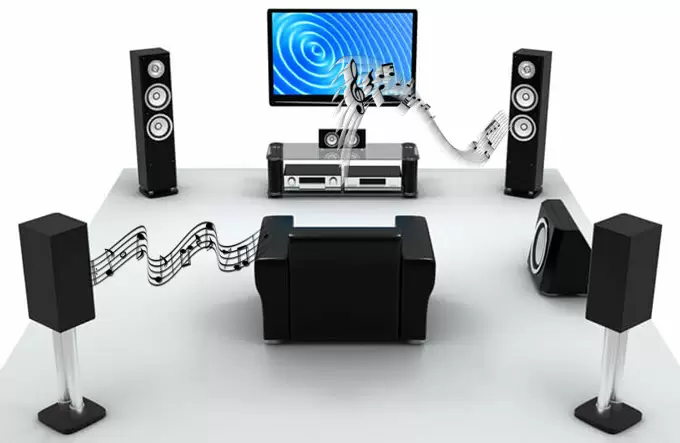
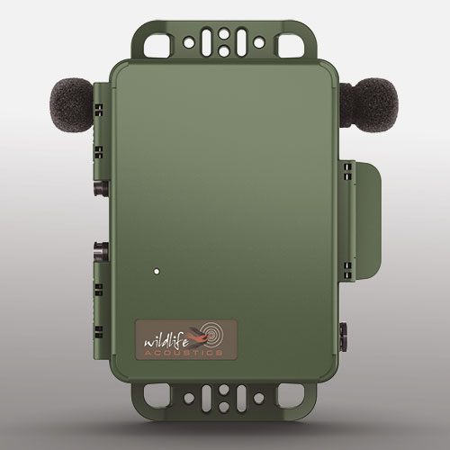

# Audio channel

Physically speaking, a Channel is the passage way a signal or data is transported. In case of audio files, it’s the passage or communication channel in which a sound signal is transported from the player source to the speaker.

A single microphone can produce one channel of audio, and a single speaker can accept one channel of audio, for example. An audio file can contain one, two or even more Channels. Especially in the case of surround sound, more audio Channels are needed to create the feeling of sound being – as the name suggests – all around the listener.

Music that is mixed for headphone listening is saved as a file with two channels - one sent to the left ear, one sent to the right, while surround-sound movie audio is often mixed for 6 channels. These channels are often marked as channel 0, or the left channel, and channel 1, or right.

The value found with the Channels information of a files metadata indicates the actual amount or number of Channels in the audio file. One Channel is usually referred to as mono, while more Channels could either indicate stereo, surround sound and the like.

A recorder which has two microphones

# References

[What Are Audio Channels?](https://www.get-metadata.com/file-info/channels)

[Wildlife Acoustics - What is an audio channel?](https://www.wildlifeacoustics.com/support/technical-faq/136-song-meter-sm4/826-what-is-an-audio-channel)

[Overview](https://www.wildlifeacoustics.com/products/song-meter-sm4/overview)