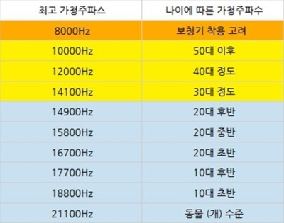

# Audio frequency

An **audio frequency** (abbreviation: **AF**) or **audible frequency (가청주파수)** is a periodic vibration whose frequency is in the band audible to the average human. It is the property of sound that most determines pitch.

The generally accepted standard range of audible frequencies for humans is 20 to 20,000 Hz, although the range of frequencies individuals hear is greatly influenced by environmental factors. In air at atmospheric pressure, these represent sound waves with wavelengths of 17 meters to 1.7 centimetres. Frequencies below 20 Hz are generally felt rather than heard, assuming the amplitude of the vibration is great enough. High frequencies are the first to be affected by hearing loss due to age or prolonged exposure to very loud noises.

# Human

사람은 가청주파수에서 가장 잘들리는 주파수는 3,000 ~ 4000 Hz정도로, 같은 진폭에서 제일 크게 들립니다!

## Try it out!

[Ultrasonic Ringtones](http://www.ultrasonic-ringtones.com/)

> 8kHz - 당신은 헤드셋을 끼고 높은 볼륨의 음악을 들으며 늙었거나 청각을 엉망으로 만들었습니다.
10kHz - 당신의 귀는 젊은이들이 경험하고 있는 소리들 중 대부분을 들을 수 없습니다.
12kHz - 당신의 귀는 중년의 위기에 처해 있습니다.
14.1kHz - 당신이 만약 젊다면, 당신은 귀를 혹사했거나 잘 돌보지 않았습니다.
14.9kHz - 당신은 전형적인 삼십대의 귀를 갖고 있습니다. 적당히 행복하게 살 수 있는 수준으로 들립니다.
15.8kHz - 당신은 이십대의 귀를 갖고 있으며, 합리적으로 잘 들을 수 있습니다.
16.7kHz - 당신은 약 20살이거나, 귀를 매우 잘 돌보았습니다.
17.7kHz - 당신의 귀는 전형적인 십대입니다. 당신은 당신을 기분 좋게 만드는 많은 것들을 들을 수 있습니다.
18.8kHz - 당신은 매우 예민한 십대이며 굳이 들을 필요 없는 것들도 듣습니다. 주변 사람들을 피곤하게 만듭니다.
19.9kHz - 당신의 귀는 아직 십대도 아닙니다. 모기 장치는 당신을 위해 만들어졌습니다.
21.1kHz - 당신은 개나 모기일 수 있습니다. 확실히 인간은 아닙니다. 너 정체가 뭐야
22.4kHz - 당신은 거짓말쟁이입니다. 전혀 들리지 않는 톤을 들을 수 있다고 주장했습니다

# Animals

가청 주파수의 범위는 여러 동물마다 다르게 나타납니다. 조류는 사람과 비슷하고,양서류와 파충류는 저음에 민감합니다. 그리고 곤충은 고음에 민감하여 사람이 느끼지 못하는 60,000㎐의 초음파도 감지한다고 합니다.

# References

[Audio frequency](https://en.wikipedia.org/wiki/Audio_frequency)

[가청주파수!](http://blog.naver.com/PostView.nhn?blogId=qjqh159&logNo=220659823007)