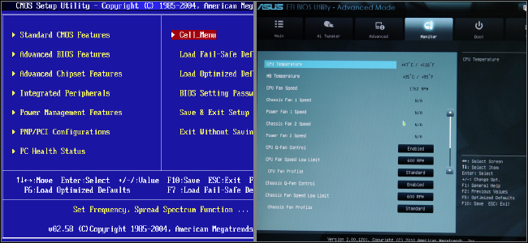
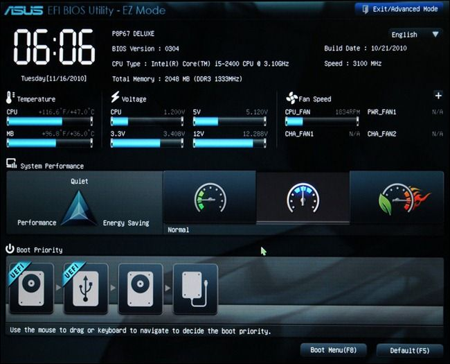
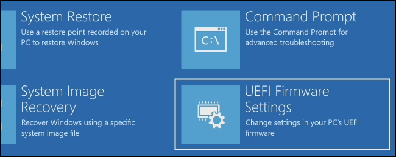

# BIOS and UEFI

Both UEFI and BIOS are low-level software that starts when you boot your PC before booting your operating system, but UEFI is a more modern solution, supporting larger hard drives, faster boot times, more security features, and—conveniently—graphics and mouse cursors.

The BIOS will soon be dead: Intel has announced plans to completely replace it with UEFI on all their chipsets by 2020

# BIOS

BIOS is short for **Basic Input-Output system**. 

It’s low-level software that resides in a chip on your computer’s motherboard. The BIOS loads when your computer starts up, and the BIOS is responsible for waking up your computer’s hardware components, ensures they’re functioning properly, and then runs the bootloader that boots Windows or whatever other operating system you have installed.

You can configure various settings in the BIOS setup screen. Settings like your computer’s hardware configuration, system time, and boot order are located here. When you save a setting, it’s saved to the memory on your motherboard itself. When you boot your computer, the BIOS will configure your PC with the saved settings.

## POST (Power-On Self Test)

The BIOS goes through a POST, or Power-On Self Test, before booting your operating system. It checks to ensure your hardware configuration is valid and working properly. If something is wrong, you’ll see an error message or hear a cryptic series of beep codes.

## MBR (Master Boot Record)

When your computer boots—and after the POST finishes—the BIOS looks for a Master Boot Record, or MBR, stored on the boot device and uses it to launch the bootloader.

## CMOS (Complementary Metal-Oxide-Semiconductor)

You may also see the acronym CMOS, which stands for Complementary Metal-Oxide-Semiconductor. This refers to the battery-backed memory where the BIOS stores various settings on the motherboard. It’s actually not accurate anymore, since this method has been replaced with flash memory (also referred to as EEPROM) in contemporary systems.

## ACPI (Advanced Configuration and Power Interface)

ACPI, the Advanced Configuration and Power Interface, allows the BIOS to more easily configure devices and perform advanced power management functions, like sleep.

## Limitations of BIOS

The traditional BIOS can only boot from drives of 2.1 TB or less. 3 TB drives are now common, and a computer with a BIOS can’t boot from them. That limitation is due to the way the BIOS’s Master Boot Record system works.

The BIOS must run in 16-bit processor mode, and only has 1 MB of space to execute in. It has trouble initializing multiple hardware devices at once, which leads to a slower boot process when initializing all the hardware interfaces and devices on a modern PC.

# UEFI

UEFI stands for Unified Extensible Firmware Interface.

## History

Intel started work on the Extensible Firmware Interface (EFI) specification back in 1998. In 2007, Intel, AMD, Microsoft, and PC manufacturers agreed on a new Unified Extensible Firmware Interface (UEFI) specification. This is an industry-wide standard managed by the Unified Extended Firmware Interface Forum, and isn’t solely driven by Intel. UEFI support was introduced to Windows with Windows Vista Service Pack 1 and Windows 7. The vast majority of computers you can buy today now use UEFI rather than a traditional BIOS.

## GPT partitioning scheme

The UEFI firmware can boot from drives of 2.2 TB or larger—in fact, the theoretical limit is 9.4 zettabytes. That’s roughly three times the estimated size of all the data on the Internet. That’s because UEFI uses [the GPT partitioning scheme instead of MBR](https://www.howtogeek.com/193669/whats-the-difference-between-gpt-and-mbr-when-partitioning-a-drive/). It also boots in a more standardized way, launching EFI executables rather than running code from a drive’s master boot record.

## Other features

UEFI can run in 32-bit or 64-bit mode and has more addressable address space than BIOS, which means your boot process is faster. It also means that UEFI setup screens can be slicker than BIOS settings screens, including graphics and mouse cursor support.

UEFI is packed with other features. It supports [Secure Boot](https://www.howtogeek.com/116569/htg-explains-how-windows-8s-secure-boot-feature-works-what-it-means-for-linux/), which means the operating system can be checked for validity to ensure no malware has tampered with the boot process. It can support networking features right in the UEFI firmware itself, which can aid in remote troubleshooting and configuration. With a traditional BIOS, you have to be sitting in front of a physical computer to configure it.

It’s not just a BIOS replacement, either. UEFI is essentially a tiny operating system that runs on top of the PC’s firmware, and it can do a lot more than a BIOS. It may be stored in flash memory on the motherboard, or it may be loaded from a hard drive or network share at boot.

## Access from OS

If you need to access low-level settings, there may be a slight difference. You may need to access the UEFI settings screen through the Windows boot options menu rather than pressing a key while your computer starts. With PCs now booting so quickly, PC manufacturers don’t want to slow down the boot process by waiting to see if you press a key. However, we’ve also seen PCs with UEFI that allow you to access the BIOS in the same way, by pressing a key during the boot-up process.

# References

[What Is UEFI, and How Is It Different from BIOS?](https://www.howtogeek.com/56958/htg-explains-how-uefi-will-replace-the-bios/)