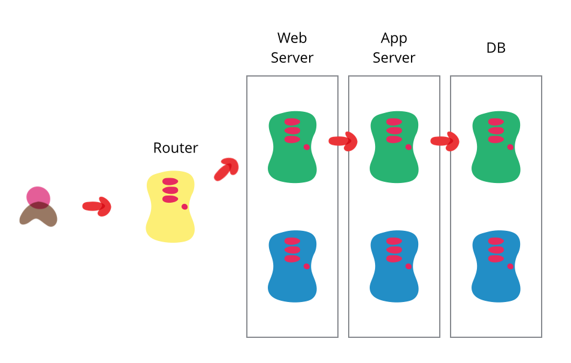

# Blue-green deployment

Blue-green deployment is a technique that reduces downtime and risk by running two identical production environments called Blue and Green.

At any time, only one of the environments is live, with the live environment serving all production traffic. For this example, Green is currently live and Blue is idle.

As you prepare a new version of your software, deployment and the final stage of testing takes place in the environment that is *not* live: in this example, Blue. Once you have deployed and fully tested the software in Blue, you switch the router so all incoming requests now go to Blue instead of Green. Blue is now live, and Green is idle.

This technique can eliminate downtime due to app deployment. In addition, blue-green deployment reduces risk: if something unexpected happens with your new version on Blue, you can immediately roll back to the last version by switching back to Green.

# Challenges

Databases can often be a challenge with this technique, particularly when you need to change the schema to support a new version of the software. The trick is to separate the deployment of schema changes from application upgrades. So first apply a database refactoring to change the schema to support both the new and old version of the application, deploy that, check everything is working fine so you have a rollback point, then deploy the new version of the application. (And when the upgrade has bedded down remove the database support for the old version.)

# Reference

[Using Blue-Green Deployment to Reduce Downtime and Risk | Cloud Foundry Docs](https://docs.cloudfoundry.org/devguide/deploy-apps/blue-green.html)

[bliki: BlueGreenDeployment](https://martinfowler.com/bliki/BlueGreenDeployment.html)