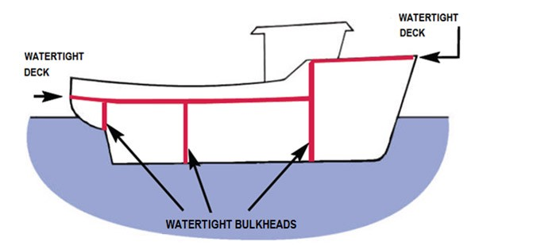
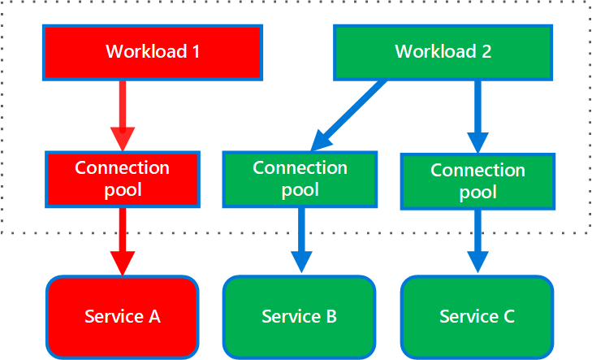
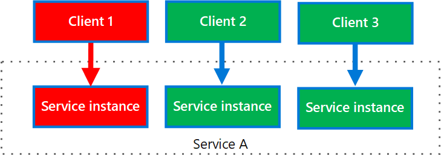

# Bulkhead

Isolate elements of an application into pools so that if one fails, the others will continue to function.

This pattern is named Bulkhead because it resembles the sectioned partitions of a ship's hull. If the hull of a ship is compromised, only the damaged section fills with water, which prevents the ship from sinking.

Ship Hull Bulkheads

# Context

## Failure affecting services

A consumer may send requests to multiple services simultaneously, using resources for each request. When the consumer sends a request to a service that is misconfigured or not responding, the resources used by the client's request may not be freed in a timely manner. As requests to the service continue, those resources may be exhausted. For example, the client's connection pool may be exhausted. At that point, requests by the consumer to other services are affected. Eventually the consumer can no longer send requests to other services, not just the original unresponsive service.

## Failure affecting clients

The same issue of resource exhaustion affects services with multiple consumers. A large number of requests originating from one client may exhaust available resources in the service. Other consumers are no longer able to consume the service, causing a cascading failure effect.

# Solution

Partition service instances into different groups, based on consumer load and availability requirements.

A consumer can also partition resources, to ensure that resources used to call one service don't affect the resources used to call another service. For example, a consumer that calls multiple services may be assigned a connection pool for each service. If a service begins to fail, it only affects the connection pool assigned for that service, allowing the consumer to continue using the other services.

## Multiple services

The following diagram shows bulkheads structured around connection pools that call individual services. If Service A fails or causes some other issue, the connection pool is isolated, so only workloads using the thread pool assigned to Service A are affected. Workloads that use Service B and C are not affected and can continue working without interruption.

## Multiple clients

The next diagram shows multiple clients calling a single service. Each client is assigned a separate service instance. Client 1 has made too many requests and overwhelmed its instance. Because each service instance is isolated from the others, the other clients can continue making calls.

# When to use this pattern

Use this pattern to:

- Isolate resources used to consume a set of backend services, especially if the application can provide some level of functionality even when one of the services is not responding.
- Isolate critical consumers from standard consumers.
- Protect the application from cascading failures.

This pattern may not be suitable when:

- Less efficient use of resources may not be acceptable in the project.
- The added complexity is not necessary

# Example

The following Kubernetes configuration file creates an isolated container to run a single service, with its own CPU and memory resources and limits.

    apiVersion: v1
    kind: Pod
    metadata:
      name: drone-management
    spec:
      containers:
      - name: drone-management-container
        image: drone-service
        resources:
          requests:
            memory: "64Mi"
            cpu: "250m"
          limits:
            memory: "128Mi"
            cpu: "1"

# Reference

[Bulkhead pattern - Cloud Design Patterns](https://docs.microsoft.com/en-us/azure/architecture/patterns/bulkhead)

[SRE: Resiliency: Bulkheads in Action - Using JS](https://medium.com/dm03514-tech-blog/sre-resiliency-bulkheads-in-action-using-js-453c02a940c0)

[What is Bulkhead Pattern used by Hystrix?](https://stackoverflow.com/questions/30391809/what-is-bulkhead-pattern-used-by-hystrix)

[Designing bulkheads for microservices architecture](https://www.linkedin.com/pulse/designing-bulkheads-microservices-architecture-subhash-chandran/)