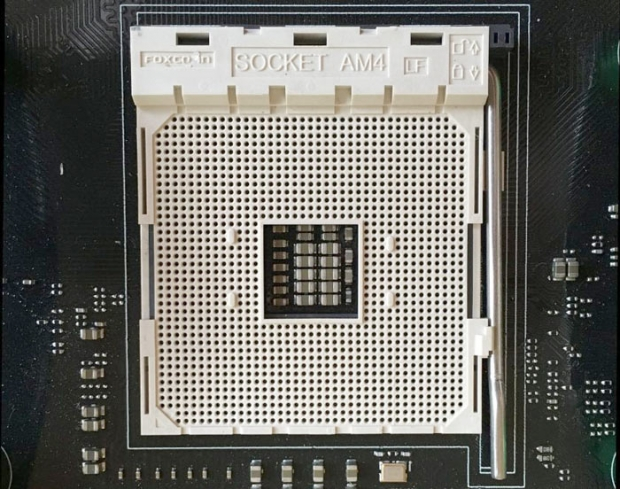

# CPU socket

The **processor socket** (also called a **CPU socket**) is the connector on the motherboard that houses a CPU and forms the electrical interface and contact with the CPU. Motherboards are subcategorized by the type of processor socket they have. 

# Types of CPU sockets

## PGA Socket

A **pin grid array (PGA)** socket is usually a square package made up of a number of holes in an array. The CPU itself has the pins that insert into the socket. The arrangement of pins on the CPU must correspond to the slots on the socket.

## ZIF Socket

A **zero insertion force (ZIF)** socket is an extension of a PGA socket, with pins on the CPU. With a ZIF socket, you don’t have to press down on the CPU to lock it in place. Instead, you simply place the CPU into the socket, then lock it in using a lever or slider on the side of the socket. This results in less risk of you damaging the CPU when you try to insert or remove it from the socket.

## LGA Socket

A **land grid array (LGA)** socket is essentially the opposite of a PGA socket. Instead of having the pins connected to the CPU, they’re connected to the socket itself while the CPU has slots with connectors. To lock a CPU into an LGA socket, you have to line up the pins and apply a small amount of pressure. LGA sockets are less fragile overall than PGA sockets.

# What do the pins on a CPU do?

Pins are the only way for signals (control and data) to get into or out of the CPU. In general, one “bit” of information can flow in or out across one pin on each clock cycle.

CPU designers will try hard to get as many pins onto the die that they can manage within the limits of the fabrication technology they are using. If (for example) they wanted to get 64 bits of data into the CPU from the memory subsystem on each clock cycle, they would need to use 64 pins for the data, plus a couple more pins for control signals.

# Examples

## AM4

Socket AM4 is a microprocessor socket used by AMD's CPUs launched in September 2016 and was designed to replace the sockets AM3+, FM2+ and FS1b as a single platform. It has 1331 pin slots (AM3+ has 942 pins). It achieves unified compatibility between high-end CPUs (previously using Socket AM3+) and AMD's lower-end APUs (on various other sockets). AM

## FCLGA1151

**FCLGA (Flip-Chip Land Grid Array)** is the full name (the full acronym) for LGA.

LGA 1151, also known as **Socket H4**, is an Intel microprocessor compatible socket which comes in two distinct versions: the first revision which supports both Intel's **Skylake** and **Kaby Lake** CPUs, and the second revision which supports **Coffee Lake** CPUs exclusively.

Intel® Core™ i9-9900K Processor is compatible with FCLGA1151.

# Reference

[What is CPU Socket? Webopedia Definition](https://www.webopedia.com/TERM/C/CPU_socket.html)

[Types of CPU Sockets](https://itstillworks.com/types-cpu-sockets-1255.html)

[LGA 1151 - Wikipedia](https://en.wikipedia.org/wiki/LGA_1151)