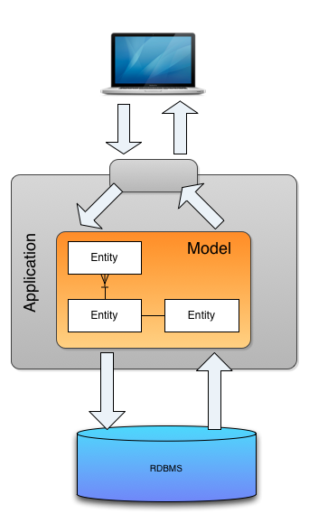
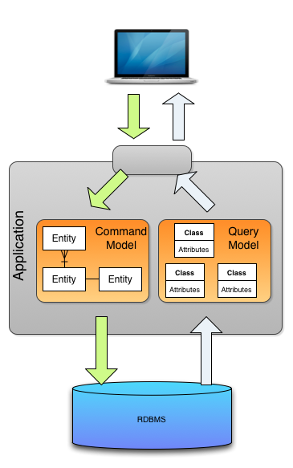
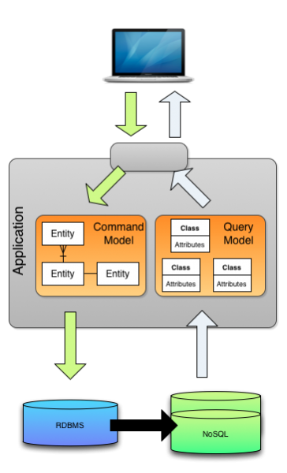
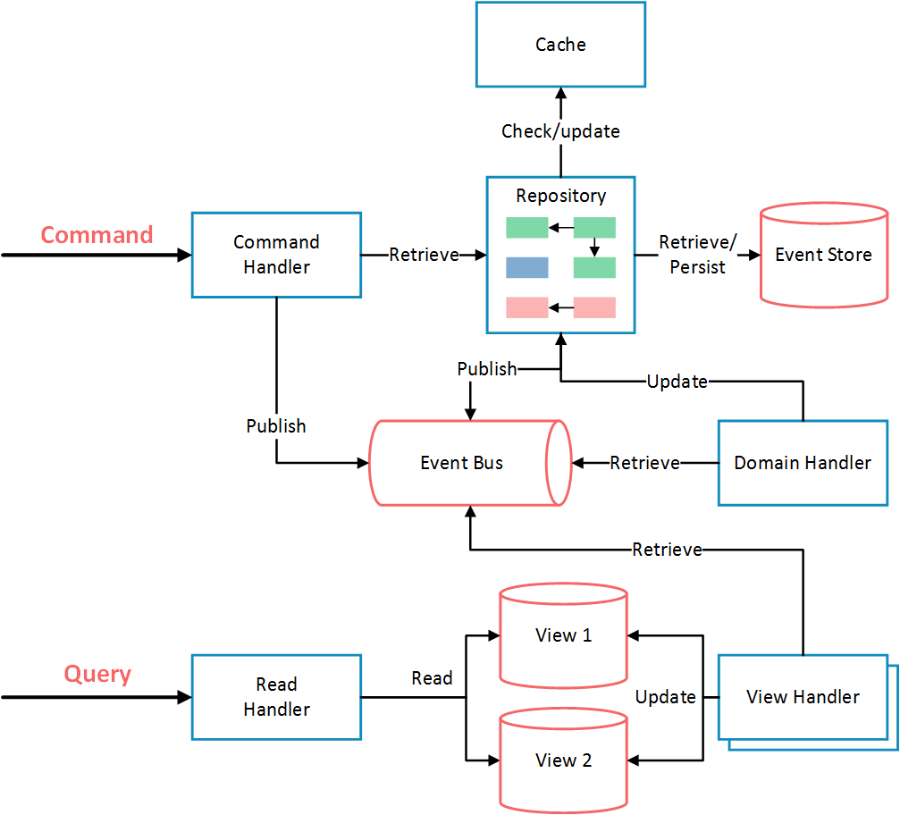

# CQRS

CQRS stands for **Command Query Responsibility Segregation**. At its heart is the notion that you can use a different model to update information than the model you use to read information. For some situations, this separation can be valuable, but beware that for most systems CQRS adds risky complexity.

# vs. CRUD

The mainstream approach people use for interacting with an information system is to treat it as a CRUD datastore. By this I mean that we have mental model of some record structure where we can**c**reate new records, **r**ead records, **u**pdate existing records, and **d**elete records when we're done with them. In the simplest case, our interactions are all about storing and retrieving these records.

전통적인 CRUD 아키텍처 기반에서 Application을 개발 및 운영하다 보면 자연스레 Domain Model의 복잡도가 증가되기 마련이고 이로 인해 유지보수 Cost는 지속적으로 증가하게 되며 Domain Model은 점점 설계 시 의도한 방향과는 다르게 변질 되게 된다. 특히나 요즘처럼 고차원적인 UX(User eXperience), 급변하는 Business, 시도때도 없이 달라지는 요구사항을 충족하는 Model을 만드는건 더욱더 어려운일이 되어버렸다.

이런 일련의 변경사항과 흐름을 곰곰히 관찰해 보니 Application의 Business정책이나 제약(흔히 비지니스 로직이라 부르는것들)은 거의 대 부분 데이터 변경 (C,U,D) 작업에서 처리되고 데이터 조회(R)작업은 단순 데이터 조회가 대 부분인데 이 두 업무를 동일한 Domain Model로 처리하게 되면 각 업무 영역에 필요치 않은 Domain 속성들로 인해 복잡도는 한 없이 증가하고 Domain Model은 애초 설계 의도와는 다른 방향으로 변질되게 된다.

그럼 어떻게 이 문제를 해결 할 수 있을까? 우리 선배 개발자님들은 고민을 시작했고 의외로 해법은 간단했다. 바로 **명령을 처리하는 책임**과 **조회를 처리하는 책임**을 분리 구현 하면 되는거 아닌가? 그렇다 이게 바로 CQRS 인것이다.

일반적으로 전통적인 CRUD 시스템은 그림과 같은 계층 구조로 처리된다.

# 1. Separate model

첫번째로 CQRS를 가장 간단하게 적용할 수 있는 방식은 단일 Data Store에 Command와 Query Model을 분리된 계층으로 나누는 방식이다.

그림처럼 Database(RDBMS) 는 분리하지 않고 기존 구조 그대로 유지 시키고 Model Layer 부분만 Command와 Query Model로 분리하는 수준으로 간단하게 적용할 수 있다. 이렇게 분리된 Model은 각자의 Domain Layer에 대해서만 모델링하고 코딩하기 때문에 훨씬 단순하게 구현/적용 할 수 있다. 하지만 동일 Database사용에 따른 성능상 문제점은 개선하지 못한다.

# 2. Separate databases

이 형태는 Command용 Database와 Query용 Database를 분리하고 별도의 Broker를 통해서 이 둘 간의 Data를 동기화 처리 하는 방식이다. 이 Case는 데이터를 조회 하려는 대상 서비스(시스템)들은 각자 자신의 시스템(서비스)에 맞는 저장소를 선택 할 수 있기에 **폴리글랏 저장 구조** (참고 : 다수의 Database 혼용하여 사용 하는 것을 폴리글랏 저장소 라고 함)로 구성 할 수 도 있다. 이 경우 각각의 Model에 맞게 저장소(RDBMS, NoSql, Cache)를 튜닝하여 사용할 수 있다는 이점이 있고 이는 1)일반 유형에서 거론된 동일 Database사용에 따른 성능 관점의 문제점을 해결 할 수 도 있다. 하지만 동기화 처리를 위한 Broker의 가용성과 신뢰도가 보장되어야 하는 Risk가 존재한다.

# 3. Use event-sourcing

세번째 형태는 이벤트 소싱(EventSourcing)을 적용한 구조이다.

이벤트 소싱이란 Application내의 모든 Activity를 이벤트로 전환해서 이벤트 스트림(Event Stream)을 별도의 Database에 저장하는 방식을 말한다. 이벤트 스트림을 저장하는 Database에는 오직 데이터 추가만 가능하고 계속적으로 쌓인 데이터를 구체화(Materialized) 시키는 시점에서 그때 까지 구축된 데이터를 바탕으로 조회대상 데이터를 작성하는 방법을 말한다.

이벤트 소싱의 이벤트 스트림은 오직 추가만 가능하고 이를 필요로 하는 시점에서 구체화 단계를 거치게 되고 이런 처리 구조가 CQRS의 Model분리 관점과 굉장히 궁합이 잘 맞기에 대 부분 CQRS 패턴을 적용하고자 할 때 이벤트 소싱이 적용된 구조를 선택하게 된다.

CQRS패턴에 이벤트 소싱은 필수가 아니지만 이벤트 소싱에 CQRS는 필수이다.

# Reference

[bliki: CQRS](https://martinfowler.com/bliki/CQRS.html)

[CQRS, Task Based UIs, Event Sourcing agh!](http://codebetter.com/gregyoung/2010/02/16/cqrs-task-based-uis-event-sourcing-agh/)

[나만 모르고 있던 CQRS & EventSourcing | Popit](https://www.popit.kr/cqrs-eventsourcing/)

[1 Year of Event Sourcing and CQRS](https://hackernoon.com/1-year-of-event-sourcing-and-cqrs-fb9033ccd1c6)

[Greg Young - CQRS and Event Sourcing - Code on the Beach 2014](https://youtu.be/JHGkaShoyNs)