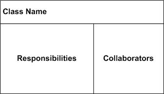
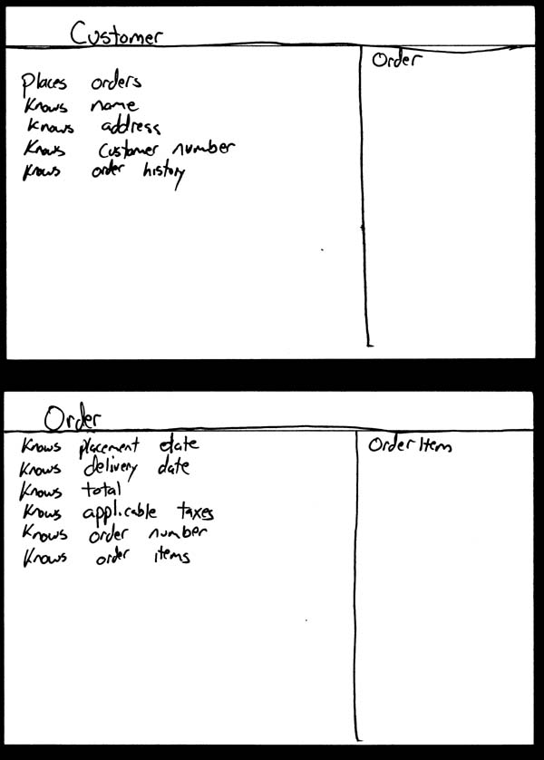
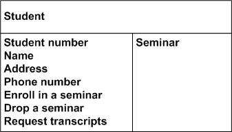
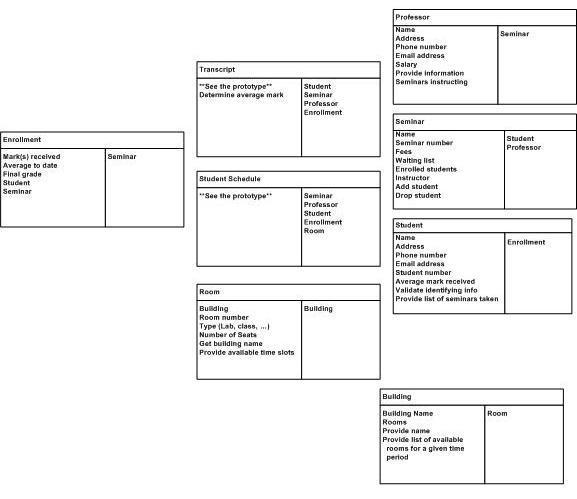
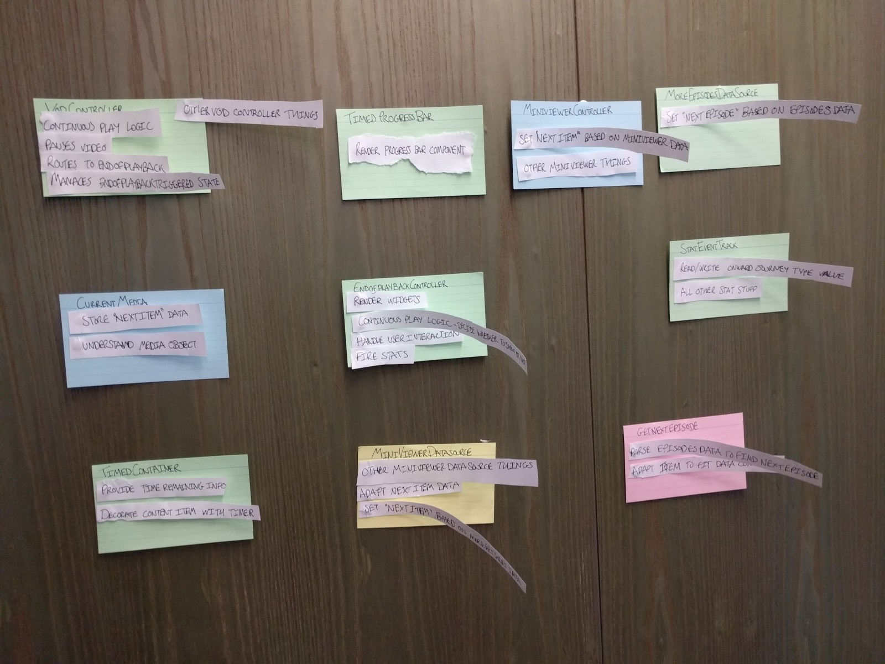
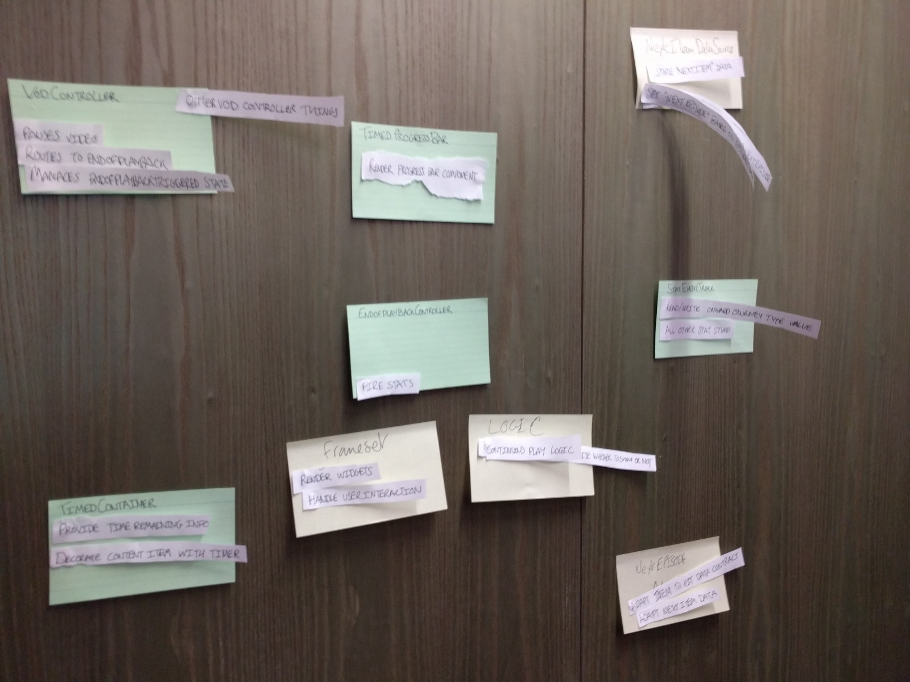

# CRC Model

A Class Responsibility Collaborator (CRC) model is a collection of standard index cards that have been divided into three sections. A class represents a collection of similar objects, a responsibility is something that a class knows or does, and a collaborator is another class that a class interacts with to fulfill its responsibilities.

# Description

Although CRC cards were originally introduced as a technique for teaching object-oriented concepts, they have also been successfully used as a full-fledged modeling technique. My experience is that CRC models are an incredibly effective tool for conceptual modeling as well as for detailed design.

A **class** represents a collection of similar objects. An object is a person, place, thing, event, or concept that is relevant to the system at hand. For example, in a university system, classes would represent students, tenured professors, and seminars. The name of the class appears across the top of a CRC card and is typically **a singular noun or singular noun phrase**, such as Student, Professor, and Seminar. You use singular names because each class represents a generalized version of a singular object. Although there may be the student John O'Brien, you would model the class Student. The information about a student describes a single person, not a group of people. Therefore, it makes sense to use the name Student and not Students. Class names should also be simple. For example, which name is better: Student or Person who takes seminars?

A **responsibility** is anything that a class knows or does. For example, students have names, addresses, and phone numbers. These are the things a student knows. Students also enroll in seminars, drop seminars, and request transcripts. These are the things a student does. The things a class knows and does constitute its responsibilities. Important: **A class is able to change the values of the things it knows, but it is unable to change the values of what other classes know.**

Sometimes a class has a responsibility to fulfill, but not have enough information to do it. For example, to enroll in seminars, a student needs to know if a spot is available in the seminar and, if so, he then needs to be added to the seminar. However, students only have information about themselves (their names and so forth), and not about seminars. What the student needs to do is collaborate/interact with the card labeled Seminar to sign up for a seminar. Therefore, Seminar is included in the list of collaborators of Student.

Collaboration takes one of two forms: A request for information or a request to do something. For example, the card Student requests an indication from the card Seminar whether a space is available, a request for information. Student then requests to be added to the Seminar, a request to do something. Another way to perform this logic, however, would have been to have Student simply request Seminar to enroll himself into itself. Then have Seminar do the work of determining if a seat is available and, if so, then enrolling the student and, if not, then informing the student that he was not enrolled.

# How to create CRC models

So how do you create CRC models? Iteratively perform the following steps:

- **Find classes**. Finding classes is fundamentally an analysis task because it deals with identifying the building blocks for your application. **A good rule of thumb is that you should look for the three-to-five main classes right away**, such as Student, Seminar, and Professor. I will sometimes include UI classes such as Transcript and Student Schedule, both are reports, although others will stick to just entity classes. Also, I'll sometimes include cards representing actors when my stakeholders are struggling with the concept of a student in the real world (the actor) versus the student in the system (the entity).
- **Find responsibilities**. You should ask yourself what a class does as well as what information you wish to maintain about it. You will often identify a responsibility for a class to fulfill a collaboration with another class.
- **Define collaborators**. A class often does not have sufficient information to fulfill its responsibilities. Therefore, it must collaborate (work) with other classes to get the job done. Collaboration will be in one of two forms: a request for information or a request to perform a task. To identify the collaborators of a class for each responsibility ask yourself "does the class have the ability to fulfill this responsibility?". If not then look for a class that either has the ability to fulfill the missing functionality or the class which should fulfill it. In doing so you'll often discover the need for new responsibilities in other classes and maybe even the need for a new class or two.
- **Move the cards around**. To improve everyone's understanding of the system, the cards should be placed on the table in an intelligent manner. Two cards that collaborate with one another should be placed close together on the table, whereas two cards that don't collaborate should be placed far apart. Furthermore, the more two cards collaborate, the closer they should be on the desk. By having cards that collaborate with one another close together, it's easier to understand the relationships between classes.

The best way to do this is to create a CRC model for a single requirement, such as a user story, business rule, or system use case, instead of the entire collection of requirements for your system

# **Tips**

1. Write a card for **before** and **after** the change and then compare.
2. Write the cards based on the genuine code. Do not base it on some drawing or some memory you have of what it does or whatever. Open the code, read the code line by line, write it out as you do it. Make sure EVERYTHING is in there.
3. In my view writing a good CRC card means introducing a level of abstraction from the code. The responsibilities should be reflective of your domain NOT necessarily your code. What do I mean by that? Well lets say you have a ‘EmailAddressValidator’ object, its responsibility might be ‘validate email addresses’ however, it might take 3 functions to do that. Responsibility > Implementation.
4. Throw them away. Often. If you can’t recreate these cards quickly then its often a code smell that your code is too complex — see ‘Software that fits in your head’
5. If you can’t fit all the responsibilities and the collaborators on one side of the card then its often a code smell that your code is too complex .
6. If you are doing any kind of refactoring sessions, put the responsibilities and collaborators on separate slithers of paper that you can stick with blue tack to the cards. Encourage people to move the bits of paper around.
7. Remember to include ALL THE THINGS. Common things people don’t include but you should include include:
    1. Configuration changes
    2. Changes to test code
    3. DB changes
    4. Infrastructure

## Before refactoring

## After refactoring

# Reference

[Class Responsibility Collaborator (CRC) Models: An Agile Introduction](http://agilemodeling.com/artifacts/crcModel.htm)

[How I use CRC (Class Responsibility Collaboration) Cards every day (Part 1)](https://medium.com/@defmyfunc/how-i-use-crc-class-responsibility-collaboration-cards-in-my-day-to-day-work-a9f4814697c5)