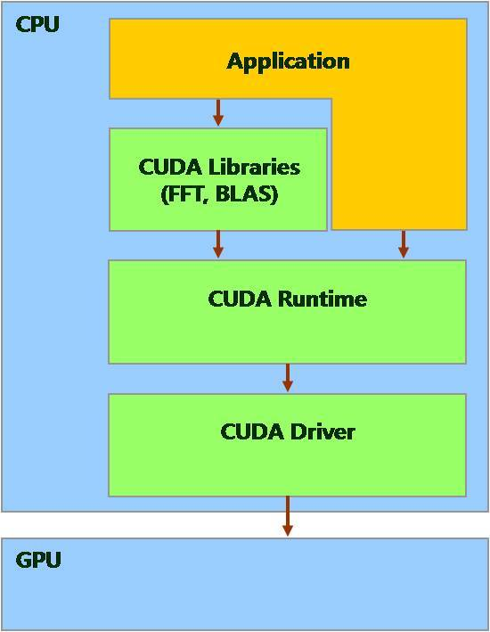
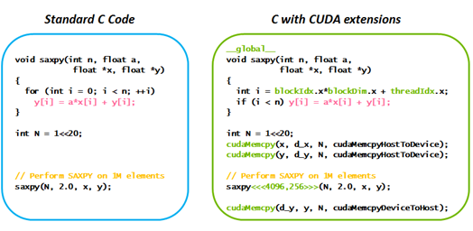

# CUDA, cuDNN, Nvidia driver

# CUDA

**CUDA (Computed Unified Device Architecture)** is a parallel computing platform and programming model that makes using a GPU for general purpose computing simple. The developer still programs in the familiar C, C++, or Fortran and incorporates extensions of these languages in the form of a few basic keywords.

> 처음에 엔비디아 GPU는 대규모 데이터를 효과적으로 처리할 수 있는 다중 연산 및 초고속 병렬 연산 능력에도 불구하고, 제한적인 범위에서만 활용됐습니다. 그래픽스 처리 장치를 이용한 범용 프로그래밍(General Purpose GPU, GPGPU)이 고급 그래픽 프로그래밍 기술 범주에 속했고, 그래픽 애플리케이션 프로그래밍 인터페이스(Application Programming Interface, API)에 익숙하지 않은 일반 개발자들은 GPU를 이용하기가 쉽지 않았기 때문이지요.
그런데 엔비디아가 2006년에 CUDA 솔루션을 출시하면서 상황은 달라졌습니다. CUDA가 GPU에서 수행하는 병렬 처리 알고리즘을 C언어 등을 비롯한 산업 표준언어를 이용해 작성할 수 있도록 함으로써 CUDA를 통해 그래픽 API를 알지 못하는 개발자들도 GPU를 활용할 수 있게 된 것입니다. 말하자면 CUDA 가 하나의 높았던 진입장벽을 해소해준 것이지요.

[What Is CUDA | NVIDIA Official Blog](https://blogs.nvidia.com/blog/2012/09/10/what-is-cuda-2/)

[CUDA 툴킷 다운로드하고, GPU를 자유자재로 활용해보자! - 엔비디아 공식 블로그](https://blogs.nvidia.co.kr/2018/01/16/cuda-toolkit/)

[CUDA (쿠다) 란, 왜 사용하는 것인가.](https://kaen2891.tistory.com/20)

[cuda란 무엇인가?](https://cuda.tistory.com/entry/cuda%EB%9E%80-%EB%AC%B4%EC%97%87%EC%9D%B8%EA%B0%80)

# cuDNN

The NVIDIA **CUDA® Deep Neural Network library (cuDNN)** is a GPU-accelerated library of primitives for deep neural networks. cuDNN provides highly tuned implementations for standard routines such as forward and backward convolution, pooling, normalization, and activation layers.

[NVIDIA cuDNN](https://developer.nvidia.com/cudnn)

# Nvidia driver

The NVIDIA Driver is the software driver for NVIDIA Graphics GPU installed on the PC. It is a program used to communicate from the host OS to the device.

## What is a driver?

In the most fundamental sense, a driver is a software component that lets the operating system and a device communicate with each other. For example, suppose an application needs to read some data from a device. The application calls a function implemented by the operating system, and the operating system calls a function implemented by the driver. The driver, which was written by the same company that designed and manufactured the device, knows how to communicate with the device hardware to get the data. After the driver gets the data from the device, it returns the data to the operating system, which returns it to the application.

## Relation to CUDA driver

cuda driver is `libcuda.so` which is included in nvidia driver and used by cuda runtime api. Nvidia driver includes driver kernel module and user libraries.

[Should I remove NVIDIA Drivers by NVIDIA?](https://www.shouldiremoveit.com/NVIDIA-Drivers-7438-program.aspx)

[What is a driver - Windows drivers](https://docs.microsoft.com/en-us/windows-hardware/drivers/gettingstarted/what-is-a-driver-)

[What's the relation between nvidia driver, cuda driver and cuda toolkit?](https://stackoverflow.com/questions/45293580/whats-the-relation-between-nvidia-driver-cuda-driver-and-cuda-toolkit)