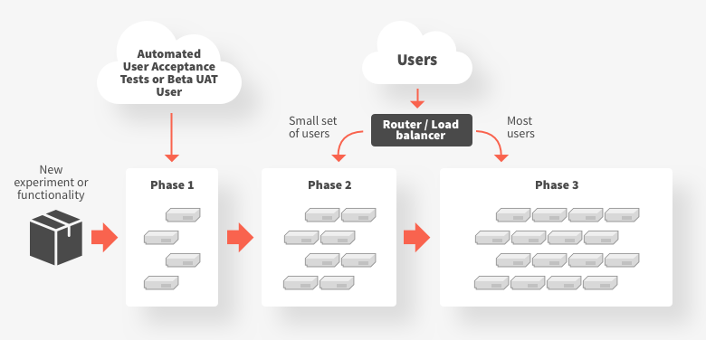
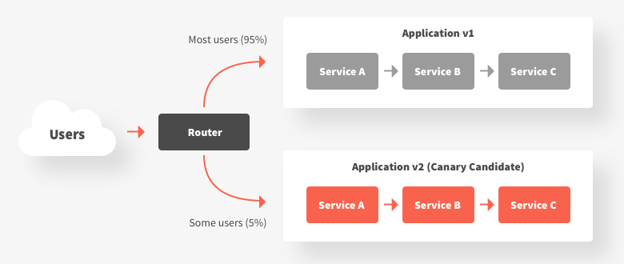
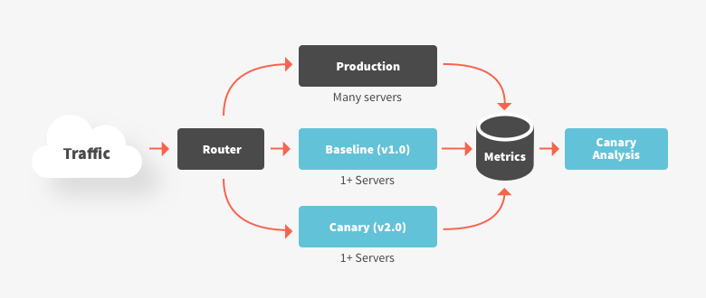

# Canary Release

[Canary release](https://martinfowler.com/bliki/CanaryRelease.html) is a technique that is used to reduce the risk of introducing a new software version in production by gradually rolling out the change to a small subgroup of users, before rolling it out to the entire platform/infrastructure and making it available to everybody.

# **Motivation**

This technique was inspired from the fact that canary birds were once used in coal mines to alert miners when toxic gases reached dangerous levels — the gases would kill the canary before killing the miners, which provides a warning to get out of the mine tunnels immediately. As long as the canary kept singing, the miners knew that the air was free of dangerous gases. If a canary died, then this signaled an immediate evacuation.

This techniques is called “canary” releasing because just like canaries that were once used in coal mining to alert miners when toxic gases reached dangerous levels, a small set of end users selected for testing act as the canaries and are used to provide an early warning. Unlike the poor canaries of the past, obviously no users are physically hurt during a software release, but negative results from a canary release can be inferred from telemetry and metrics in relation to key performance indicators (KPIs).

Canary tests can be automated, and are typically run after testing in a pre-production environment has been completed. The canary release is only visible to a fraction of actual users, and any bugs or negative changes can be reversed quickly by either routing traffic away from the canary or by rolling-back the canary deployment.

# **Applicability**

Use canary releases when:

- An application consists of multiple (micro)services that are changing at independent rates, and verification of functionality must be conducted in a realistic (ideally production) environment
- There is high operational risk of deploying new functionality, and this can be mitigated by experimenting with directing a small percentage of traffic to the new deployment
- A service depends on a (third-party or legacy) upstream system that cannot effectively be tested against, and the only reliable method to validate successful integration is to actually integrate with this service

Do not use canary releases when:

- You are working on a mission, safety or life critical system that cannot tolerate failure. No one wants to see the canary release of a nuclear meltdown safety mechanism.
- End users will be overly sensitive to canary results. For example, extra care would have to be taken if canary releasing software that manipulates large amounts of financial transactions.
- The experiment would require the modification of backend data (or the data store schema) in a way that is not compatible with the current service requirements

# **Structure/Implementation**

Typically canary releases are implemented via a proxy like [Envoy](https://www.envoyproxy.io/) or [HAProxy](http://www.haproxy.org/), smart router, or configurable load balancer. The releases can be triggered and orchestrated by continuous integration/delivery pipeline tooling, such as [Jenkins](https://cloud.google.com/solutions/continuous-delivery-jenkins-kubernetes-engine#deploying_a_canary_release) or [Spinnaker](https://medium.com/netflix-techblog/automated-canary-analysis-at-netflix-with-kayenta-3260bc7acc69), automated “DevOps” platform like [Electric Cloud](https://electric-cloud.com/), or automate or feature management SaaS platforms like [LaunchDarkly](https://launchdarkly.com/) or [Optimizely](https://www.optimizely.com/).

Here are some implementation issues to consider:

- A prerequisite to implementing canary releases is the ability to effectively observe and monitor your infrastructure and application stack. This includes the ability to observe and comprehend both technical metrics (e.g. an increase in HTTP 500 status codes being returned to end users) and business metrics (e.g. a drop in the number of customers purchasing)
- The front proxy, router or load balancer used to direct traffic must be programmable, and expose an API that allows dynamic configuration of traffic shaping and shifting.
- Ideally the canary release process, and traffic shifting configuration, will be written and stored declaratively, as this enables a “GitOps” style of working, and facilitates disaster recovery and auditing
- If the new canary version of the application requires data store schema modification, the rollout of this must be carefully managed in order to prevent breaking the existing production services that rely on this schema. Often the “[parallel change](https://martinfowler.com/bliki/ParallelChange.html)”, otherwise known as “expand and contract”, pattern must be used
- Services involved within the canarying will typically have to capable of passing headers or tokens (that indicate a canaried request) to upstream services.

# **Consequences**

Using canary releases has the following benefits:

- Gradual rollout of new functionality limits the potential system blast radius of any operational issues
- Gradual release of new functionality to users reduces risk of negative outcomes impacting a large percentage of your user base

and liabilities:

- Manual canary releasing can be time consuming and error prone (a positive pattern is to automate the entire canary release life cycle)
- There is limited value in canary releases if the system, application, and user behaviour is not observable and well-instrumented
- Managing incompatibilities between API versions and database schema changes (and mutability of the data structure in state management services in general) can be challenging if the team does not have good testing and migration strategies in place

# **Example**

An example of how to implement a canary release with the Ambassador API gateway can be found in the article “[Canary deployments, A/B testing, and microservices with Ambassador](https://blog.getambassador.io/canary-deployments-a-b-testing-and-microservices-with-ambassador-f104d0458736)”.

# **Known Uses**

The following list highlights organisations that are known to use the canary release pattern:

- Netflix: [https://medium.com/netflix-techblog/automated-canary-analysis-at-netflix-with-kayenta-3260bc7acc69](https://medium.com/netflix-techblog/automated-canary-analysis-at-netflix-with-kayenta-3260bc7acc69) and [https://medium.com/netflix-techblog/deploying-the-netflix-api-79b6176cc3f0](https://medium.com/netflix-techblog/deploying-the-netflix-api-79b6176cc3f0)
- Facebook: [https://code.fb.com/web/rapid-release-at-massive-scale/](https://code.fb.com/web/rapid-release-at-massive-scale/)
- Google: [https://landing.google.com/sre/book/chapters/release-engineering.html](https://landing.google.com/sre/book/chapters/release-engineering.html)

# **Related Patterns**

- Feature flags
- [Traffic shadowing](https://www.getambassador.io/reference/shadowing)

# **Additional references**

- [https://martinfowler.com/bliki/CanaryRelease.html](https://martinfowler.com/bliki/CanaryRelease.html)
- [https://featureflags.io/canary-testing/](https://featureflags.io/canary-testing/)
- [https://blog.getambassador.io/canary-deployments-a-b-testing-and-microservices-with-ambassador-f104d0458736](https://blog.getambassador.io/canary-deployments-a-b-testing-and-microservices-with-ambassador-f104d0458736)
- [http://blog.christianposta.com/deploy/blue-green-deployments-a-b-testing-and-canary-releases/](http://blog.christianposta.com/deploy/blue-green-deployments-a-b-testing-and-canary-releases/)

# Reference

[A Comprehensive Guide to Canary Releases](https://blog.getambassador.io/cloud-native-patterns-canary-release-1cb8f82d371a)