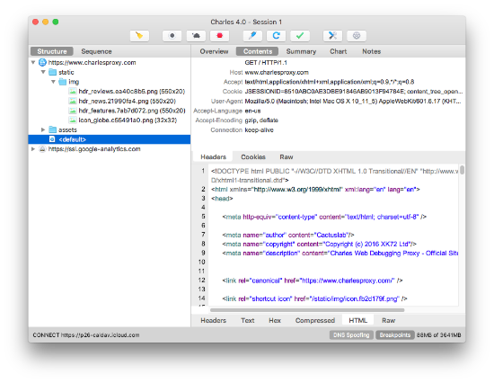

# Charles

Charles is a web proxy that runs on your own computer. Your web browser (or any other Internet application) is then configured to access the Internet through Charles, and Charles is then able to record and display for you all of the data that is sent and received.

# How to monitor macOS network traffic

- Turn on Proxy > macOS Proxy

# How to monitor iOS HTTPS network traffic

[Monitoring iOS HTTPS Network Traffic](https://medium.com/@jamesmarino/monitoring-ios-https-network-traffic-a5d9fbe0edfe)

## When HTTPS request on iOS fails on Charles Proxy

- On iOS, General > About > Certificate Trust Settings, and find the Charles Proxy certificate, and switch it on to enable full trust for it.
- 인증서 위치: 일반 > 프로파일 및 기기 관리

[Why https request fails on Charles Proxy if SSL proxying is turned on](https://stackoverflow.com/questions/48873791/why-https-request-fails-on-charles-proxy-if-ssl-proxying-is-turned-on)