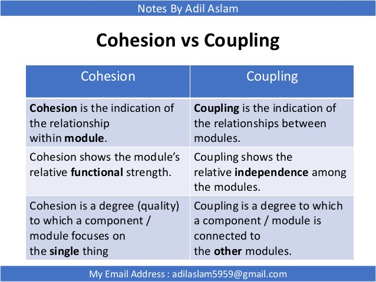
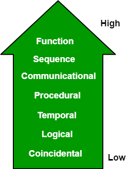
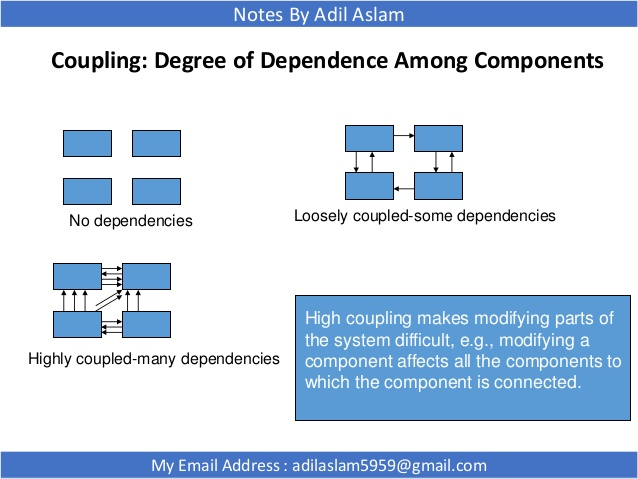
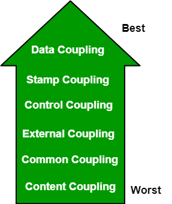

# Cohesion vs. Coupling

# Cohesion

Cohesion is a measure of the degree to which the elements inside a module belong together. It is the degree to which all elements directed towards performing a single task are contained in the component. A cohesive component / module focus on a single task (i.e., **single-mindedness**). Cohesion is intra-module concept.

A good software design strives for high cohesion.

## Types of cohesion

- **Functional Cohesion:** Every essential element for a single computation is contained in the component. A functional cohesion performs the task and functions. It is an ideal situation.
- **Sequential Cohesion:** An element outputs some data that becomes the input for other element, i.e., data flow between the parts. It occurs naturally in functional programming languages.
- **Communicational Cohesion:** Two elements operate on the same input data or contribute towards the same output data. Example- update record in the database and send it to the printer.
- **Procedural Cohesion:** Elements of procedural cohesion ensure the order of execution. Actions are still weakly connected and unlikely to be reusable. Ex- calculate student GPA, print student record, calculate cumulative GPA, print cumulative GPA.
- **Temporal Cohesion:** The elements are related by their timing involved. A module connected with temporal cohesion all the tasks must be executed in the same time-span. This cohesion contains the code for initializing all the parts of the system. Lots of different activities occur, all at init time.
- **Logical Cohesion:** The elements are logically related and not functionally. Ex- A component reads inputs from tape, disk, and network. All the code for these functions is in the same component. Operations are related, but the functions are significantly different.
    - My thought: Scala의 Source는 Logical cohesion의 예이다. rama도 한 예이다.
- **Coincidental Cohesion:** The elements are not related(unrelated). The elements have no conceptual relationship other than location in source code. It is accidental and the worst form of cohesion. Ex- print next line and reverse the characters of a string in a single component.

# Coupling

Coupling is the measure of the degree of interdependence between the modules. Coupling is inter-module concept. It is characterized by passage of control between modules.

A good software design strives for low coupling.

## Types of coupling

- **Data Coupling:** If the dependency between the modules is based on the fact that they communicate by passing only data, then the modules are said to be data coupled. In data coupling, the components are independent to each other and communicating through data. Module communications don’t contain tramp data. Example-customer billing system.
- **Stamp Coupling** In stamp coupling, the complete data structure is passed from one module to another module. Therefore, it involves tramp data. It may be necessary due to efficiency factors- this choice made by the insightful designer, not a lazy programmer.
- **Control Coupling:** If the modules communicate by passing control information, then they are said to be control coupled. It can be bad if parameters indicate completely different behavior and good if parameters allow factoring and reuse of functionality. Example- sort function that takes comparison function as an argument.
- **External Coupling:** In external coupling, the modules depend on other modules, external to the software being developed or to a particular type of hardware. Ex- protocol, external file, device format, etc.
- **Common Coupling:** The modules have shared data such as global data structures. The changes in global data mean tracing back to all modules which access that data to evaluate the effect of the change. So it has got disadvantages like difficulty in reusing modules, reduced ability to control data accesses and reduced maintainability.
- **Content Coupling:** In a content coupling, one module can modify the data of another module or control flow is passed from one module to the other module. This is the worst form of coupling and should be avoided.

# Reference

[Coupling and Cohesion in Software Engineering](https://www.slideshare.net/AdilAslam4/coupling-and-cohesion-in-software-engineering)

[Software Engineering | Coupling and Cohesion - GeeksforGeeks](https://www.geeksforgeeks.org/software-engineering-coupling-and-cohesion/)

[Coupling (computer programming) - Wikipedia](https://en.wikipedia.org/wiki/Coupling_(computer_programming))

[Cohesion (computer science) - Wikipedia](https://en.wikipedia.org/wiki/Cohesion_(computer_science))