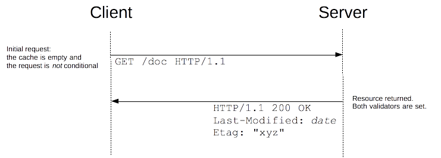
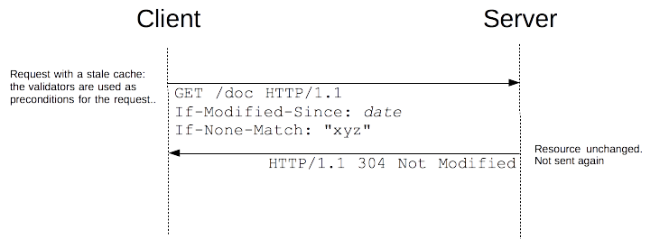
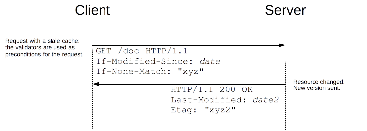

# Conditional GET

An HTTP request message is a so-called **conditional GET** message if the request message uses the GET method and the request message includes an **In-Modified-Since:** header line.

# Caching Mechanism

In this request, a specific request header is sent **If-Modified-Since.** This header sends a **RFC 2822 formatted date** as the value. The proxy which is between the Server and the client checks the date, and the cached document, if the condition matches, A **304 Not Modified** header is sent back to the client in the response.

## The very first request

Here goes the request header as follows…

> GET /sample.html HTTP/1.1
> Host: [example.com](http://example.com/)

Now the response that comes from the server is the document with the response headers. The response headers would be…

> HTTP/1.x 200 OK
> Via: The-proxy-name
> Content-Length: 32859
> Expires: Tue, 27 Dec 2005 11:25:11 GMT
> Date: Tue, 27 Dec 2005 05:25:11 GMT
> Content-Type: text/html; charset=iso-8859-1
> Server: Apache/1.3.33 (Unix) PHP/4.3.10
> Cache-Control: max-age=21600
> Last-Modified: Wed, 01 Sep 2004 13:24:52 GMT
> Etag: “4135cda4”

- **Cache-Control**: It tells the client the maximum time in seconds to cache the document.
- **Last-Modified**: The document’s last modified date
- **Etag**: A unique hash for the document.

Once the Server responds, the client caches the document and stores it for the specified amount of time, In this case for 21600 seconds.

## The second request

Next time when the user calls for the same document /sample.html within the specified cache time frame. The browser(client) will make a conditional get request, try to ask the server that if the document is modified after the specified time zone whose hashed value was the **Etag value**, ONLY THEN return a new document or else confirm that it is an old document.

So the request header would be as…

> GET /sample.html HTTP/1.1
> Host: [example.com](http://example.com/)
> If-Modified-Since: Wed, 01 Sep 2004 13:24:52 GMT
> If-None-Match: “4135cda4”

The header is self explanatory, it is asking for a new document which modified after Wed, 01 Sep 2004 13:24:52. The If-None-Match specifies that the client has mapped the document with that Entity value. **RFC 2616** specifies that if **If-None-Match** is not accompanied with **If-Modified-Since** then the server **must not send a 304 (Not Modified) header.**

The response to the above request would be as.

> HTTP/1.x 304 Not Modified
> Via: The-proxy-server
> Expires: Tue, 27 Dec 2005 11:25:19 GMT
> Date: Tue, 27 Dec 2005 05:25:19 GMT
> Server: Apache/1.3.33 (Unix) PHP/4.3.10
> Keep-Alive: timeout=2, max=99
> Etag: “4135cda4”
> Cache-Control: max-age=21600

The server confirms the that the document is not modified and sends a 304 Not Modified header.

The client checks the 304 response header, and renders the document from the cache.

If the resource has changed, the server just sends back a 200 OK response, with the new version of the resource, like if the request wasn't conditional and the client uses this new resource (and caches it).

# Conditional headers

Several HTTP headers, called conditional headers, lead to conditional requests. These are:

## **`[If-Match](https://developer.mozilla.org/en-US/docs/Web/HTTP/Headers/If-Match)`**

Succeeds if the `[ETag](https://developer.mozilla.org/en-US/docs/Web/HTTP/Headers/ETag)` of the distant resource is equal to one listed in this header. By default, unless the etag is prefixed with `'W/'`, it performs a strong validation.

## **`[If-None-Match](https://developer.mozilla.org/en-US/docs/Web/HTTP/Headers/If-None-Match)`**

Succeeds if the `[ETag](https://developer.mozilla.org/en-US/docs/Web/HTTP/Headers/ETag)` of the distant resource is different to each listed in this header. By default, unless the etag is prefixed with `'W/'`, it performs a strong validation.

## **`[If-Modified-Since](https://developer.mozilla.org/en-US/docs/Web/HTTP/Headers/If-Modified-Since)`**

Succeeds if the `[Last-Modified](https://developer.mozilla.org/en-US/docs/Web/HTTP/Headers/Last-Modified)` date of the distant resource is more recent than the one given in this header.

## **`[If-Unmodified-Since](https://developer.mozilla.org/en-US/docs/Web/HTTP/Headers/If-Unmodified-Since)`**

Succeeds if the `[Last-Modified](https://developer.mozilla.org/en-US/docs/Web/HTTP/Headers/Last-Modified)` date of the distant resource is older or the same than the one given in this header.

## **`[If-Range](https://developer.mozilla.org/en-US/docs/Web/HTTP/Headers/If-Range)`**

Similar to `[If-Match](https://developer.mozilla.org/en-US/docs/Web/HTTP/Headers/If-Match)`, or `[If-Unmodified-Since](https://developer.mozilla.org/en-US/docs/Web/HTTP/Headers/If-Unmodified-Since)`, but can have only one single etag, or one date. If it fails, the range request fails, and instead of a `[206](https://developer.mozilla.org/en-US/docs/Web/HTTP/Status/206)` `Partial Content` response, a `[200](https://developer.mozilla.org/en-US/docs/Web/HTTP/Status/200)` `OK` is sent with the complete resource.

# Reference

[The Conditional GET](http://bright28677.tripod.com/proj2/get.htm)

[Conditional GET Request](https://ruturajv.wordpress.com/2005/12/27/conditional-get-request/)

[HTTP conditional requests](https://developer.mozilla.org/en-US/docs/Web/HTTP/Conditional_requests)