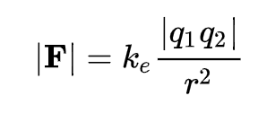
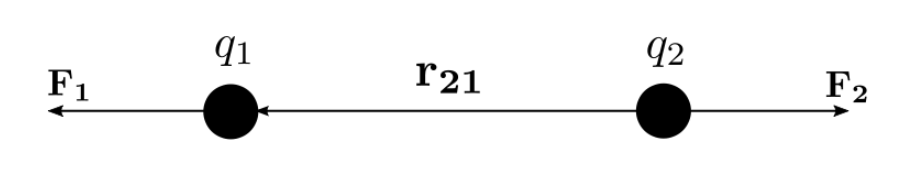

# Coulomb's law

**Coulomb's law**, or **Coulomb's inverse-square law**, is a law of physics that quantifies the amount of force between two stationary, electrically charged particles.

> The magnitude of the electrostatic force of attraction or repulsion between two point charges is directly proportional to the product of the magnitudes of charges and inversely proportional to the square of the distance between them.

# Coulomb's constant

`k_e` is Coulomb's constant (`k_e` = 8.9875517873681764×10^9 N⋅m^2⋅C^−2

# Reference

[Coulomb's Law](https://www.khanacademy.org/video/coulombs-law)