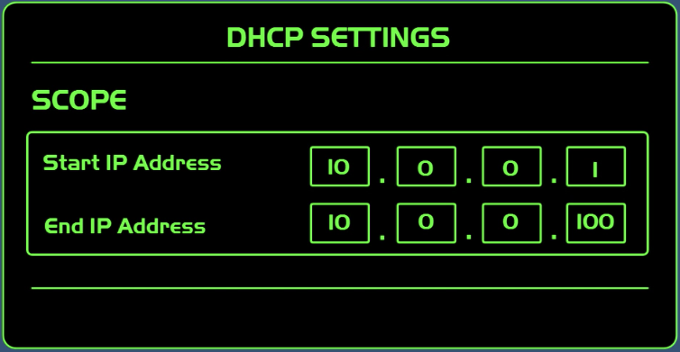
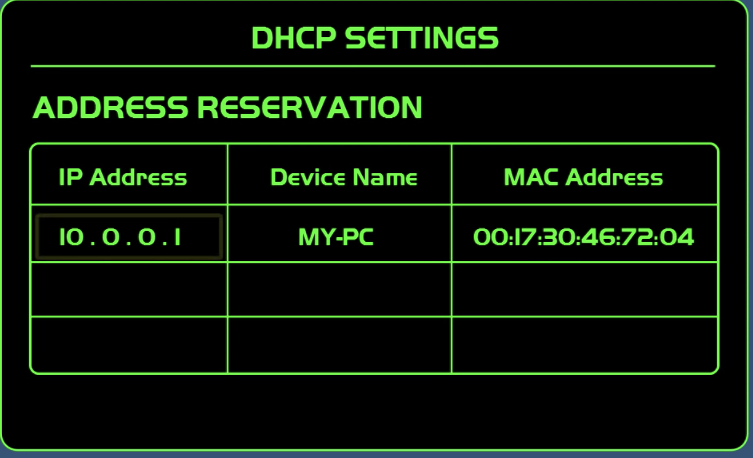
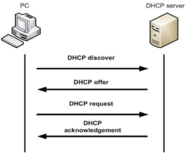

# DHCP

DHCP(Dynamic Host Configuration Protocol) is a client/server protocol that automatically provides an Internet Protocol (IP) host with its IP address and other related configuration information such as the subnet mask and default gateway.

# Protocol

The TCP/IP protocols (our computers' built-in, internal networking software) include a DHCP protocol. DHCP is a part of the "application layer," which is just one of the several TCP/IP protocols. It automatically assigns and keeps tabs of IP addresses and any "subnetworks" that require them.

# DHCP Server

DHCP is a service that runs on a server, such as a Microsoft server or a Linux server. It's also a service that runs on routers. Whether the router is a business router or a small office home office router. these routers will have a DHCP service built into them.

A DHCP server is one computer on the network that has a number of IP address at its disposal to assign to the computers/hosts on that network. If you use a cable company for Internet access, making them your Internet Service Provider, they likely are your DHCP server.

# Scope

A DHCP server assigns IP addresses to computers on a network from a scope. A scope is a range of IP addresses that a DHCP server can hand out.

# Reservation

A reservation ensures that a specific computer or device will always be given the same IP address. Reservations are typically given to special devices or computers, such as network printers, servers, and routers.

# How DHCP works

The key word in DHCP is "dynamic." Because instead of having just one fixed and specific IP address, most computers will be assigned one that is available from a **subnet** or **"pool"** that is assigned to the network.

One of the features of DHCP is that it provides IP addresses that "expire." When DHCP assigns an IP address, it actually leases that connection identifier to the user's computer for a specific amount of time.

Here is how the DHCP process works when you go online:

1. Your go on your computer to connect to the Internet.
2. The network requests an IP address (this is actually referred to as a **DHCP discover message**).
3. On behalf of your computer's request, the DHCP server allocates (leases) to your computer an IP address. This is referred to as the **DHCP offer message**.
4. Your computer (remember—you're the DHCP client) takes the first IP address offer that comes along. It then responds with a **DHCP request message** that verifies the IP address that's been offered and accepted.
5. DHCP then updates the appropriate network servers with the IP address and other configuration information for your computer.
6. Your computer (or whatever network device you're using) accepts the IP address for the lease term.

# Reference

[Overview of Dynamic Host Configuration Protocol (DHCP) for Beginners](https://whatismyipaddress.com/dhcp)

[https://www.youtube.com/watch?v=e6-TaH5bkjo](https://www.youtube.com/watch?v=e6-TaH5bkjo)

[Dynamic Host Configuration Protocol (DHCP)](https://docs.microsoft.com/en-us/windows-server/networking/technologies/dhcp/dhcp-top)