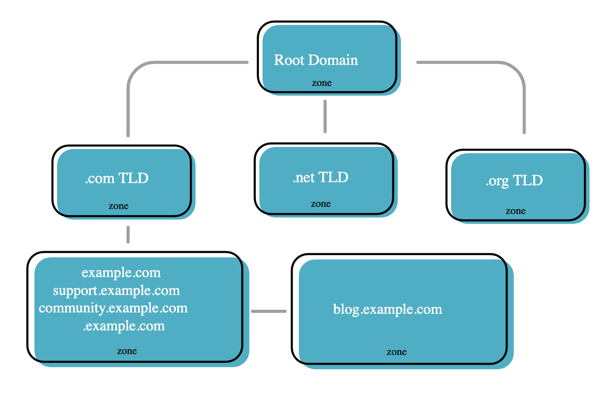

# DNS Zones

A DNS zone is a certain portion of the domain name space in the **Domain Name System (DNS)** for which administrative responsibility has been delegated to a single manager.

The domain name space of the Internet is organized into a hierarchical layout of subdomains below the **DNS root domain**. The individual domains of this tree may serve as delegation points for administrative authority and management. The domain name space is partitioned into **areas (zones)** for this purpose. A zone starts at a domain and extends downward in the tree to the leaf nodes or to the top-level of subdomains where other zones start.

# DNS Zone Levels

The Domain Name System (DNS) defines a domain namespace, which specifies **Top Level Domains** (such as “.com”), **second-level domains**, (such as “acme.com”) and lower-level domains, also called **subdomains** (such as “support.acme.com”). Each of these levels can be a DNS zone.

For example, the root domain “acme.com” may be delegated to a Acme Corporation. Acme assumes responsibility for setting up an **authoritative DNS server** that holds the correct DNS records for the domain.

At each hierarchical level of the DNS system, there is a **Name Server** containing a **zone file**, which holds the trusted, correct DNS records for that zone.

# DNS Root Zone

The DNS root is the highest level in the DNS chain. Let's say a user wants to visit `www.example.com.au.`. Domain names are organised in a hierarchical structure and searched starting from right to left. The top of the domain name structure is the **root (.) zone**. The **resolver** will ask a **root server**, "where is www.example.com.au?" These root servers only contain answers about the location of the next level down in the structure, in this instance '.au'. When asked, they respond with "I don't know where www.example.com.au is, but I do know where '.au' is and here is the answer." The process repeats until the example.com.au DNS servers return the IP of the www record.

Since 2016, the root zone is overseen by the **Internet Corporation for Assigned Names and Numbers (ICANN)**, which delegates management to a subsidiary acting as the **Internet Assigned Numbers Authority (IANA)**. The DNS root zone is operated by 13 logical servers, run by organizations like Verisign, the U.S. Army Research Labs and NASA. Any recursive DNS query starts by contacting one of these root servers, and requesting details for the next level down the tree—the Top Level Domain (TLD) server.

# TLD Zones

There is a DNS zone for each **Top Level Domain**, such as “.com”, “.org” or country codes like “.co.uk”. there are currently over 1500 top level domains. Most top level domains are managed by ICANN/IANA.

# Secondary DNS Zones

DNS servers can be deployed in a **master/slave topology**, where a secondary DNS server holds a read-only copy of the primary DNS server’s DNS records. The primary server holds the master zone file, and the secondary server constitutes an identical secondary zone; DNS requests are distributed between primary and secondary servers. A DNS zone transfer occurs when the primary server zone file is copied, in whole or in part, to the secondary DNS server.

In DNS there are always two name servers for resilience.

# DNS Zone File

The DNS Zone file is the representation of the DNS Zone - it is the actual file, which contains all the records for a specific domain. The zone file consists of a header called the **Start Of Authority (SOA)**, which contains things like the default **Time To Live (TTL)**, and the email address of the responsible person.

The body of the zone file then contains multiple records that tell the DNS server which IP addresses to serve, where your email servers are, and where your nameservers are, amongst other things.

    $ORIGIN example.com. ; designates the start of this zone file in the name space
    $TTL 1h ; The default expiration time of a resource record without its own TTL value 
    example.com. IN SOA ns.example.com. root.example.com. ( 
    2008120710 ; serial number of this zone file
    1d ; slave refresh (1 day)
    1d ; slave retry time in case of a problem (1 day)
    4w ; slave expiration time (4 weeks)
    1h ; minimum caching time in case of failed lookups (1 hour)
    )
    example.com. NS dns1.ntchosting.com. ; ns.example.com is the nameserver for example.com
    example.com. NS dns2.ntchosting.com. ; ns.somewhere.com is a backup nameserver for example.com
    example.com. MX 10 mx1.ntchosting.com
    example.com. MX 10 mx2.ntchosting.com ; mail.example.com is the mailserver for example.com
    example.com. A 209.25.134.47 ; ip address for "example.com"
    www A 209.25.134.47

The DNS zone file consists of **directives** and **resource records**.

## Directives

Directives begin with a **$.** There are three Directives

- **$TTL** – Time to Live value for the zone.
- **$ORIGIN** – Defines base name -used in domain name substitution
- **$INCLUDE**– Include a file

The $TTL directive must appear at the top of the Zone File before the SOA record.

## SOA

The SOA (start of authority) must be present in a zone file, and defines the domain global values mainly to do with **zone transfer**.

# Zone Delegation

When an administrator of a domain decides to allocate responsibility of a child domain to someone else e.g. sub domain 1 of domain 3. then they will delegate the zone.

This means that the zone file is stored on another DNS server than the parent domain. However the parent domain will **keep track on the location of the zone** by creating **glue records** to the name servers responsible for the zone data.

# Reference

[DNS Zones Explained](https://ns1.com/resources/dns-zones-explained)

[DNS Zones and Zone Files Explained](http://www.steves-internet-guide.com/dns-zones-explained/)

[Web Hosting Services, VPS Servers and Domain Names by NTC Hosting](https://www.ntchosting.com/encyclopedia/dns/zone/)

[What is the Root Zone?](https://auda.zendesk.com/hc/en-us/articles/201449204-What-is-the-Root-Zone-)

[DNS zone - Wikipedia](https://en.wikipedia.org/wiki/DNS_zone)