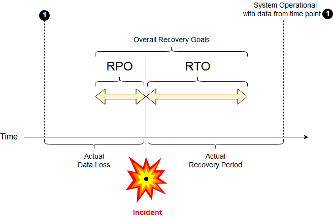
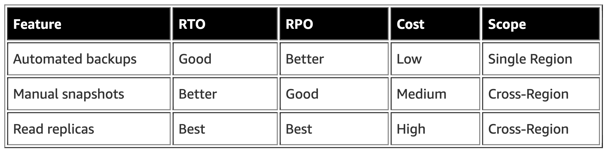

# DR

**Disaster Recovery (DR)** involves a set of policies, tools and procedures to enable the recovery or continuation of vital technology infrastructure and systems following a natural or human-induced disaster.

# RTO

The **Recovery Time Objective (RTO)** represents how many hours it takes you to return to a working state after a disaster. RTO is the targeted duration of time and a service level within which a business process must be restored after a disaster (or disruption) in order to avoid unacceptable consequences associated with a break in business continuity.

### **Recovery Time Actual**

It is Recovery Time Actual (RTA) which is "the critical metric for business continuity and disaster recovery."

RTA is established during exercises or actual events. The business continuity group times rehearsals (or actuals) and makes needed refinements.

# RPO

A **Recovery Point Objective** **(RPO)**, which is also expressed in hours, represents how much data you could lose when a disaster happens. For example, an RPO of 1 hour means that you could lose up to 1 hour’s worth of data when a disaster occurs. RPO is the maximum targeted period in which [data](https://en.wikipedia.org/wiki/Data) (transactions) might be lost from an IT service due to a major incident.

If RPO is measured in minutes (or even a few hours), then in practice, off-site mirrored backups must be [continuously maintained](https://en.wikipedia.org/wiki/Continuous_data_protection); a daily off-site backup on tape will not suffice.

# AWS RDS

# References

[Implementing a disaster recovery strategy with Amazon RDS | Amazon Web Services](https://aws.amazon.com/blogs/database/implementing-a-disaster-recovery-strategy-with-amazon-rds/)

[Disaster recovery](https://en.wikipedia.org/wiki/Disaster_recovery)