# Database Normalization

Database Normalization is a systematic approach of decomposing tables to eliminate data redundancy(repetition) and undesirable characteristics like Insertion, Update and Deletion Anomalies.

Normalization is used for mainly two purposes,

- Eliminating redundant(useless) data.
- Ensuring data dependencies make sense i.e data is logically stored.

# Reasons

There are three main reasons to normalize a database. The first is to minimize duplicate data, the second is to minimize or avoid data modification issues, and the third is to simplify queries.

Consider the following table:

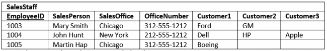
The first thing to notice is this table serves many purposes including:

1. Identifying the organization’s salespeople
2. Listing the sales offices and phone numbers
3. Associating a salesperson with an sales office
4. Showing each salesperson’s customers

As a DBA this raises a red flag. In general I like to see tables that have one purpose. Having the table serve many purposes introduces many of the challenges; namely, data duplication, data update issues, and increased effort to query data.

## Data Duplication and Modification Anomalies

Notice that for each SalesPerson we have listed both the SalesOffice and OfficeNumber. There is duplicate sales person data. Duplicated information presents two problems:

1. It increases storage and decrease performance.
2. It becomes more difficult to maintain data changes.

For example:

Consider if we move the Chicago office to Evanston, IL. To properly reflect this in our table, we need to update the entries for all the SalesPersons currently in Chicago. Our table is a small example, but you can see if it were larger, that potentially this could involve hundreds of updates.

These situations are modification anomalies. Database normalization fixes them. 

There are three modification anomalies that can occur:

### Insert Anomaly

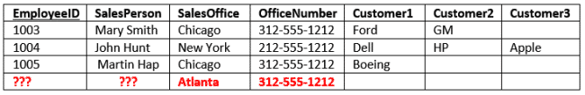
There are facts we cannot record until we know information for the entire row. In our example we cannot record a new sales office until we also know the sales person. Why? Because in order to create the record, we need provide a primary key. In our case this is the EmployeeID.

### Update Anomaly

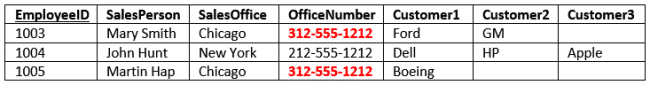
In this case we have the same information in several rows. For instance if the office number changes, then there are multiple updates that need to be made. If we don’t update all rows, then inconsistencies appear.

### Deletion Anomaly

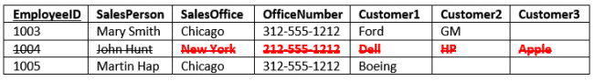
Deletion of a row causes removal of more than one set of facts. For instance, if John Hunt retires, then deleting that row cause us to lose information about the New York office.

## Search and Sort Issues

The last reason we’ll consider is making it easier to search and sort your data. In the SalesStaff table if you want to search for a specific customer such as Ford, you would have to write a query like

    SELECT SalesOffice
    FROM SalesStaff
    WHERE Customer1 = ‘Ford’ OR
          Customer2 = ‘Ford’ OR
          Customer3 = ‘Ford’

Clearly if the customer were somehow in one column our query would be simpler. Also, consider if you want to run a query *and* sort by customer.

# First Normal Form

## Rule

### **Rule 1: Single Valued Attributes**

Each column of your table should be single valued which means they should not contain multiple values.

### **Rule 2: Attribute Domain should not change**

This is more of a "Common Sense" rule. In each column the values stored must be of the same kind or type.

**For example:** If you have a column `dob` to save date of births of a set of people, then you cannot or you must not save 'names' of some of them in that column along with 'date of birth' of others in that column. It should hold only 'date of birth' for all the records/rows.

### **Rule 3: Unique name for Attributes/Columns**

This rule expects that each column in a table should have a unique name.

### **Rule 4: Order doesn't matters**

This rule says that the order in which you store the data in your table doesn't matter.

## Example

### Before

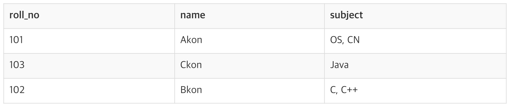
Our table already satisfies 3 rules out of the 4 rules, as all our column names are unique, we have stored data in the order we wanted to and we have not inter-mixed different type of data in columns.

But 2 students have opted for more than 1 subject. And we have stored the subject names in a single column. But as per the 1st Normal form each column must contain atomic value.

### After

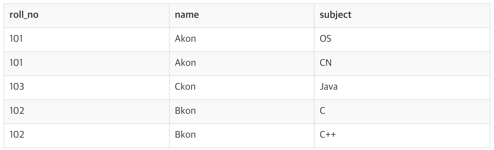
By doing so, although a few values are getting repeated but values for the `subject` column are now atomic for each record/row.

Using the First Normal Form, data redundancy increases, as there will be many columns with same data in multiple rows but each row as a whole will be unique.

# Second Normal Form

## Rule

1. The table should be in the First Normal Form.
2. There should be no Partial Dependency.

## Partial dependency

Partial Dependency is where an attribute in a table depends on only a part of the **primary key** and not on the whole key.

## Example

### Before

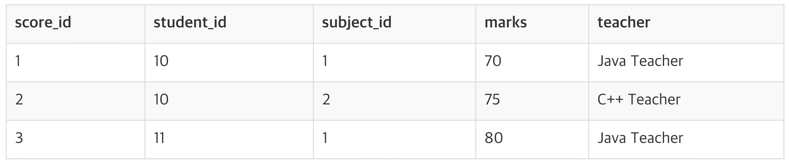
Together, student_id + subject_id forms a **Candidate Key** for this table, which can be the **Primary key**.

The teacher's name only depends on subject, hence the `subject_id`, and has nothing to do with `student_id`. This is **Partial Dependency**,

### After

There can be many different solutions for this, but our objective is to remove teacher's name from Score table.

The simplest solution is to remove columns `teacher` from Score table and add it to the Subject table.

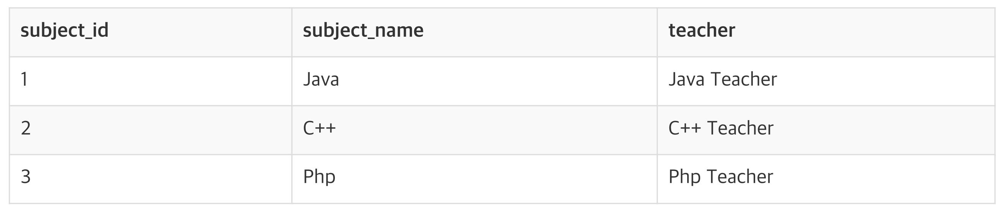
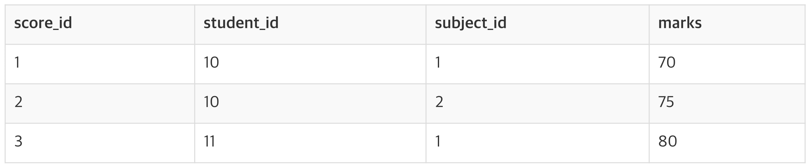
# Third Normal Form

## Rule

1. It should be in the Second Normal form.
2. And it should not have Transitive Dependency.

## Transitive Dependency

Transitive Dependency is when a non-prime attribute depends on other non-prime attributes rather than depending upon the prime attributes or primary key.

## Example

### Before

In the Score table, we need to store some more information, which is the exam name and total marks, so let's add 2 more columns to the Score table.

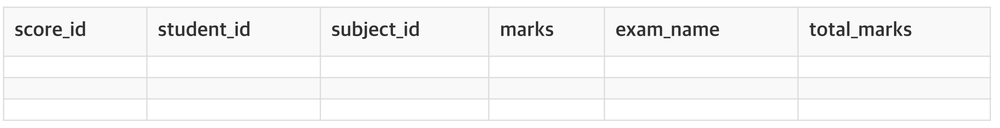
### After

The column `total_marks` depends on `exam_name` as with exam type the total score changes. For example, practicals are of less marks while theory exams are of more marks.

But, `exam_name` is just another column in the score table. It is not a primary key or even a part of the primary key, and `total_marks` depends on it.

The solution is very simple. Take out the columns exam_name and total_marks from Score table and put them in an Exam table and use the exam_id wherever required.

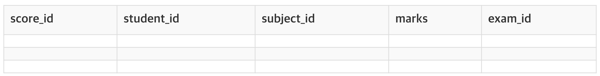
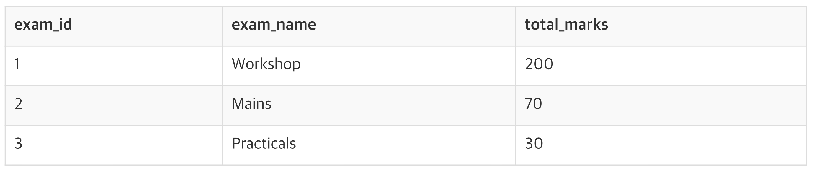
# References

[Database Normalization (Explained in Simple English) - Essential SQL](https://www.essentialsql.com/get-ready-to-learn-sql-database-normalization-explained-in-simple-english/)

[1NF, 2NF, 3NF and BCNF in Database Normalization | Studytonight](https://www.studytonight.com/dbms/database-normalization.php)

[First Normal Form (1NF) of Database Normalization | Studytonight](https://www.studytonight.com/dbms/first-normal-form.php)

[Second Normal Form (2NF) of Database Normalization | Studytonight](https://www.studytonight.com/dbms/second-normal-form.php)

[Second Normal Form (2NF) of Database Normalization | Studytonight](https://www.studytonight.com/dbms/second-normal-form.php)

[What is Normalization? 1NF, 2NF, 3NF & BCNF with Examples](https://www.guru99.com/database-normalization.html)