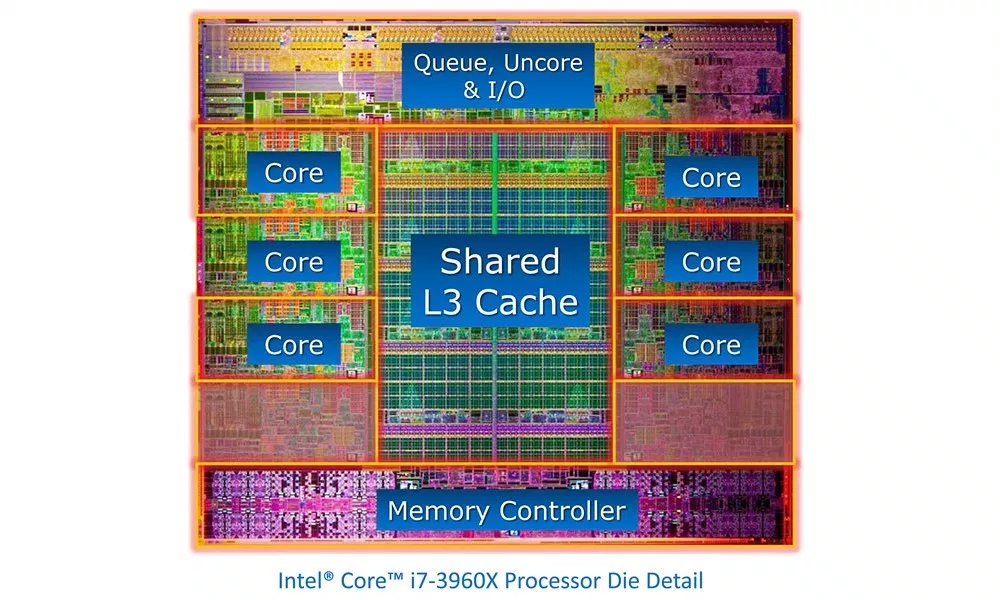
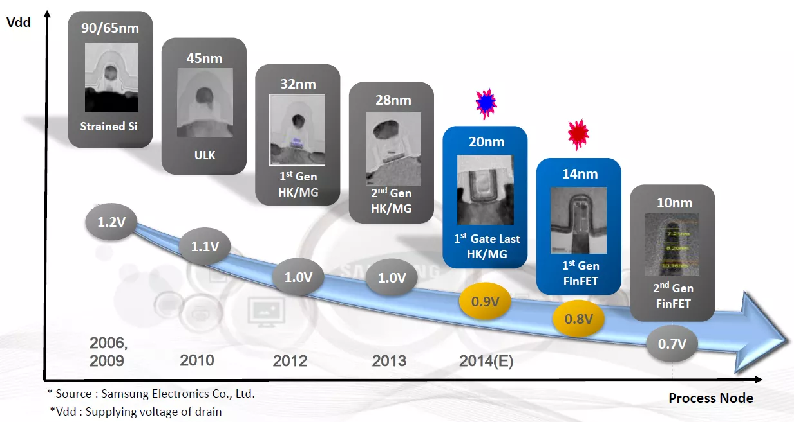

# Die shrink

**Die shrink**, also called **optical shrink** or **process shrink**, refers to semiconductor scaling of semiconductor devices, specifically transistors. “Shrinking a die” is to create an identical circuit using advanced fabrication processes.

# Die or bare chip

Die(다이)란 어떤 기본이 되는 밑판을 의미한다. 반도체에서 Bare chip상의 패턴들이나 혹은 Bare chip 그 자체를 지칭하는 용어로 많이 사용된다.

반도체에서의 사전적인 정의로 Die는 Wafer상에서 개별적으로 잘라낸(sawing)한 하나하나의 IC 원판을 의미하게 된다.

Bare chip과 거의 유사한 뜻이지만, 실제로 사용되는 경우는 조금 다르다. Bare chip이란 용어는 아직 패키징을 하지 않은 상태에 중점을 둔 용어이고, Die란 용어는 Wafer에서 잘라낸 개별 소자라는 의미에 중점을 둔 것이다.

보통 반도체를 위에서 바라본 패턴(찍힌 형상)을 얘기할 때는 Die상의 패턴이라고 하지 bare chip상의 패턴이라고 하진 않는다.

이런 용어가 분류된 큰 이유중 하나는, 반도체 공정에서 화합물 공정과 패키징은 완전히 분리된 작업이기 때문이다. 반도체 공정 쪽에서 회로 모양이 제대로 찍혔느냐라는 관점에서 개별칩을 지칭할 때는 Die란 용어를, 패키징의 관점에서 아직 패키징하지 않은 개별 칩을 말할 때는 bare chip이라는 용어를 사용하는 경향이 있다.

# Process size

In this context, “process” is used to describe the fabrication process rather than the computer’s processor. It’s about how the chip gets made, not what it can do. The size of the process node, measured in nanometers, describes the size of a processor’s smallest possible element.

Imagine it like this: If a processor’s design is a digital image, the size of one “pixel” would be the process size. For example, on Intel’s current process, the smallest possible element is 14 nanometers, or 14nm. The smaller the process, the greater the resolution that can be obtained. As a result, fabricators can make transistors and other components smaller. This means that more transistors can be crammed into a smaller physical space. This provides some major benefits as well as a couple downsides.

# Advantages of die shrink

- More transistors in a given space.
- Increases in computational parallelism and cache sizes.
- lower capacitance, allowing transistors to turn on and off more quickly while using less energy.
- The faster a transistor can toggle on and off, the faster it can do work.
- Reduces the operating power, or “dynamic power consumption,” required by a processor.
- A chip with lower dynamic power consumption will drain batteries more slowly, cost less to run, and be more ecologically friendly.
- Per-die costs drop significantly.

# Disadvantages of die shrink

- harder to make.
- Some chips won’t be able to run at top speed, and these chips will get “binned,” or labelled, as chips with lower clock speeds or smaller caches. Smaller processes generally have more chips binned at lower clock speeds.
- Smaller transistors also have greater “leakage.” Leakage is a measurement of how much current a transistor allows through when in the “off” position. This means that as leakage increases, so does the static power consumption or the amount of power a transistor consumes while idle.

# History

Intel’s first Pentium CPU was released using a 0.8 micrometer (μm) manufacturing process.

Intel’s 14 nm microarchitecture is called Kaby Lake and includes the “7th Gen” 7000 series of processors. Kaby Lake was originally meant to be a die shrink, but due to the growing amount of hurdles that comes with dealing with continually decreasing sizes, Kaby Lake was instead optimized at the 14 nm level.

# Reference

[Die (다이)](https://toparadic.tistory.com/203)

[What Is a Processor's Process Size and Why Does It Matter? - Make Tech Easier](https://www.maketecheasier.com/processors-process-size/)

[What is a CPU Die Shrink and What Does it Mean for the Future?](https://blog.exxactcorp.com/cpu-die-shrink-mean-future/)