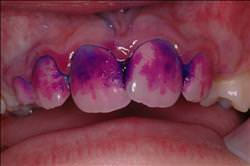
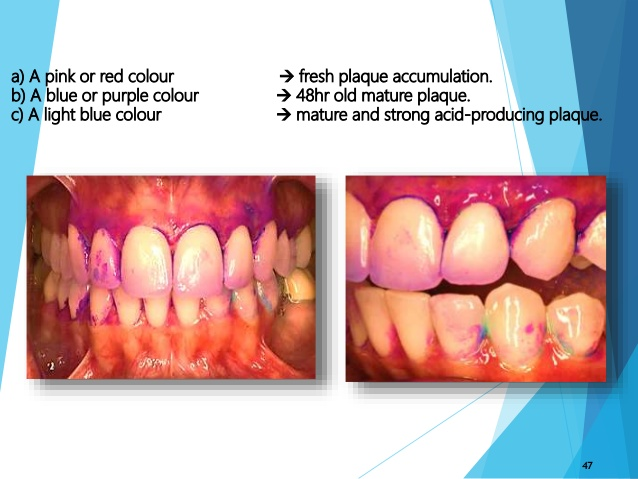

# Disclosing agent

A disclosing agent(치면착색제) is a dye in liquid or tablet form that colors the teeth to show plaque.

# Types

A **tablet** is thoroughly chewed and swished around the teeth and gums for maximum coverage and then rinsed out. Alternatively, **solution** is painted on to the teeth using a cotton bud then rinsed away with a mouthful of water. Solution is the agent of choice as it is quick and easy and works better than the tablets. These agents are quite harmless and contain a vegetable dye that stains any areas of plaque on your teeth. Any areas of the mouth remaining pink or blue after rinsing are places plaque is present.

# Usage

Because plaque is forming continuously on the teeth a light pink stain may show up. This is okay. You are looking for dark or thick pink staining which indicates plaque has been present for longer than 12 hours. This thick plaque will lead to cavities forming and inflammation of the gums; the start of gum disease. Use your disclosing agent before brushing your teeth to see exactly where the plaque is or after brushing to see the places you missed. If you use it regularly you will soon discover the plaque spots you frequently miss.

Eventually, your brushing skill will improve to the point where you will be able to brush all the plaque away without the use of a plaque disclosing agent. Disclosing agents are available from the chemist. Please supervise the use of disclosing agents as it can stain clothing.

# Mechanism

Disclosing agents work by changing the color of dental plaque so that it contrasts with the white tooth surface. Dental plaque has the ability to retain a large number of dye substances which can be used for disclosing purposes. This property is related to interaction, because of the polarity difference between the components of plaque and dyes. The particles are bound to the surface of electrostatic interaction(proteins) and hydrogen bonds(polysaccharides).

# Meanings

# References

[Disclosing Solution](http://www.kidz-teeth.com/patient-education/preventive-care-for-children/disclosing-solution)

[PLAQUE DISCLOSING AGENTS](https://www.slideshare.net/drpoonamdholakia/plaque-disclosing-agents)

[퓨어덴탈](http://www.puredental.co.kr/inc/?ty=0&ct=3&v=128)