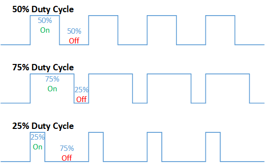
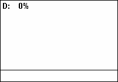
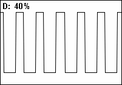
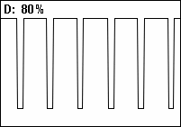
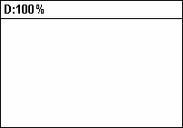

# Duty cycle

A **duty cycle** or **power cycle** is the fraction of one [period](https://en.wikipedia.org/wiki/Frequency) in which a signal or system is active.

 Duty cycle is commonly expressed as a percentage or a ratio. A **period** is the time it takes for a signal to complete an on-and-off [cycle](https://en.wikipedia.org/wiki/Turn_(geometry)). As a formula, a **duty cycle (%)** may be expressed as:

[https://wikimedia.org/api/rest_v1/media/math/render/svg/897969e05008873bbb057d62cfe074f2fc7ef511](https://wikimedia.org/api/rest_v1/media/math/render/svg/897969e05008873bbb057d62cfe074f2fc7ef511)

Equally, a **duty cycle (ratio)** may be expressed as:

[https://wikimedia.org/api/rest_v1/media/math/render/svg/5026ed7ee0beef6b4280d2013485823f8264f2ee](https://wikimedia.org/api/rest_v1/media/math/render/svg/5026ed7ee0beef6b4280d2013485823f8264f2ee)

where D is the duty cycle, PW is the **pulse width (pulse active time)**, and T is the total period of the signal. Thus, a 60% duty cycle means the signal is on 60% of the time but off 40% of the time.

The **duty factor** for periodic signal expresses the same notion, but is usually scaled to a maximum of one rather than 100%.