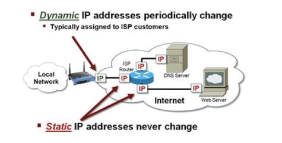

# Dynamic vs. Static IP

A static IP address, or **fixed IP address**, is an IP address that never changes, while a dynamic IP address does change.

# How a dynamic IP works

Internet service providers (ISP) traditionally assign all their IP address to customers dynamically. This is due to historical shortages of available IP numbers. Dynamic IP addresses are assigned not manually but automatically, by **DHCP (Dynamic Host Configuration Protocol)**.

# When a dynamic IP changes

컴퓨터가 켜져있는 동안에 IP주소 255.111.123.1(임의의 공인 IP주소)를 할당받았다면 분명 **임대주기가 존재**합니다. 임대주기는 회선마다 다르기는 한데 **제 회선의 경우 "10분"**입니다. 즉, 컴퓨터와 랜선이 연결되어 있어도 컴퓨터가 꺼져(**전원차단**)있다면 **10분뒤에 컴퓨터를 켜서 IP주소를 확인하면 IP주소가 변경되어 집니다.**

위에서 "**컴퓨터가 켜져있는한, 임대 유지**" 라는 부분이 핵심인데, 공유기에 물려 있고 공유기 전원이 꺼지거나, 랜선을 10분이상 뺏다가 다시 꼽지 않는 경우에는**같은 IP주소로 유지가 된다는 점**에 있습니다.

# When you need a static IP

Static IP addresses are necessary for devices that need constant access.

- Setting up a home file [server](https://www.lifewire.com/servers-in-computer-networking-817380)
- Adding a second [router](https://www.lifewire.com/what-is-a-router-2618162) to a network
- Enabling access to a computer when away from home/work
- [Forwarding ports](https://www.lifewire.com/how-to-port-forward-4163829) to certain devices
- Sharing a printer over a network
- Connecting to an IP camera when away from home

# Static IP Address Assignment on Home Networks

You can have a static IP address for your home network. When making static IP assignments for local devices on home and other private networks, the address numbers should be chosen from the private IP address ranges defined by the Internet Protocol standard:

- 10.0.0.0–10.255.255.255
- 172.16.0.0–172.31.255.255
- 192.168.0.0–192.168.255.255 (이 대역이 일반적인 인터넷 공유기 환경에서 사용하는 대역입니다.)

To choose and set specific static IP addresses suitable for your network, follow these guidelines.

- Do not choose any addresses that end with ".0" or ".255." These addresses are usually reserved for use by [network protocols](https://www.lifewire.com/definition-of-protocol-network-817949).
- Do not choose the addresses at the beginning of a private range. Addresses like [10.0.0.1](https://www.lifewire.com/10-0-0-1-818065) and [192.168.0.1](https://www.lifewire.com/192-168-0-1-818066) are commonly used by network routers and other consumer devices. These are the first addresses hackers attack when trying to break into a private computer network.
- Don't choose an IP address that falls outside the range of your local network. For example, to support all addresses in the 10.x.x.x private range, the [subnet](https://www.lifewire.com/what-is-subnet-818392)mask on all devices must be set to 255.0.0.0. If they aren't, some static IP addresses in this range don't work.

# Price

Contact your service provider if you prefer a static IP address; you can't get yourself a

[public IP address](https://www.lifewire.com/what-is-a-public-ip-address-2625974) that's static without requesting it from your ISP. Customers can sometimes obtain a static IP by subscribing to a special service plan and paying extra fees.

# Reference

[개인서버에서 유동 IP를 고정IP처럼 (DDNS 아님)](https://studyforus.tistory.com/137)

[Static vs. Dynamic IP Addresses](https://www.lifewire.com/using-static-ip-address-on-private-computer-818404)

[아이피 주소](http://easympd.com/tips/0024_others.php)

[고정아이피 쓸 수 있는지 문의 : 백메가](https://www.100mb.kr/bbs/board.php?bo_table=customer&wr_id=221874)

[KT 비즈올레에 오신 것을 환영합니다.::](http://ktbiznet.co.kr/sub02/2_3.php#none)