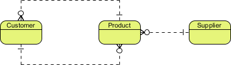

# ERD

Entity Relationship Diagram, also known as ERD, ER Diagram or ER model, is a type of structural diagram for use in database design. An ERD contains different symbols and connectors that visualize two important information: **The major entities within the system scope**, and the **inter-relationships among these entities**. And that's why it's called "Entity" "Relationship" diagram (ERD)!

# Entity

An ERD entity is a definable thing or concept within a system, such as a person/role (e.g. Student), object (e.g. Invoice), concept (e.g. Profile) or event (e.g. Transaction) When determining entities, think of them as nouns.

## Entity Attributes

Also known as a **column**, an attribute is a property or characteristic of the entity that holds it.

## Primary Key

Also known as PK, a primary key is a special kind of entity attribute that uniquely defines a record in a database table.

## Foreign Key

Also known as FK, a foreign key is a reference to a primary key in a table.

# Relationship

**Cardinality** defines the possible number of occurrences in one entity which is associated with the number of occurrences in another. For example, ONE team has MANY players. When present in an ERD, the entity Team and Player are inter-connected with a one-to-many relationship.

In an ER diagram, cardinality is represented as a crow's foot at the connector's ends. The three common cardinal relationships are one-to-one, one-to-many, and many-to-many.

## One-to-One cardinality example

A one-to-one relationship is mostly used to split an entity in two to provide information concisely and make it more understandable.

## One-to-Many cardinality example

A one-to-many relationship refers to the relationship between two entities X and Y in which an instance of X may be linked to many instances of Y, but an instance of Y is linked to only one instance of X. The figure below shows an example of a one-to-many relationship.

## Many-to-Many cardinality example

A many-to-many relationship refers to the relationship between two entities X and Y in which X may be linked to many instances of Y and vice versa. Note that a many-to-many relationship is split into a pair of one-to-many relationships in a physical ERD.

# Conceptual, Logical and Physical data models

An ER model is typically drawn at up to three levels of abstraction:

- [Conceptual ERD / Conceptual data model](https://www.visual-paradigm.com/guide/data-modeling/what-is-entity-relationship-diagram/#erd-data-models-conceptual)
- [Logical ERD / Logical data model](https://www.visual-paradigm.com/guide/data-modeling/what-is-entity-relationship-diagram/#erd-data-models-logical)
- [Physical ERD / Physical data model](https://www.visual-paradigm.com/guide/data-modeling/what-is-entity-relationship-diagram/#erd-data-models-physical)

A general understanding to the three data models is that business analyst uses a conceptual and logical model to model the business objects exist in the system, while database designer or database engineer elaborates the conceptual and logical ER model to produce the physical model that presents the physical database structure ready for database creation.

## Conceptual data model

Conceptual ERD models the business objects that should exist in a system and the relationships between them. A conceptual model is developed to present an overall picture of the system by recognizing the business objects involved. For example, 'many to many' tables may exist in a logical or physical data model but they are just shown as a relationship with no cardinality under the conceptual data model.

Conceptual ERD supports the use of generalization in modeling the 'a kind of' relationship between two entities, for instance, Triangle, is a kind of Shape. The usage is like generalization in UML. Notice that only conceptual ERD supports generalization.

## Logical data model

Logical ERD is a detailed version of a Conceptual ERD.

## Physical data model

Physical ERD represents the actual design blueprint of a relational database. A physical data model elaborates on the logical data model by assigning each column with type, length, nullable, etc. Make sure the column types are supported by the DBMS and reserved words are not used in naming entities and columns.

# Examples

## Movie Rental System

# References

[What is Entity Relationship Diagram (ERD)?](https://www.visual-paradigm.com/guide/data-modeling/what-is-entity-relationship-diagram/)