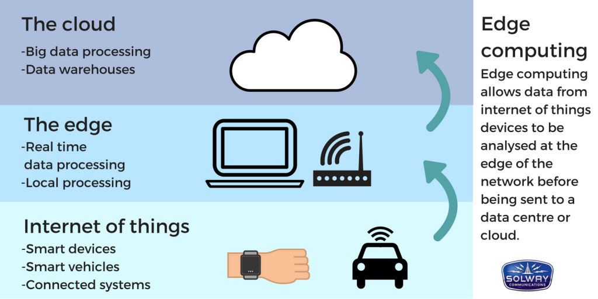
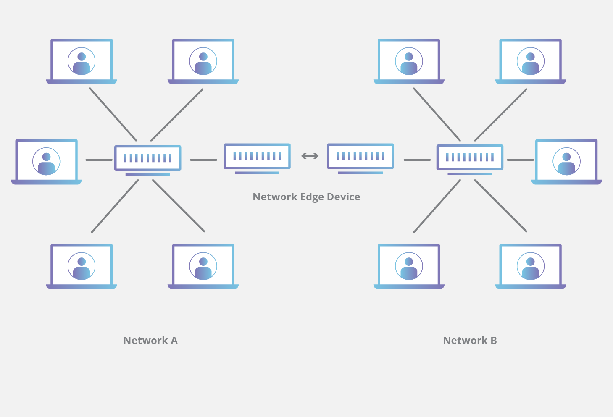
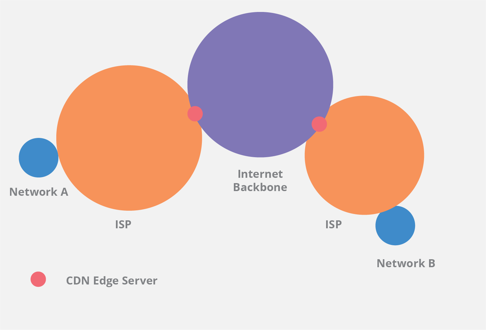

# Edge computing

Edge computing is a distributed computing paradigm focused on bringing computing as close to the source of data as possible in order to reduce latency and bandwidth use. Edge computing pushes applications, data and computing power (services) away from centralized points to locations closer to the user.

# Edge server

An edge server is any server that resides on the “edge” between two networks. The **edge** is a bit of a fuzzy term; for example a user’s computer or the processor inside of an IoT camera can be considered the network edge, but the user’s router, ISP, or local edge server are also considered the edge.

Edge servers can serve different purposes depending on the context.

- Security Context: This is usually a firewall, router, or similar device that secures the network by monitoring all traffic coming in for anything dangerous and blocking anything dangerous or not allowed.
- Application Context: This is generally to do with load balancing or in the case of DNS based load balancing the front end web servers themselves that sit between the internet and the back end data.
- Content Distribution Context: This one is a special case where the term “edge server” is used extremely often. In the above context’s those are examples of things that “can” be called edge servers but that also have their own names which are more commonly used. In a **Content Distribution Network (CDN) “edge servers”** which are basically large web servers which serve static content, are located all over the world on as many networks as possible in order to move the static content as close to the end user as possible. The reason why these are edge servers is that from the main network through to each of those servers the traffic passes over the companies' private network but once it hits that server it is exposed to the outside world.

# vs. Cloud computing

In contrast to cloud computing, edge computing refers to decentralized data processing at the edge of the network. Edge computing means running fewer processes in the cloud and moving those processes to local places, such as on a user’s computer, an IoT device, or an **edge server**. The target of edge computing is any application or general functionality needing to be closer to the source of the action. 

# Reference

[What Is Edge Computing? | Cloudflare](https://www.cloudflare.com/learning/serverless/glossary/what-is-edge-computing/)

[Edge computing - Wikipedia](https://en.wikipedia.org/wiki/Edge_computing)

[What is a CDN edge server? | Cloudflare](https://www.cloudflare.com/learning/cdn/glossary/edge-server/)