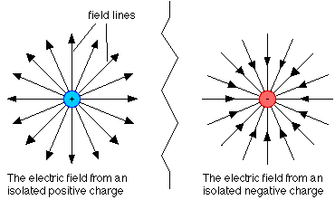

# Electric Field

- An electric charge is a property of matter that causes two objects to attract or repel depending on their charges (positive or negative).
- An electric field is a region of space around an electrically charged particle or object in which an electric charge would feel force.
- An electric field is a vector quantity and can be visualized as arrows going toward or away from charges. The lines are defined as pointing *radially outward*, away from a positive charge, or *radially inward*, toward a negative charge.

# Electric field vs. electric force

Electric field E at a point in space is defined to be the amount of electric force per charge exerted at that point in space.

# Electric field of two point charges

For two point charges, F is given by Coulomb’s law.

$$F = (k|q_1q_2|)/r^2$$

where q_2 is defined as the **test charge** that is being used to “feel” the electric field.

We then use the electric field formula to obtain E = F/q_2, since q_2 has been defined as the test charge.

After substituting for F

$$E = (k|q_1|)/r^2$$

# References

[What Is an Electric Field?](https://www.thoughtco.com/electric-field-4174366)

[Electric field definition](https://www.khanacademy.org/video/electric-field-definition)

