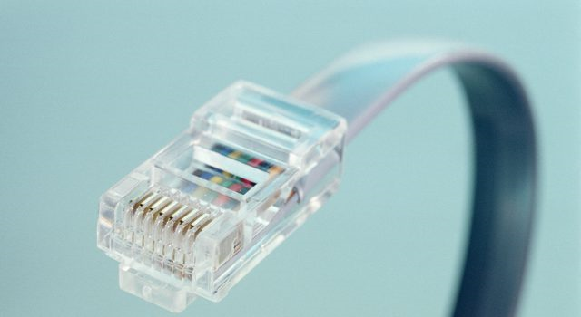
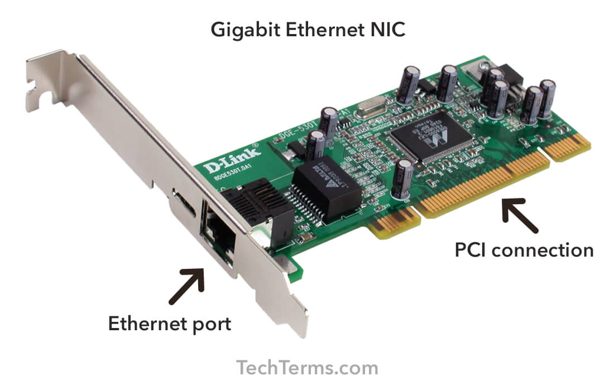

# Ethernet

Ethernet(IEEE 802.3) is the most widely used local area network (LAN) technology, that defines wiring and signaling standards for the physical layer of TCP/IP with a protocol called Carrier Sense Multiple Access with Collision Detection (CSMA/CD).

# Terminology

The basic terminologies used in the Ethernet are (a) Node, (b) Medium, (s) Segment and (d) Frame. When the Ethernet devices are connected, they make a LAN.

## Node

The nodes are the devices like computers, routers, and peripheral devices that communicate through Ethernet.

## Medium

The medium is the path used by the devices to communicate. In Ethernet, the medium can be a coaxial cable, twisted pair cable (RJ-45), or it can be a fiber optics cable.

## Segment

The segment is the shared medium (i.e. the single path /cable) that is being shared by the network devices.

## Frame

The frame is the short message shared over the network.

# CSMA/CD

The CSMA/CD is the most widely used Ethernet protocol. The purpose of this protocol is to handle the discarded, lost, or corrupted packets. 

In Ethernet, as mentioned earlier, the network devices wait for the free path to transmit the messages (frames) over the network. When there is no device transmitting data over the medium, the waiting device takes the opportunity to transmit the data. If two devices transmit the messages at the same time, a collision occurs and the messages (frames) are discarded. The CSMA/CD protocol is used to prevent the data loss from such collisions.

# NIC

A network interface controller (NIC, also known as a network interface card, network adapter, LAN adapter or physical network interface, and by similar terms) implements the electronic circuitry required to communicate using a specific physical layer and data link layer standard such as Ethernet or Wi-Fi.

# With Wi-Fi

IEEE 802.3 is the signaling standards for Ethernet, and IEEE 802.11 is the standards for Wi-Fi. With the prosperity of Internet, Wi-Fi, the wireless LAN technology standardized by IEEE 802.11, is used in hybrid with Ethernet LAN to offer portability.

# Versions

Ethernet was originally standardized as IEEE 802.3 with a data transmission rate of 10 Mb/s. Newer versions of Ethernet were introduced lately to offer higher data rates. Fast Ethernet and Gigabit Ethernet support data rates of 100 Mbps and 1 Gbps (1000 Mbps) respectively. An Ethernet LAN may use coaxial cable (10Base2), unshielded twisted pair wiring (10BaseT, 100BaseT and 1000BaseT), or fiber optic cable.

Ethernet devices are backward compatible. For instance, a computer device with 10BASE-T Network Interface Card (NIC) connects to the 100BASE-T medium, the communication is carried out at 10 Mbps speed. Similarly, when a network device with 100BASE-T NIC is connected to a 1000BASE-T medium, the communication speed is limited to 100 Mbps.

# Limitations

## Cable length matters

Since the Ethernet operates on a shared cable, the length of the cable matters a lot in the performance of the network. If the cable length is long, the signals may drop and the network performance may not be up to the mark. 

## Collision of signals

Similarly, the Ethernet devices wait for their turn to transmit the signals. This not only cause delay in communication but also cause the data loss due to the collision of the signals.

# Reference

[https://m.youtube.com/watch?v=HLziLmaYsO0&feature=youtu.be](https://m.youtube.com/watch?v=HLziLmaYsO0&feature=youtu.be)

[What is Ethernet?](https://www.iplocation.net/ethernet)