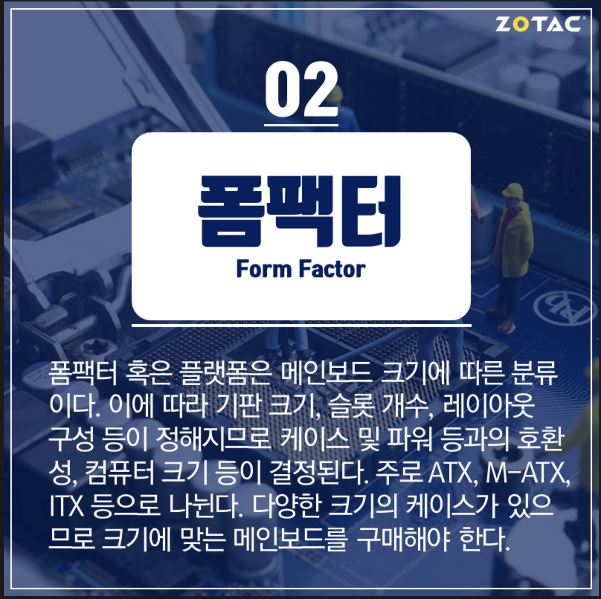

# Form factor

Form factor is an aspect of hardware design which defines and prescribes the size, shape, and other physical specifications of components. It is usually highlighted by a prominent feature, such as a QWERTY keyboard, a touch-screen or the way the device opens and closes. The term is used to specify the size, configuration or physical arrangement and specifications of device hardware, along with some focus on its internal components.

# For a motherboard

In the terms of a motherboard, the form factor would refer to the kind of hardware peripherals it can support and also somewhat defines the structure of the motherboard. It may also highlight some ad hoc standards that fall under that particular form factor. Examples of motherboard form factors include the ATX and micro-ATX form factors.

Because motherboards follow a certain standard or form factor, it’s easy to look for a replacement; the user just has to look for one that follows the same form factor.

# For a cell phone

For cell phones, form factor would refer to the overall design and shape of the phone, such as the traditional candy bar form, which differs from the flip and slide form factors. Today’s phones mostly have a face dominated by a touchscreen, a form factor known as the slate form factor.

# Reference

[What is a Form Factor? - Definition from Techopedia](https://www.techopedia.com/definition/2201/form-factor)

[[포켓 IT 용어사전] 메인보드 (폼팩터, 칩셋, 소켓, 슬롯, PCIe 등)](https://m.blog.naver.com/PostView.nhn?blogId=zotackr&logNo=221220048196&proxyReferer=https%3A%2F%2Fwww.google.com%2F)