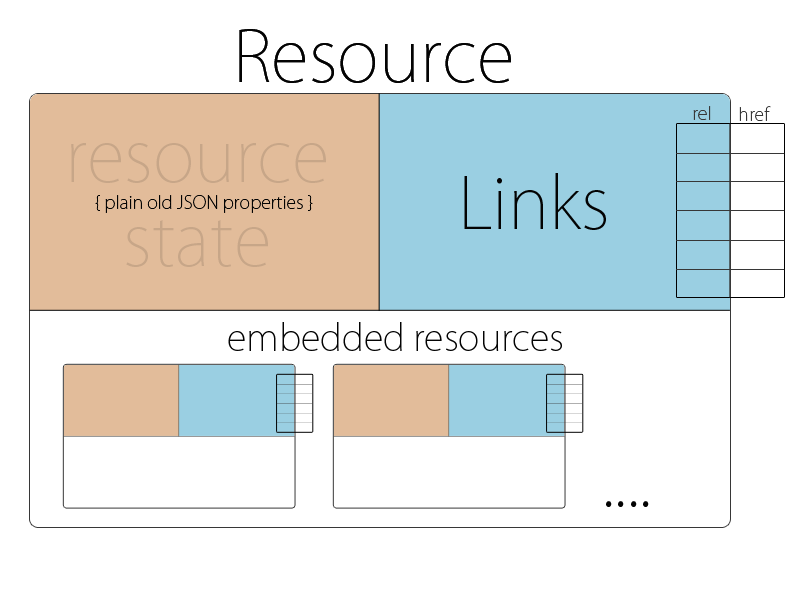

# HAL

HAL, short for "**Hypertext Application Language**", is an open specification describing a generic structure for RESTful resources. HAL is designed for building APIs in which clients navigate around the resources by following links. The standard was initially proposed on June 2012 specifically for use with JSON and has since become available in two variations, JSON and XML.

    {
      "_links": {
        "self": {
          "href": "http://example.com/api/book/hal-cookbook"
        }
      },
      "id": "hal-cookbook",
      "name": "HAL Cookbook"
    }

# Design: The HAL Model

HAL is structured in such a way as to represent elements based on two concepts: **Resources** and **Links**. The structure it proposes readily achieves the Richardson Maturity Model's Level 3 by ensuring that each resource contains relational links, and that a standard, identifiable structure exists for embedding other resources.

## Resources

Resources have:

- Links (to URIs)
- Embedded Resources (i.e. other resources contained within them)
- State (your bog standard JSON or XML data)

In most cases, resources should have a self URI

    {
        "_links": {
            "self": { "href": "/example_resource" }
        }
    }

## Links

Links have:

- A target (a URI)
- A relation aka. 'rel' (the name of the link)
- A few other optional properties to help with deprecation, content negotiation, etc.

Links must be contained directly within a resource. Links are represented as JSON object contained within a _links hash that must be a direct property of a resource object:

    {
        "_links": {
            "next": { "href": "/page=2" }
        }
    }

## CURIEs

"CURIE"s help providing links to resource documentation. HAL gives you a reserved link relation 'curies' which you can use to hint at the location of resource documentation.

    "_links": {
      "curies": [
        {
          "name": "doc",
          "href": "http://haltalk.herokuapp.com/docs/{rel}",
          "templated": true
        }
      ],
    
      "doc:latest-posts": {
        "href": "/posts/latest"
      }
    }

There can be multiple links in the 'curies' section. They come with a 'name' and a templated 'href' which must contain the `{rel}`placeholder.

Links in turn can then prefix their 'rel' with a CURIE name. Associating the `latest-posts` link with the `doc` documentation CURIE results in a link 'rel' set to `doc:latest-posts`.

To retrieve documentation about the `latest-posts` resource, the client will expand the associated CURIE link with the actual link's 'rel'. This would result in a URL `http://haltalk.herokuapp.com/docs/latest-posts` which is expected to return documentation about this resource.

# Convention

- The two associated MIME types are media type: `application/hal+xml` and media type: `application/hal+json`.
- The URI of the main resource being represented ('/orders') expressed with a self link
- The 'next' link pointing to the next page of orders
- A templated link called 'ea:find' for searching orders by id
- The multiple 'ea:admin' link objects contained in an array
- Two properties of the orders collection; 'currentlyProcessing' and 'shippedToday'
- Embedded order resources with their own links and properties
- The compact URI (curie) named 'ea' for expanding the name of the links to their documentation URL

# Example

The example below is how you might represent a collection of orders with `hal+json`.

    {
        "_links": {
            "self": { "href": "/orders" },
            "curies": [{ "name": "ea", "href": "http://example.com/docs/rels/{rel}", "templated": true }],
            "next": { "href": "/orders?page=2" },
            "ea:find": {
                "href": "/orders{?id}",
                "templated": true
            },
            "ea:admin": [{
                "href": "/admins/2",
                "title": "Fred"
            }, {
                "href": "/admins/5",
                "title": "Kate"
            }]
        },
        "currentlyProcessing": 14,
        "shippedToday": 20,
        "_embedded": {
            "ea:order": [{
                "_links": {
                    "self": { "href": "/orders/123" },
                    "ea:basket": { "href": "/baskets/98712" },
                    "ea:customer": { "href": "/customers/7809" }
                },
                "total": 30.00,
                "currency": "USD",
                "status": "shipped"
            }, {
                "_links": {
                    "self": { "href": "/orders/124" },
                    "ea:basket": { "href": "/baskets/97213" },
                    "ea:customer": { "href": "/customers/12369" }
                },
                "total": 20.00,
                "currency": "USD",
                "status": "processing"
            }]
        }
    }

# Reference

[The Hypertext Application Language](http://stateless.co/hal_specification.html)

[Hypertext Application Language - Wikipedia](https://en.wikipedia.org/wiki/Hypertext_Application_Language)

[Apigility](https://apigility.org/documentation/api-primer/halprimer)