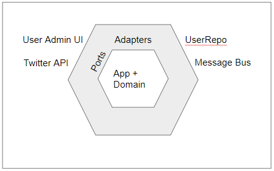

# Hexagonal Architecture

Hexagonal architecture is a model or pattern for designing software applications that put inputs and outputs at the edges of your design. In doing so, you isolate the **central logic (the core)** of your application from outside concerns. Having inputs and outputs at the edge means you can swap out their handlers without changing the core code.

Hexagonal architecture was proposed by Alistair Cockburn in 2005.

- I/O goes on the outside of the model.
- Adapters are in the gray area.
- The sides of the hexagons are the ports.
- Finally, the center is the application and domain.

# Ports and Adapters Pattern

“Hexagonal architecture” was actually the working name for the “ports and adapters pattern.” But the “hexagonal architecture” name stuck, and that’s the name many people know it by today.

Imagine a hexagon shape with another, larger hexagon shape around it. The center hexagon is the core of the application (the business and application logic).

The layer between the core and the outer hexagon is the adapter layer. And each side of the hexagon represents the ports.

The sides are simply representations in the model for ports. Alistair chose this flat-sided shape instead of a circle to convey a specific intent about ports.

# Ports

Ports are interfaces. An interface defines how one module communicates with another. An interface is an abstraction.

# Adapters

Adapters are where we want to think about the concrete implementation. This is how the message is either handled or passed along.

# Swappable Components

Hexagonal architecture is all about swapping components—specifically, external components.

# Test Drive

The bottom line is that you don’t need to rely on external factors to test your application. Instead, just make the core of the system interact through ports. This way, your test framework will drive the application through those ports. You could even use files and scripts to drive it instead!

# vs. Layered Architecture

Hexagonal architecture was a departure from layered architecture. It’s possible to use dependency injection and other techniques in layered architecture to enable testing. But there’s a key difference in the hexagonal model: The UI can be swapped out, too.

## Layers

Layers are logical separations in your code. Components are grouped in horizontal layers. Each layer has a specific function.

They are not tiers. And they do not require that all layers are physically separated. Additionally, layers don’t concern themselves with how your files are organized. (Though *you* probably should.)

Layers separate different responsibilities of your application.

## Benefits

- This is one of the most widely used architectures.
- Testing is easier, as each layer is encapsulated and modular.
- This is easy to extend

## Drawbacks

- The layered architecture is very database-centric. As mentioned before, since everything flows down, it’s often the database that’s the last layer. Critics of this architecture point out that your application isn’t about storing data; it’s about solving a business problem. However, when so many applications are simple CRUD apps, maybe the database is more than just a secondary player.
- Scaleability can be difficult with a layered architecture. This is tied to the fact that many layered applications tend to take on monolithic properties.
- A layered application is harder to evolve, as changes in requirements will often touch all layers.
- A layered architecture is deployed as a whole. That’s even if it’s modular and separated into good components and namespaces.

# Reference

[Hexagonal Architecture: What Is It and How Does It Work? - NDepend](https://blog.ndepend.com/hexagonal-architecture/)

[Layered Architecture: Still a Solid Approach - NDepend Blog](https://blog.ndepend.com/layered-architecture-solid-approach/)