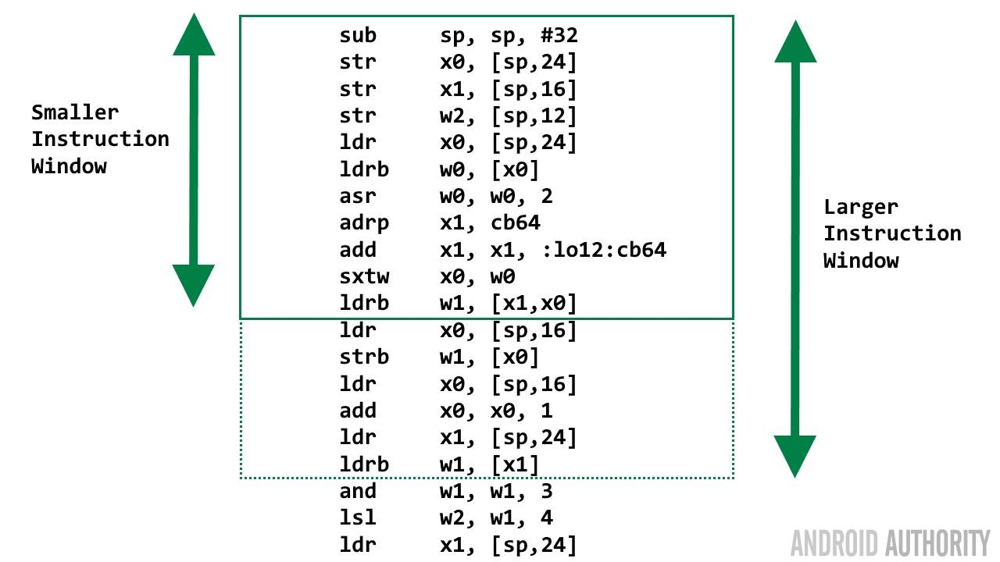

# IPC

IPC stands for **instructions per cycle/clock**. This tells you the average number of instructions executed for each clock cycle.

# Calculation

The calculation of IPC is done through running a set piece of code, calculating the number of machine-level instructions required to complete it, then using high-performance timers to calculate the number of clock cycles required to complete it on the actual hardware. The final result comes from dividing the number of instructions by the number of CPU clock cycles.

# CPU Design Factors

## Overview

Certain processor features tend to lead to designs that have higher-than-average IPC values; the presence of **multiple [arithmetic logic units](https://en.wikipedia.org/wiki/Arithmetic_logic_unit)** (an ALU is a processor subsystem that can perform elementary arithmetic and logical operations), and **short pipelines**. When comparing different [instruction sets](https://en.wikipedia.org/wiki/Instruction_set), a **simpler instruction set** may lead to a higher IPC figure than an implementation of a more complex instruction set using the same chip technology; however, the more complex instruction set may be able to achieve more useful work with fewer instructions.

A given level of instructions per second can be achieved with a high IPC and a low clock speed (like the AMD Athlon and early Intel's Core Series), or from a low IPC and high clock speed (like the Intel Pentium 4 and to a lesser extent the AMD Bulldozer). Both are valid processor designs, and the choice between the two is often dictated by history, engineering constraints, or marketing pressures. However, a high IPC with a high frequency will always give the best performance.

## Pipelining

### Sequential execution

The steps needed to execute an instruction can be broadly defined as: **fetch, decode, execute, and write-back**. So first the instruction needs to be fetched from memory. Then it needs to be decoded to find out what type of instruction it is. When the CPU knows what it needs to do it goes forward and executes the instruction. The resulting changes to the registers and status flags etc. are then written back, ready for the next instruction to be executed.

First a bit of history. Back in the day of 8-bit processors, and probably a bit after as well, all CPU instructions were **executed sequentially**. When one instruction was completed, the next instruction was executed and so on. 

So this means that it would take 4 clock cycles to execute an instruction, which is 0.25 instructions per clock. To get more performance you need to up the clock speed. That means that for these “simple” designs then the clock speed was the main factor influencing performance.

### Pipeline

if the processing of instructions can be split into different stages, into a pipeline, then four instructions can be on the assembly line (in the pipeline) simultaneously. Once the pipeline is full there is an instruction in the fetch stage, one in the decode stage, one in the execute stage, and one in the write-back stage.

The result of the pipeline approach is that now one instruction can be completed per clock cycle, bumping the IPC from 0.25 to 1.

The pipeline idea can be extended further to break down the instruction handling into more than just four stages. These **superpipelines** have the advantage that complex stages can be broken down into smaller bits. With shorter pipelines the slowest stage dictates the speed of the whole pipeline, making it a bottleneck. Any bottlenecks can be alleviated by turning one complex stage into several simpler, but faster, ones. For example, the ARM Cortex-A72 uses a 15 stage pipeline, while the Cortex-A73 uses an 11 stage pipeline.

## Multiple execution units

Any CPU instruction set has different classes of instructions. For example reading a value from memory is a different class of instruction than adding two integer numbers, which is in turn different to multiplying two floating point numbers, which is again different to testing if a condition is true, and so on.

Multiplying two floating point numbers is slower than adding two integers, or loading a value into a register. So the next step to improving performance is to split the **execution engine** into **separate units** which can run in parallel. This means that while a slow floating point multiply is occurring then a quick integer operation can also be dispatched and completed. Since there are now two instructions in the execute engine this is known as **instruction-level parallelism (ILP)**.

When applied across the pipeline it means that these **superscalar processors** can have multiple decode units as well as multiple **execution units**. What is interesting is that the parallelism doesn’t need to be confined to different classes of instructions, but there can also be two load/store units, or two floating point engines and so on. The more execution units the greater the ILP. The greater the ILP the higher the performance.

The length of the pipeline is sometimes referred to as the **processors depth**, while its ILP capabilities are known as its **width**. Deep and wide seems to offer a lot of performance benefits. A wide CPU can complete more than one instruction per cycle. So we started at an IPC of 0.25. That went up to 1 and now it can be anywhere from 2 to 8 depending on the CPU.

## Challenges

### ILP Wall

At first glance it would seem that creating the deepest and widest processor possible would yield the highest performance gains. However there are some limitations. Instruction level parallelism is only possible if one instruction doesn’t depend on the result of the next. Here is a simplified example:

> x = y * 3.14;
> z = x + 2;

When compiled into machine code the instructions for the multiplication have to occur first and then the add. While the compiler could make some optimizations, if they are presented to the CPU in the order written by the programmer then the add instructions can’t occur until after the multiply. That means that even with multiple execution units the integer unit can’t be used until the floating point unit has done its job.

This creates what is called **a bubble, a hiccup in the pipeline**. This means that the IPC will drop, in fact it is very rare (if not impossible) that a CPU will run at its full theoretical IPC. This means that ILP also has practical limitations, often referred to as the **ILP Wall**.

### Branching

There is also another problem with ILP. Computer programs aren’t linear. In fact they jump about all over the place. As you tap on the user interface in an app the program needs to jump to one place or another to execute the relevant code. Also things like loops cause the CPU to jump, backwards to repeat the same section of code, again and again, and then to jump out of the loop when it completes.

The problem with branching is that the pipeline is being filled preemptively with the next set of instructions. When the CPU branches then all the instructions in the pipeline could be the wrong ones! This means that the pipeline needs to be emptied and re-filled. To minimize this the CPU needs to predict what will happen at the next branch. This is called **branch prediction**. The better the branch prediction the better the performance.

## Out of order

“Out of order” means that something was done in a different sequence than originally specified. Since there can be bubbles in the pipeline then it would be good if the CPU could scan ahead and see if there are any instructions it could use to fill those gaps. Of course this means that the instructions aren’t being executed in the order specified by the programmer (and the compiler).

This is OK, as long as the CPU can guarantee that executing the instructions in a different order won’t alter the functionality of the program. To do this the CPU needs to run **dependency analysis** on potential instructions that will be executed out-of-order. If one of these instructions loads a new value into a register that is still being used by a previous group of instructions then the CPU needs to create a copy of the registers and work on both sets separately. This is known as **register renaming**.

The problem with out-of-order execution, dependency analysis and register renaming is that it is complex. It takes a lot of silicon space and because it is used for every instruction, all the time, then it can be a power hog. As a result not all CPUs have out-of-order capabilities. For example the ARM Cortex-A53 and the Cortex-A35 are “in order” processors. This means that they use less power than their bigger siblings, like the Cortex-A57 or Cortex-A73, but they also have lower performance levels. It is the old trade-off between power consumption and performance.

## Instruction Window

When looking for instructions to execute out of order, the CPU needs to scan ahead in the pipleline. How far ahead it scans is known as the instruction window. A larger instruction window gives a higher performance per clock cycle, a greater IPC. However it also means a **greater silicon area and higher power consumption**. It also presents problems for CPU designers as the larger the instruction window, the **harder it is to get the internal timings right** which means **the peak clock frequency will be lower**. CPUs with larger instruction windows need more internal resources. There needs to be **more register renaming resources**, the **issue queues** need to be longer and the various **internal buffers** need to be increased.

This means that CPU designers have a choice to work with a smaller instruction windows and aim for high clock frequencies, less silicon, and less power consumption; or work with a larger instruction window, with lower clock frequencies, more silicon and greater power consumption.

Since **larger instruction windows means lower clock frequencies**, **more silicon (which means higher costs), and greater power consumption** then you might think that the choice would be easy. However it isn’t because although the clock frequency is lower, the IPC is higher. And although the power consumption is higher the CPU has a greater chance of going to idle quicker, which saves power in the long run.

# ARM, Apple, Qualcomm, Samsung etc

ARM licenses its **CPU designs (i.e. Intellectual Property or IP)** to its customers who then in turn build their own chips. So a processor like the [Qualcomm Snapdragon 652](https://www.androidauthority.com/snapdragon-652-vs-802-whats-difference-686684/) contains four ARM Cortex A72 cores and four ARM Cortex A53 cores, in a **big.LITTLE arrangement**. However ARM also grants some OEMs (via another license) the right to [design their own ARM architecture cores](https://www.androidauthority.com/arm-cortex-core-custom-core-kryo-explained-664777/), with the condition that the designs are fully compatible with the ARM instruction set. These are known as “**architectural licenses**”. Such licenses are held by Qualcomm, Apple, Samsung, NVIDIA and Huawei.

In general when ARM designs an out-of-order CPU core it opts for a **smaller instruction window and higher clock speeds**. The Cortex-A72 is capable of running at 2.5GHz, while the Cortex-A73 is able to reach 2.8GHz. The same is probably true of the Samsung Mongoose core, it can peak at 2.6GHz. However it looks like Qualcomm and Apple are going with the larger instruction window approach.

Qualcomm and Apple aren’t very forthcoming about the internal details of their CPUs, unlike ARM. But looking at the clock frequencies we see that the **Kryo core** in the Snapdragon 820 has a peak clock frequency of 2.15GHz. Now that isn’t particularly low, however it is lower than the 2.5GHz-2.8GHz of the ARM and Samsung cores. However the performance of the Kryo core is at least equal, if not better, than the ARM and Samsung cores. This means that the Kryo has a higher IPC, greater ILP and probably a larger instruction window.

When it comes to Apple’s core designs, it seems that Cupertino has heavily invested in the larger instruction window idea. The Apple A9 (as found in the iPhone 6S) is clocked at only 1.85 GHz. More than that it is a dual-core design, compared to the quad-core and octa-core designs from Qualcomm and Samsung. However the performance of the A9 is clearly on par or better than the current high end Snapdragon and Exynos processors. The same can be said for its predecessor, the Apple A8, which was clocked at just 1.5GHz.

# Other Factors

The number of instructions executed per clock is not a constant for a given processor; it depends on how the particular [software](https://en.wikipedia.org/wiki/Software) being run interacts with the processor. and indeed the entire machine, including **the cache memory system**, the **interconnects between the various components**, the **GPU**, the **speed of the external memory** and so on.

# Referen

[Instructions Per Cycle - Gary explains](https://www.androidauthority.com/instructions-per-cycle-gary-explains-705127/)

[Instructions per cycle - Gary explains](https://www.youtube.com/watch?v=gLsdS0zQ82c)

[What Is a CPU's IPC? A Basic Definition](https://www.tomshardware.com/reviews/ipc-cpu-definition)

[Instructions per cycle - Wikipedia](https://en.wikipedia.org/wiki/Instructions_per_cycle)