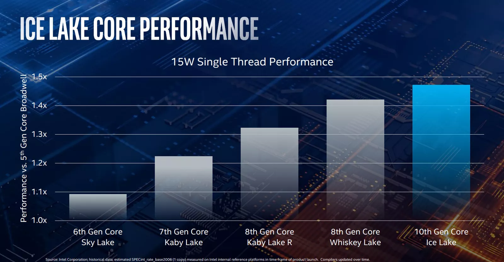
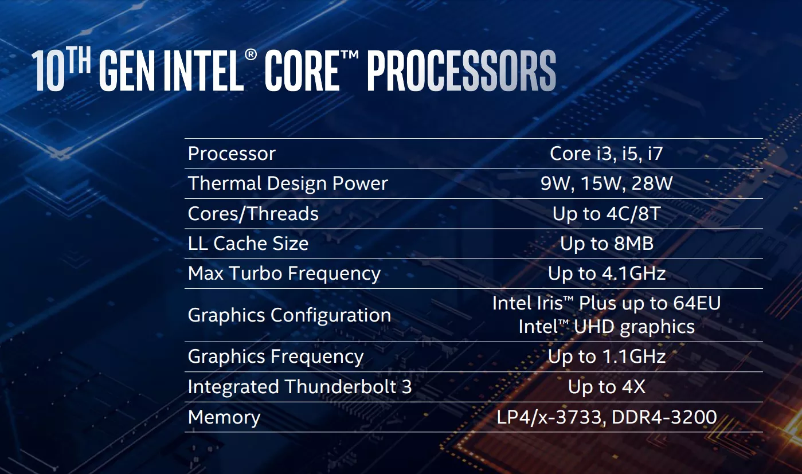

# Ice Lake

Ice Lake is Intel's codename for the **10th generation Intel Core processors** based on the new **Sunny Cove microarchitecture**. Ice Lake is expected to replace the Coffee Lake, Whiskey Lake, Kaby Lake and Cannon Lake microarchitectures in 2019 and 2020, representing the **architecture step** in Intel's Process-Architecture-Optimization model. Ice Lake will be produced on the second generation of Intel's 10 nm process, 10 nm+, becoming Intel's second microarchitecture to be manufactured on the 10 nm process.

# Reference

[Intel's 10th Gen, 10nm Ice Lake CPUs: everything you need to know](https://www.theverge.com/2019/5/28/18639317/intel-10nm-10th-gen-core-ice-lake-cpu-processor-laptop-launch-thunderbolt-3-sunny-cove)

[Intel Unveils 10th Gen Core Ice Lake-U & Ice Lake-Y Mobile CPUs: 10nm Sunny Cove Later This Year](https://www.anandtech.com/show/14436/intel-10th-gen-10nm-ice-lake-cpus)