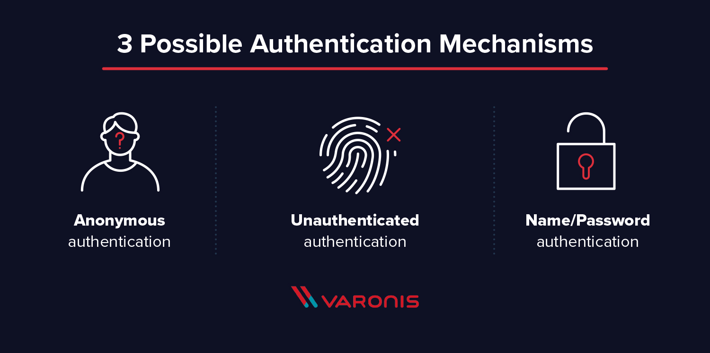

# LDAP

**LDAP (Lightweight Directory Access Protocol)** is an open and cross platform protocol used for directory services authentication.

LDAP provides the communication language that applications use to communicate with other **directory services** servers. Directory services store the users, passwords, and computer accounts, and share that information with other entities on the network.

# LDAP vs. Directory service

LDAP is a way of speaking to Active Directory.

LDAP is a protocol that many different directory services and access management solutions can understand.

The relationship between AD and LDAP is much like the relationship between Apache and HTTP:

- HTTP is a web protocol.
- Apache is a web server that uses the HTTP protocol.
- LDAP is a directory services protocol.
- [Active Directory](https://www.varonis.com/blog/active-directory-domain-naming-best-practices/) is a directory server that uses the LDAP protocol.

Occasionally you’ll hear someone say, “We don’t have Active Directory, but we have LDAP.” What they probably mean is that they have another product, such as OpenLDAP, which is an LDAP server.It’s kind of like someone saying “We have HTTP” when they really meant “We have an Apache web server.”

# Directory services

## Active directory

Active Directory is a database based system that provides authentication, directory, policy, and other services in a Windows environment.

Microsoft AD is by far the most common directory services system in use today. AD provides **Single-SignOn (SSO)** and works well in the office and over VPN.

Active Directory (AD) supports both **Kerberos** and LDAP, although most people don’t know that because AD mostly authenticates leveraging Kerberos. AD and Kerberos are not cross platform. AD does support LDAP, which means it can still be part of your overall access management scheme.

## OpenLDAP

OpenLDAP has largely worked outside of the Windows structure focusing on the Linux / Unix environment and with more technical applications. OpenLDAP doesn’t have the same concepts of domains or single sign-on. OpenLDAP is largely implemented with open source solutions and as a result has more flexibility than AD.

## Others

Active Directory and OpenLDAP are just two examples of a directory service that supports LDAP. There are other flavors, too: Red Hat Directory Service, Apache Directory Server, and more.

# LDAP Authentication

There are two options for LDAP authentication in **LDAP v3** – **simple** and **SASL (Simple Authentication and Security Layer)**.

## Simple authentication

Simple authentication allows for three possible authentication mechanisms:

- **Anonymous authentication:** Grants client anonymous status to LDAP.
- **Unauthenticated authentication:** For logging purposes only, should not grant access to a client.
- **Name/Password authentication:** Grants access to the server based on the credentials supplied – simple user/pass authentication is not secure and is not suitable for authentication without confidentiality protection.

## SASL

SASL authentication binds the LDAP server to another authentication mechanism, like **Kerberos**. The LDAP server uses the LDAP protocol to send an LDAP message to the other authorization service. That initiates a series of challenge response messages that result in either a successful authentication or a failure to authenticate.

# LDAP Query

An LDAP query is a command that asks a directory service for some information. For instance, if you’d like to see which groups a particular user is a part of, you’d submit a query that looks like this:

`(&(objectClass=user)(sAMAccountName=yourUserName)(memberof=CN=YourGroup,OU=Users,DC=YourDomain,DC=com))`

Luckily, in most cases, you won’t need to write LDAP queries. To maintain your sanity, you’ll perform all your directory services tasks through a point-and-click management interface.

It’s important to note that LDAP passes all of those messages in clear text by default, so anyone with a network sniffer can read the packets. You need to add TLS encryption or similar to keep your usernames and passwords safe.

# Reference

[The Difference Between LDAP and Active Directory | JumpCloud](https://jumpcloud.com/blog/active-directory/difference-between-ldap-and-active-directory/)

[What are the differences between LDAP and Active Directory?](https://stackoverflow.com/questions/663402/what-are-the-differences-between-ldap-and-active-directory)

[The Difference Between LDAP and Active Directory | JumpCloud](https://jumpcloud.com/blog/active-directory/difference-between-ldap-and-active-directory/)

[What is ldap authentication](https://www.youtube.com/watch?v=lp5z8HQGAH8)

[1.What is LDAP and how to use in Active Directory](https://www.youtube.com/watch?v=mG3yNCHeQiY)