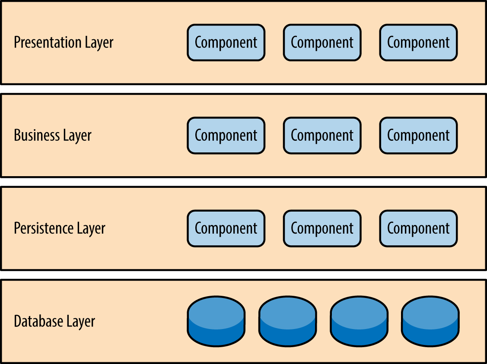
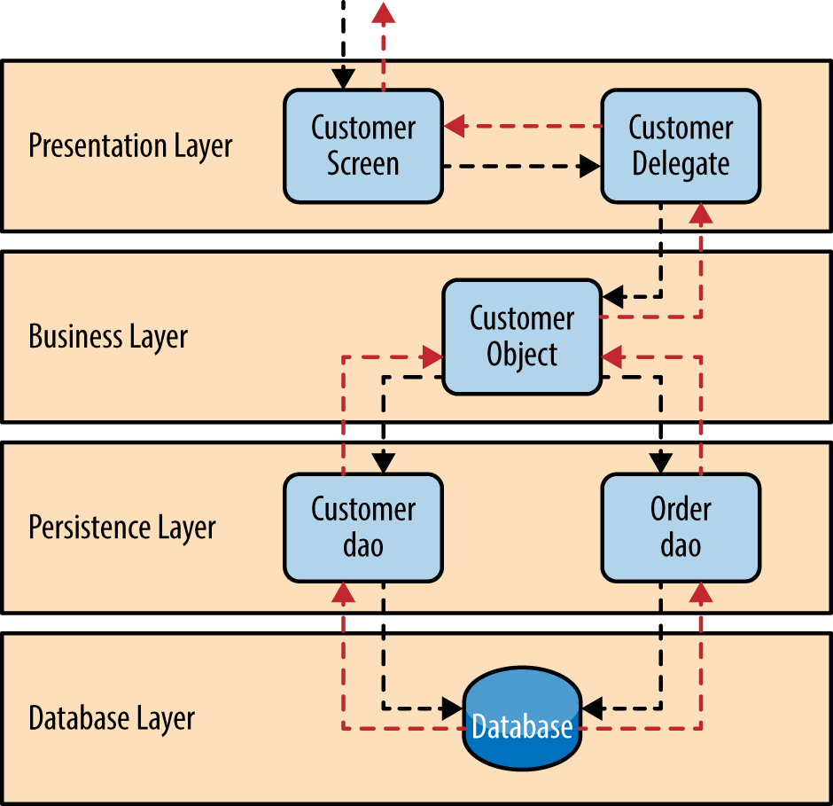
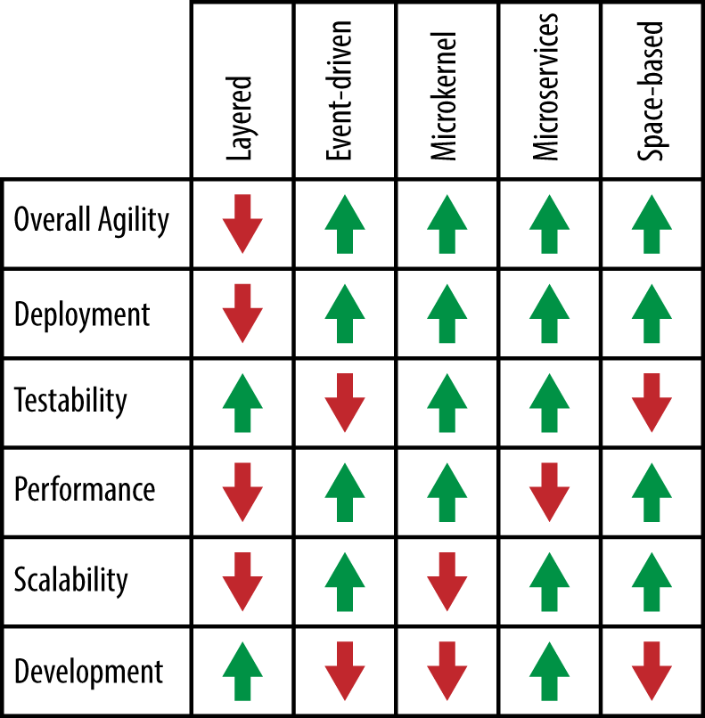

# Layered Architecture

The **layered architecture pattern**, otherwise known as the **n-tier architecture** or **multitier  architecture** pattern, is where components are organized into horizontal layers, each layer performing a specific role within the application (e.g., presentation logic or business logic).

# Pattern Description

## Number of layers

Although the layered architecture pattern does not specify the number and types of layers that must exist in the pattern, most layered architectures consist of four standard layers: presentation, business, persistence, and database . In some cases, the business layer and persistence layer are combined into a single business layer, particularly when the persistence logic (e.g., SQL or HSQL) is embedded within the business layer components. Thus, smaller applications may have only three layers, whereas larger and more complex business applications may contain five or more layers.

## Role of layers

Each layer of the layered architecture pattern has a specific role and responsibility within the application. For example, a presentation layer would be responsible for handling all user interface and browser communication logic, whereas a business layer would be responsible for executing specific business rules associated with the request. Each layer in the architecture forms an abstraction around the work that needs to be done to satisfy a particular business request. For example, the presentation layer doesn’t need to know or worry about how to get customer data; it only needs to display that information on a screen in particular format. Similarly, the business layer doesn’t need to be concerned about how to format customer data for display on a screen or even where the customer data is coming from; it only needs to get the data from the persistence layer, perform business logic against the data (e.g., calculate values or aggregate data), and pass that information up to the presentation layer.

## Separation of concerns

One of the powerful features of the layered architecture pattern is the **separation of concerns** among components. Components within a specific layer deal only with logic that pertains to that layer. For example, components in the presentation layer deal only with presentation logic, whereas components residing in the business layer deal only with business logic. This type of component classification makes it easy to build effective roles and responsibility models into your architecture, and also makes it easy to develop, test, govern, and maintain applications using this architecture pattern due to well-defined component interfaces and limited component scope.

## Popularity

The layered architecture pattern is the most common architecture pattern. This pattern is the de facto standard for most Java EE applications and therefore is widely known by most architects, designers, and developers. The layered architecture pattern closely matches the traditional IT communication and organizational structures found in most companies, making it a natural choice for most business application development efforts.

# Pattern Example

To illustrate how the layered architecture works, consider a request from a business user to retrieve customer information for a particular individual as illustrated in Figure 1-4. The black arrows show the request flowing down to the database to retrieve the customer data, and the red arrows show the response flowing back up to the screen to display the data. In this example, the customer information consists of both customer data and order data (orders placed by the customer).

The *customer screen* is responsible for accepting the request and displaying the customer information. It does not know where the data is, how it is retrieved, or how many database tables must be queries to get the data. Once the customer screen receives a request to get customer information for a particular individual, it then forwards that request onto the *customer delegate* module. This module is responsible for knowing which modules in the business layer can process that request and also how to get to that module and what data it needs (the contract). The *customer object* in the business layer is responsible for aggregating all of the information needed by the business request (in this case to get customer information). This module calls out to the customer **dao (data access object)** module in the persistence layer to get customer data, and also the *order dao* module to get order information. These modules in turn execute SQL statements to retrieve the corresponding data and pass it back up to the customer object in the business layer. Once the customer object receives the data, it aggregates the data and passes that information back up to the customer delegate, which then passes that data to the customer screen to be presented to the user.

# Considerations

## Architecture sinkhole anti-pattern

The first thing to watch out for is what is known as the architecture sinkhole anti-pattern. This anti-pattern describes the situation where requests flow through multiple layers of the architecture as simple pass-through processing with little or no logic performed within each layer. For example, assume the presentation layer responds to a request from the user to retrieve customer data. The presentation layer passes the request to the business layer, which simply passes the request to the persistence layer, which then makes a simple SQL call to the database layer to retrieve the customer data. The data is then passed all the way back up the stack with no additional processing or logic to aggregate, calculate, or transform the data.

Every layered architecture will have at least some scenarios that fall into the architecture sinkhole anti-pattern. The key, however, is to analyze the percentage of requests that fall into this category. The 80-20 rule is usually a good practice to follow to determine whether or not you are experiencing the architecture sinkhole anti-pattern. It is typical to have around 20 percent of the requests as simple pass-through processing and 80 percent of the requests having some business logic associated with the request. However, if you find that this ratio is reversed and a majority of your requests are simple pass-through processing, you might want to consider making some of the architecture layers open, keeping in mind that it will be more difficult to control change due to the lack of layer isolation.

## Monolithic applications

Another consideration with the layered architecture pattern is that it tends to lend itself toward monolithic applications, even if you split the presentation layer and business layers into separate deployable units. While this may not be a concern for some applications, it does pose some potential issues in terms of deployment, general robustness and reliability, performance, and scalability.

# Pattern Analysis

## **Overall agility:** Low

Overall agility is the ability to respond quickly to a constantly changing environment. While change can be isolated through the layers of isolation feature of this pattern, it is still cumbersome and time-consuming to make changes in this architecture pattern because of the **monolithic nature of most implementations** as well as the **tight coupling of components** usually found with this pattern.

## **Ease of deployment***:* Low

Depending on how you implement this pattern, deployment can become an issue, particularly for larger applications. One small change to a component can require a redeployment of the entire application (or a large portion of the application), resulting in deployments that need to be planned, scheduled, and executed during off-hours or on weekends. As such, this pattern does not easily lend itself toward a continuous delivery pipeline, further reducing the overall rating for deployment.

## **Testability:** High

Because components belong to specific layers in the architecture, other layers can be mocked or stubbed, making this pattern is relatively easy to test. A developer can mock a presentation component or screen to isolate testing within a business component, as well as mock the business layer to test certain screen functionality.

## **Performance***:* Low

While it is true some layered architectures can perform well, the pattern does not lend itself to high-performance applications due to the inefficiencies of having to go through multiple layers of the architecture to fulfill a business request.

## **Scalability***:* Low

Because of the trend toward tightly coupled and monolithic implementations of this pattern, applications build using this architecture pattern are generally difficult to scale. You can scale a layered architecture by splitting the layers into separate physical deployments or replicating the entire application into multiple nodes, but overall the granularity is too broad, making it expensive to scale.

## **Ease of development***:* High

Ease of development gets a relatively high score, mostly because this pattern is so well known and is not overly complex to implement. Because most companies develop applications by separating skill sets by layers (presentation, business, database), this pattern becomes a natural choice for most business-application development. The connection between a company’s communication and organization structure and the way it develops software is outlined is what is called *Conway’s law*. You can Google “Conway’s law" to get more information about this fascinating correlation.

# Pattern Analysis Summary

