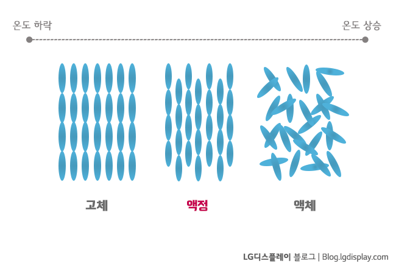
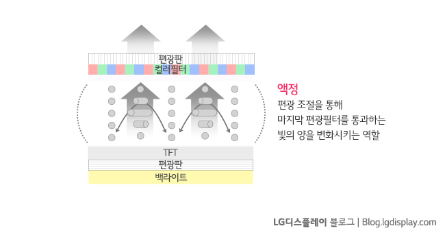
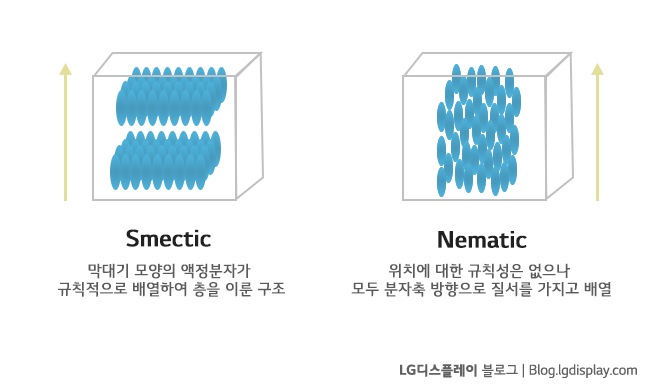
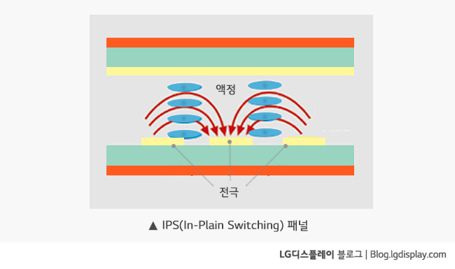

# Liquid crystal

액체(liquid)와 결정(crystal)의 중간 상태에 있는 물질이다. 이러한 물질은 분자의 배열이 어떤 방향으로는 불규칙적인 액체 상태와 같지만 다른 방향에서는 규칙적인 결정 상태를 띤다.

# Discovery

1888년, 오스트리아 식물학자 프리드리히 리차드 라이니처(Friedrich Richard Reinitzer)는 식물의 콜레스테롤 성분을 분석하다 이상한 물질을 발견했다. 이 물질은 상온에서는 투명한 액체지만 145도로 가열하면 불투명해지고, 179도에 이르면 다시 투명한 액체가 되었다.

라이니처는 액정을 좀 더 세밀히 알아보기 위해 독일에 있는 오토 레만(Otto Lehman)이라는 물리학자에게 이 물질을 보낸다. 레만은 이 물질에 액체처럼 보이나 고체 결정처럼 편광된 빛에 의해 영향을 받는다는 특징을 살려 ‘고체와 액체의 중간 상태’인 액정(Liquid crystal)이라는 이름을 붙였다.

1960년대가 되어서야 비로소 액정을 이용해 디스플레이를 만들 수 있다는 가능성이 제시되었고, 1970년대에 비로소 손목시계, 전자계산기 등에 적용되었다.

# Liquid crystal in LCD

액정은 백라이트(BLU)에서 발생하는 빛을 필요한 양만큼만 화면으로 갈 수 있도록 조절, 통과시키는 역할을 한다.

# Smectic / Nematic

액정은 배열 구조 특성에 따라 스멕틱(Smectic) 액정과 네마틱(Nematic) 액정으로 구분할 수 있다. 네마틱의 일종인 콜레스테릭 액정도 있다.

스멕틱 액정은 방향성과 질서를 갖고 있는 각 잡힌 액정들이다. 예를 들어 비누가 있다.

반대로 네마틱 액정은 방향성은 갖고 있지만, 스멕틱 액정보다는 자유로운 액정을 말한다. 전기장을 이용해 정렬될 수 있다. LCD를 만들 때는 보통 네마틱 액정을 이용한다.

# Types of LCDs

액정의 구동 방식이나 모양이 변함에 따라 LCD의 시야각도 조금씩 변화한다. 기본적인 TN(Twist Nematic)부터 VA(Vertical Alignment) 그리고 IPS(In-Plane Switching)까지 다양한 방식이 있다. 그 중에서도 LG디스플레이의 IPS는 아래 이미지처럼 액정을 수평으로 배열해 사용하고 있지요.

# Reference

[디스플레이 상식사전 - 액정 | LG디스플레이 블로그 디스퀘어](https://blog.lgdisplay.com/2016/01/liquid-crystal/)

[Liquid Crystals - Chalk Talk](https://www.youtube.com/watch?v=nAJgchCI3kg)

[What are Liquid Crystals?](https://www.youtube.com/watch?v=MuWDwVHVLio)