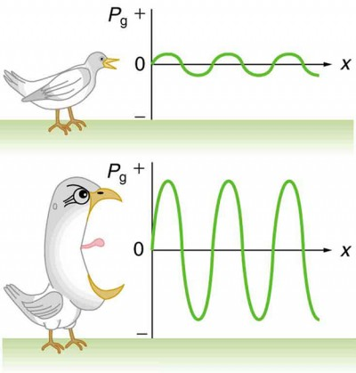
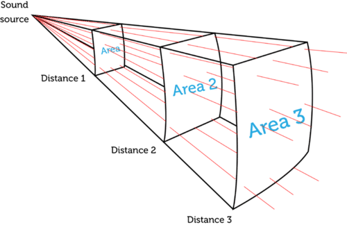

# Loudness

**Loudness** is the subjective perception of **sound intensity**. The intensity of a sound wave is related to its **amplitude**. **Sound intensity level (SIL)** or **acoustic intensity level** is the level (a logarithmic quantity) of the intensity of a sound relative to a reference value.

# Loudness

Loudness refers to how loud or soft a sound seems to a listener. The relation of physical attributes of sound to perceived loudness consists of physical, physiological and psychological components.

# Sound intensity

Intensity is defined to be the power per unit area carried by a wave. In equation form, intensity I is

$$I = \frac{P}{A}$$

P is the power through an area A. The SI unit for I is W/m^2.

# Amplitude

The intensity of a sound wave is related to its amplitude squared by the following relationship:

$$I = \frac{(\Delta p)^2}{2\rho v_w}$$

Here Δp is the pressure variation or pressure amplitude (half the difference between the maximum and minimum pressure in the sound wave). The energy of an oscillating element of air due to a traveling sound wave is proportional to its amplitude squared. In this equation, ρ is the density of the material in which the sound wave travels, in units of kg/m^3, and v_w is the speed of sound in the medium, in units of m/s.

Graphs of the gauge pressures in two sound waves of different intensities. The more intense sound is produced by a source that has larger-amplitude oscillations and has greater pressure maxima and minima. Because pressures are higher in the greater-intensity sound, it can exert larger forces on the objects it encounters.

## Distance

Intensity results from two factors: the amplitude of the sound waves and how far they have traveled from the source of the sound.

- Amplitude is a measure of the size of sound waves. It depends on the amount of [energy](https://www.ck12.org/c/physics/energy) that started the waves. Greater amplitude waves have more energy and greater intensity, so they sound louder.
- As sound waves travel farther from their source, the more spread out their [energy](https://www.ck12.org/c/physics/energy) becomes. As [distance](https://www.ck12.org/c/physics/distance) from the sound source increases, the area covered by the sound waves increases. The same amount of energy is spread over a greater area, so the intensity and loudness of the sound is less. This explains why even loud sounds fade away as you move farther from the source.

# Sound intensity level

Because of the relationship between loudness and sound intensity, we define sound intensity using a logarithmic scale. This is known as the sound intensity level. The sound intensity level (B) is given by the following equation.

$$B = 10\log{\frac{I}{I_0}}$$

I is the intensity of the sound wave that we're examining. I_0 is a reference intensity, usually the minimum intensity audible to human.

# References

[Physics](https://courses.lumenlearning.com/physics/chapter/17-3-sound-intensity-and-sound-level/)

[Intensity and Loudness of Sound](https://www.ck12.org/c/physics/intensity-and-loudness-of-sound/lesson/Intensity-and-Loudness-of-Sound-MS-PS/)

[Loudness](https://en.wikipedia.org/wiki/Loudness)

[Sound intensity](https://en.wikipedia.org/wiki/Sound_intensity)

[Sound pressure](https://en.wikipedia.org/wiki/Sound_pressure)