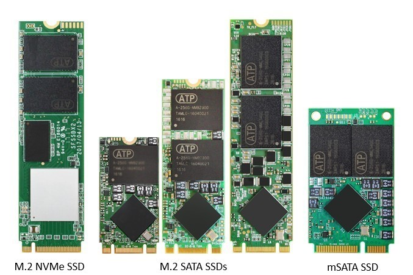
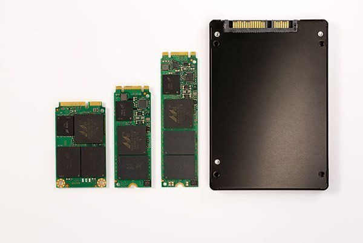
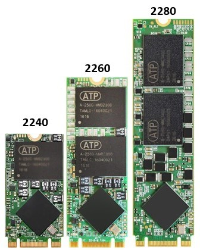
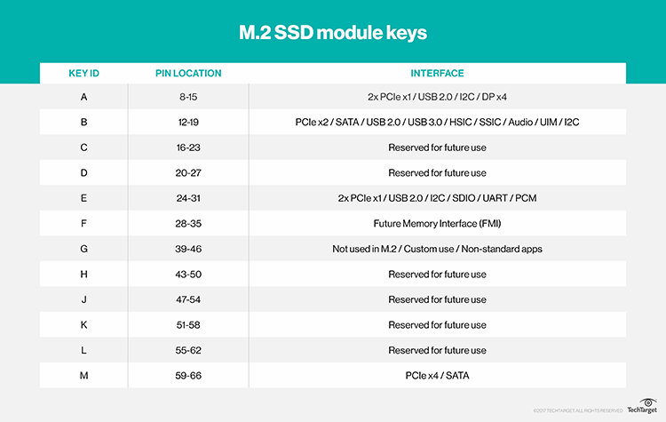
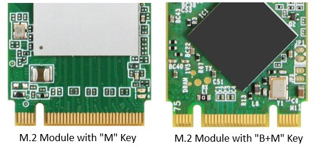
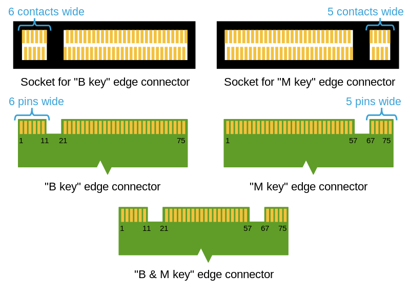
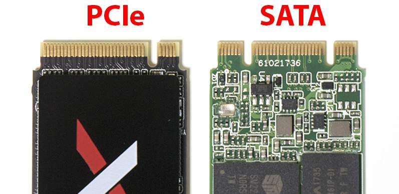

# M.2

An M.2 is a specification to describe the physical form factor of internally mounted computer expansion cards. M.2 SSDs are designed to enable high-performance storage in thin, power-constrained devices. M.2 was originally called the **Next Generation Form Factor (NGFF)**, and then formally renamed to M.2 in 2013.

# vs. mSATA

M.2 is commonly referred to as an mSATA replacement. The **Mini-SATA (mSATA)** interface, though designed specifically to provide the smallest form factor for SSDs, is limited by the SATA 6Gb/s link.

The M.2 standard was created to address the limitations of mSATA and provide more options for small form factor cards, including SSDs in different sizes and with different capacities. As mSATA's "successor," M.2 provides higher performance and capacity while minimizing module footprint.

M.2 SSDs are faster and store more data than most mSATA cards. M.2 SSDs support PCIe 3.0, SATA 3.0 and USB 3.0 interfaces, while mSATA only supports SATA. M.2 SATA SSDs have similar performance to mSATA cards, but M.2 PCIe cards are faster.

Micron M600 SSD form factors (left to right): mSATA SSD, M.2 SSD (22 mm x 60 mm double-sided), M.2 SSD (22 mm x 80 mm single-sided) and a 2.5-inch SATA SSD.

# **M.2 SSD form factor**

M.2 SSDs are rectangular. They are 22 millimeters (mm) wide and usually 60 mm or 80 mm long, although there are also 30 mm, 42 mm and 110 mm length cards. M.2 drives can be single or double-sided. The card size is identified by a four- or five-digit number. The first two digits are the width and the remaining numbers are the length. For example, a 2260 card is 22 mm wide and 60 mm long.

The 22 mm width is standard for desktop and laptops. An 80 mm or 110 mm length card can hold 8 NAND chips for 1 TB of capacity.

# Module Keys and Sockets

An M.2 SSD is "keyed" to prevent insertion of a card connector (male) to an incompatible socket (female) on the host. Keys or notches in the edge connectors of M.2 modules, distinguish the types of M.2 products. The M.2 specification identifies 12 key IDs on the module card and socket interface but M.2 SSDs typically use three common keys: B, M, and B+M.

M.2 SSD modules plug into circuit boards through mating connectors on either side. Unlike mSATA, M.2 SSD cards have two types of connectors, also known as sockets: B key sockets and M key sockets. A single card can also have B and M keys. The type of key determines the number of PCIe lanes the socket supports. An B key holds one or two PCIe lanes, while an M key holds up to four PCIe lanes. The B key edge connector is six pins wide and the M key edge connector is five pins wide.

# SATA vs. NVMe

You can get an M.2 drive that uses either SATA or NVMe. An M.2 SSD module is designed only for either a SATA or PCIe interface, not both at the same time.

M.2 SATA SSDs are B+M-keyed (can fit in sockets for B-keyed and M-keyed modules), while M.2 NVMe SSDs for PCIe 3.0 x4 lane are M-keyed.

## Speed

An M.2 drive is not faster just because of its form factor. It’s just usually the case that M.2 drives use the NVMe protocol because they already connect via PCI-E anyway.

NVMes really are only useful for those larger file transfers, too, so unless you regularly move large files for photo and video editing, or find a great deal on an NVMe drive, you may as well stick to a standard SATA 3 SSD because you can get a much bigger size for the same price.

Also, for gaming, both NVMe and SATA 3 will offer very similar boot speeds. They are both so fast that other hardware, such as RAM and CPU performance, ends up being the bottleneck.

# Reference

[What is M.2 SSD? - Definition from WhatIs.com](https://searchstorage.techtarget.com/definition/M2-SSD)

[What is M.2? Keys and Sockets Explained](https://www.atpinc.com/blog/what-is-m.2-M-B-BM-key-socket-3)

[SATA 3 vs M.2 vs NVMe - Overview and Comparison](https://www.online-tech-tips.com/computer-tips/sata-3-vs-m-2-vs-nvme-overview-and-comparison/)

[How to Install an M.2 SSD on a Desktop PC](https://slickdeals.net/article/news/how-to-install-an-m-2-ssd-on-a-desktop-pc/)

[M.2 - Wikipedia](https://en.wikipedia.org/wiki/M.2)

[M.2 As Fast As Possible](https://www.youtube.com/watch?v=opwON-7J_wI)