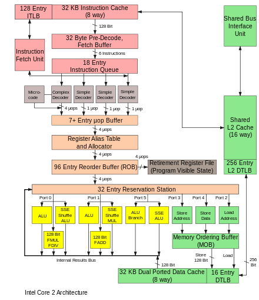

# Microarchitecture definition

In computer engineering, **microarchitecture**, also called **computer organization** and sometimes abbreviated as **µarch** or **uarch**, is the way a given **instruction set architecture (ISA)** is implemented in a particular processor. It is basically ‘what gets placed where on the chip’ and ‘how things get sorted, calculated, and sent back out’.

# Factors

There are several factors that play into a CPU’s microarchitecture. These include, but are not limited to:

- Size of the CPU
- Socket type
- Cache size

# Reference

[Microarchitecture - Wikipedia](https://en.wikipedia.org/wiki/Microarchitecture#Instruction_cycles)

