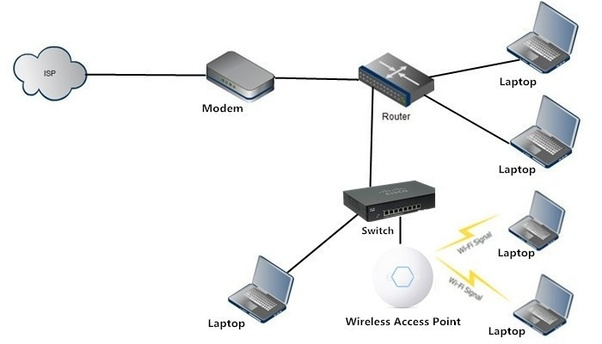

# Router, Switch, and more

# Modem

Modems receive information from your **ISP (Internet Service Provider)** through the phone lines, optical fiber, or coaxial cable in your home and convert it into a digital signal.

## Name

Historically, the term “modem” is shorthand for modulator-demodulator. Modems were used to modulate the signals on telephone lines so that digital information could be encoded and transmitted over them and then demodulated—and decoded—on the other end. Though more modern broadband connections—like cable and satellite—don’t really work the same way, we kept using the term “modem”.

[What is a Modem?](https://www.linksys.com/us/r/resource-center/what-is-a-modem/)

# Router

Routers connect networks.

# Switch

Switches create a network. When a data packet is sent to a switch, it is only directed to the intended destination port.

# Hub

Hubs re-broadcast a data packet from one port to every port.

Switches are far more preferred over hubs because they reduce any unnecessary traffic on the network.

# Access Point (AP)

Access points are devices that create a wireless local area network.

# Reference

[https://m.youtube.com/watch?v=O5jAQwAN8mo&t=1s](https://m.youtube.com/watch?v=O5jAQwAN8mo&t=1s)

[https://m.youtube.com/watch?v=1z0ULvg_pW8](https://m.youtube.com/watch?v=1z0ULvg_pW8)

[https://m.youtube.com/watch?v=Vc16CCAAz7Q&t=260s](https://m.youtube.com/watch?v=Vc16CCAAz7Q&t=260s)

[What Is a Network Switch vs a Router? Know the Differences](https://www.cisco.com/c/en/us/solutions/small-business/resource-center/networking/network-switch-what.html)

[What's the Difference Between a Modem and a Router?](https://www.howtogeek.com/234233/whats-the-difference-between-a-modem-and-a-router/)

[What is the difference between a router and an access point?](https://www.quora.com/What-is-the-difference-between-a-router-and-an-access-point)

[What is an Access Point and How is it Different from a Range Extender?](https://www.linksys.com/us/r/resource-center/what-is-a-wifi-access-point/)