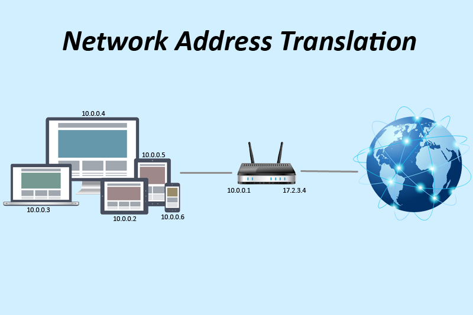

# NAT

***Network Address Translation* (NAT)** is the process where a network device, usually a firewall, assigns a public address to a computer (or group of computers) inside a private network. The main use of NAT is to limit the number of public IP addresses an organization or company must use, for both economy and security purposes.

NAT is an Internet standard that enables a local-area network (LAN) to use one set of IP addresses for internal traffic and a second set of addresses for external traffic.

The most common form of network translation involves a large private network using addresses in a private range (10.0.0.0 to 10.255.255.255, 172.16.0.0 to 172.31.255.255, or 192.168.0 0 to 192.168.255.255). The private addressing scheme works well for computers that only have to access resources inside the network, like workstations needing access to file servers and printers. Routers inside the private network can route traffic between private addresses with no trouble. However, to access resources outside the network, like the Internet, these computers have to have a public address in order for responses to their requests to return to them. This is where NAT comes into play.

Internet requests that require Network Address Translation (NAT) are quite complex but happen so rapidly that the end user rarely knows it has occurred. A workstation inside a network makes a request to a computer on the Internet. Routers within the network recognize that the request is not for a resource inside the network, so they send the request to the firewall. The firewall sees the request from the computer with the internal IP. It then makes the same request to the Internet using its own public address, and returns the response from the Internet resource to the computer inside the private network. From the perspective of the resource on the Internet, it is sending information to the address of the firewall. From the perspective of the workstation, it appears that communication is directly with the site on the Internet. When NAT is used in this way, all users inside the private network access the Internet have the same public IP address when they use the Internet. That means only one public addresses is needed for hundreds or even thousands of users.

Most modern firewalls are stateful - that is, they are able to set up the connection between the internal workstation and the Internet resource. They can keep track of the details of the connection, like ports, packet order, and the IP addresses involved. This is called keeping track of the state of the connection. In this way, they are able to keep track of the session composed of communication between the workstation and the firewall, and the firewall with the Internet. When the session ends, the firewall discards all of the information about the connection.

There are other uses for Network Address Translation (NAT) beyond simply allowing workstations with internal IP addresses to access the Internet. In large networks, some servers may act as Web servers and require access from the Internet. These servers are assigned public IP addresses on the firewall, allowing the public to access the servers only through that IP address. However, as an additional layer of security, the firewall acts as the intermediary between the outside world and the protected internal network. Additional rules can be added, including which ports can be accessed at that IP address. Using NAT in this way allows network engineers to more efficiently route internal network traffic to the same resources, and allow access to more ports, while restricting access at the firewall. It also allows detailed logging of communications between the network and the outside world.

Additionally, NAT can be used to allow selective access to the outside of the network, too. Workstations or other computers requiring special access outside the network can be assigned specific external IPs using NAT, allowing them to communicate with computers and applications that require a unique public IP address. Again, the firewall acts as the intermediary, and can control the session in both directions, restricting port access and protocols.

NAT is a very important aspect of firewall security. It conserves the number of public addresses used within an organization, and it allows for stricter control of access to resources on both sides of the firewall.

# Reference

[What is Network Address Translation (NAT)?](https://whatismyipaddress.com/nat)

[What is NAT - Network Address Translation? Webopedia Definition](https://www.webopedia.com/TERM/N/NAT.html)