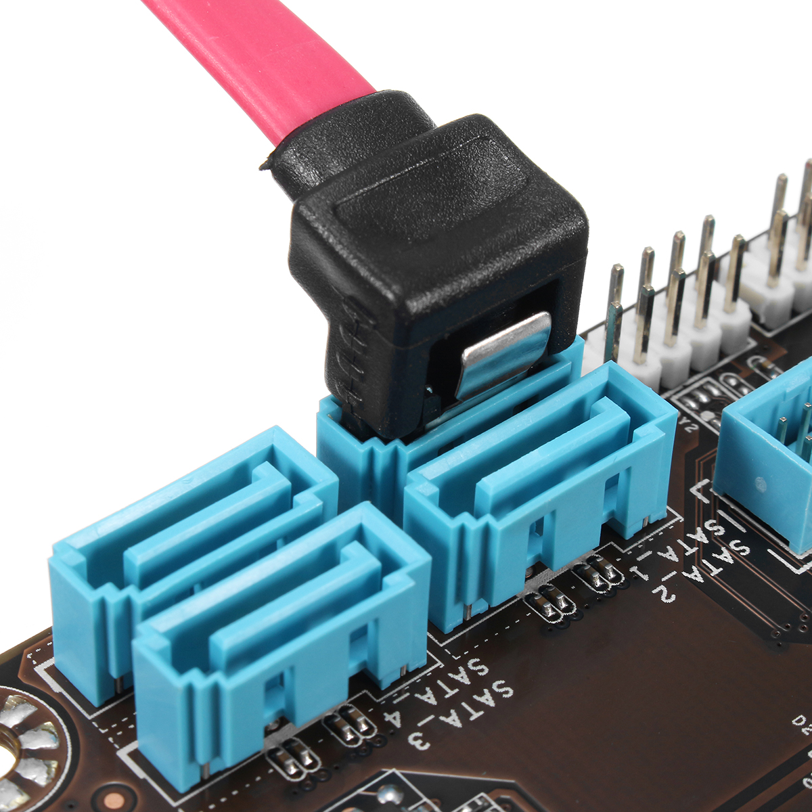
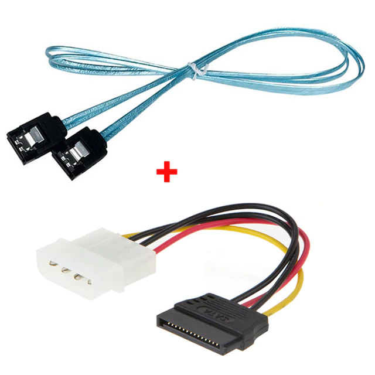
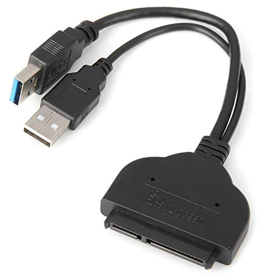
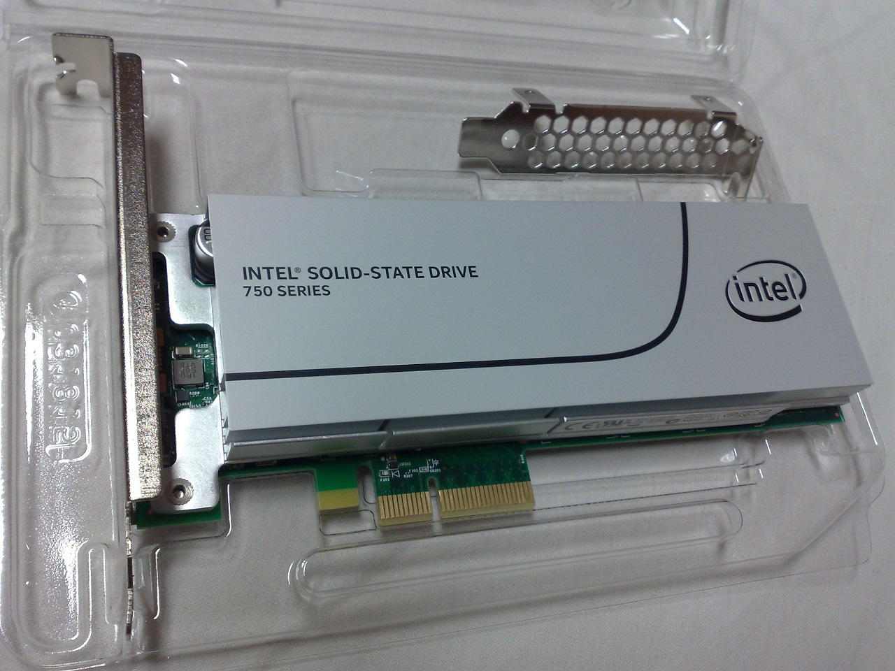

# NVMe vs. SATA

The technology used to read and write data off of an SSD is so fast that the limiting factor actually comes down to the method the drive shares data to the PC. There are two different methods a PC uses to read an SSD: SATA 3 and NVMe.

SATA 3 connections are made by connecting a data cable and a power cable directly into the motherboard and the solid state drive itself.

An NVMe connection, on the other hand, allows a solid state drive to have its data read straight from a **PCIe slot** right on the motherboard. The drive draws power directly through the motherboard. More importantly, the NVMe drive will also draw data through the motherboard at a faster rate than SATA 3. Why, you ask? Simply put, an NVMe can queue more data at once due to having access to more **PCIe lanes**.

# Description

## SATA

## NVMe

**NVM Express (NVMe)** or **Non-Volatile Memory Host Controller Interface Specification (NVMHCIS)** is an open logical device interface specification for accessing **non-volatile storage media** attached via a **PCI Express (PCIe) bus** (hence the ‘Express’ in the name). The acronym NVM stands for non-volatile memory, which is often NAND flash memory that comes in several physical form factors, including solid-state drives (SSDs), PCI Express (PCIe) add-in cards, M.2 cards, and other forms. NVMe is developed specially for SSDs by a consortium of vendors including Intel, Samsung, Sandisk, Dell, and Seagate.

NVMe is generally faster than SATA, but the performance boost is only really seen for **sequential read/write speeds**. Or, in simpler terms, for moving large files.

With the true read/write speed potential of NVMe only being reached with larger files, differences may not be that noticeable for gaming and everyday tasks. So, for boot up time and gaming, NVMe won’t offer much difference. 

For video editing and photo editing, NVMe drives can offer much better results.

# Speed

Here is a look at the typical read/write speeds of a hard drive, a SATA 3 SSD and an NVMe SSD for large files.

- 7200 RPM Hard Drive – average read/write speed of 80-160MB/second
- SATA 3 SSD – read/write speed up to 600MB/second
- NVME SSD – read/write speed up to 4GB/second

# Appearance

## SATA

SATA Cable connected to SATA port

SATA 3.0 Cable & SATA Power Cable

USB 3.0 SATA Adapter Cable

## NVMe

SSD that uses NVM Express, in form of a PCI Express 3.0 ×4 expansion card

# Reference

[SATA 3 vs M.2 vs NVMe - Overview and Comparison](https://www.online-tech-tips.com/computer-tips/sata-3-vs-m-2-vs-nvme-overview-and-comparison/)

[US$105.38 6 GPU 1150 H81BTC 6PCIE Mining Motherboard For ETH Bitcoin Miners Module Module Board For Arduino from Electronics on banggood.com](https://www.banggood.com/6-GPU-1150-H81BTC-6PCIE-Mining-Motherboard-For-ETH-Bitcoin-Miners-p-1175760.html?cur_warehouse=CN)

[US $1.99 |90cm SATA 3.0 Cable & sata power cable 6GB/s SATA III Cable Flat Data Cord for HDD SSD -in Computer Cables & Connectors from Computer & Office on Aliexpress.com | Alibaba Group](https://www.aliexpress.com/item/80cm-SATA-3-0-Cable-sata-power-cable-6GB-s-SATA-III-Cable-Flat-Data/32828657122.html)

[Dual USB 3.0 SATA Adapter Cable Up to 5Gbps with USB 2.0 Power Cable support Big Capacity SSD and Laptop Exteral 22 Pin 2.5" HHD and DVD Driver SATA 3 Converter](https://www.amazon.com/Adapter-support-Capacity-Exteral-Converter/dp/B01JUBGR9C)