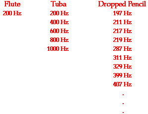

# Natural Frequency

The frequency or frequencies at which an object tends to vibrate with when hit, struck, plucked, strummed or somehow disturbed is known as the **natural frequency** of the object.

# Pure tone, rich tone, and noise

All objects have a natural frequency or set of frequencies at which they vibrate. Some objects tend to vibrate at a single frequency and they are often said to produce a pure tone. A flute tends to vibrate at a single frequency, producing a very pure tone. 

Other objects vibrate and produce more complex waves with a set of frequencies that have a whole number mathematical relationship between them; these are said to produce a rich sound. A tuba tends to vibrate at a set of frequencies that are mathematically related by whole number ratios; it produces a rich tone. 

Still other objects will vibrate at a set of multiple frequencies that have no simple mathematical relationship between them. These objects are not musical at all and the sounds that they create could be described as noise. When a meter stick or pencil is dropped on the floor, it vibrates with a number of frequencies, producing a complex sound wave that is clanky and noisy.

# Factors Affecting the Natural Frequency

The actual frequency at which an object will vibrate at is determined by a variety of factors. Each of these factors will either affect the wavelength or the speed of the object. Since

> frequency = speed/wavelength

an alteration in either speed or wavelength will result in an alteration of the natural frequency. 

## String instrument

The role of a musician is to control these variables in order to produce a given frequency from the instrument that is being played. Consider a guitar as an example. There are six strings, each having a different linear density (the wider strings are more dense on a per meter basis), a different tension (which is controllable by the guitarist), and a different length (also controllable by the guitarist). The speed at which waves move through the strings is dependent upon the properties of the medium - in this case the tightness (tension) of the string and the linear density of the strings. The vibrating portion of a particular string can be shortened by pressing the string against one of the frets on the neck of the guitar. This modification in the length of the string would affect the wavelength of the wave and in turn the natural frequency at which a particular string vibrates at.

## Wind instrument

As another example, consider the trombone with its long cylindrical tube that is bent upon itself twice and ends in a flared end. The trombone is an example of a wind instrument. The tube of any wind instrument acts as a container for a vibrating air column. The air inside the tube will be set into vibration by a vibrating reed or the vibrations of a musician's lips against a mouthpiece. While the speed of sound waves within the air column is not alterable by the musician (they can only be altered by changes in room temperature), the length of the air column is. For a trombone, the length is altered by pushing the tube outward away from the mouthpiece to lengthen it or pulling it in to shorten it. This causes the length of the air column to be changed, and subsequently changes the wavelength of the waves it produces. And of course, a change in wavelength will result in a change in the frequency. So the natural frequency of a wind instrument such as the trombone is dependent upon the length of the air column of the instrument.

[https://youtu.be/X5Uy7MhFiWA](https://youtu.be/X5Uy7MhFiWA)

# References

[The Physics of Sound and Music](https://www.physicsclassroom.com/Class/sound/u11l4a.cfm#length)