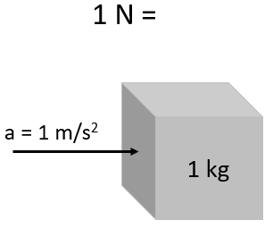
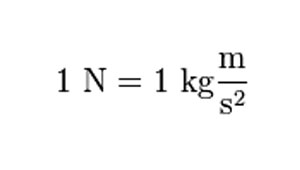

# Newton (unit)

The newton (symbol: N) is the unit of force. One newton is the force needed to accelerate one kilogram of mass at the rate of one meter per second squared in the direction of the applied force.

# Examples

At average gravity on Earth (conventionally, g = 9.80665 m/s2), a kilogram mass exerts a force of about 9.8 newtons. An average-sized apple exerts about one newton of force, which we measure as the apple's weight. The weight of an average adult exerts a force of about 608 N.

The thrust of an F100 fighter jet engine is around 130 kN.

# vs. Kilogram-force

The kilogram-force (kgf or kgF), or kilopond (kp, from Latin pondus meaning weight), is a gravitational metric unit of force. It is equal to the magnitude of the force exerted on one kilogram of mass in a 9.80665 m/s2 gravitational field. Therefore, one kilogram-force is by definition equal to 9.80665 N.

# References

[Newton (unit)](https://en.wikipedia.org/wiki/Newton_(unit))

[Newton (unit)](https://simple.wikipedia.org/wiki/Newton_(unit))

[Newton | unit of measurement](https://www.britannica.com/science/newton-unit-of-measurement)

[Kilogram-force](https://en.wikipedia.org/wiki/Kilogram-force)