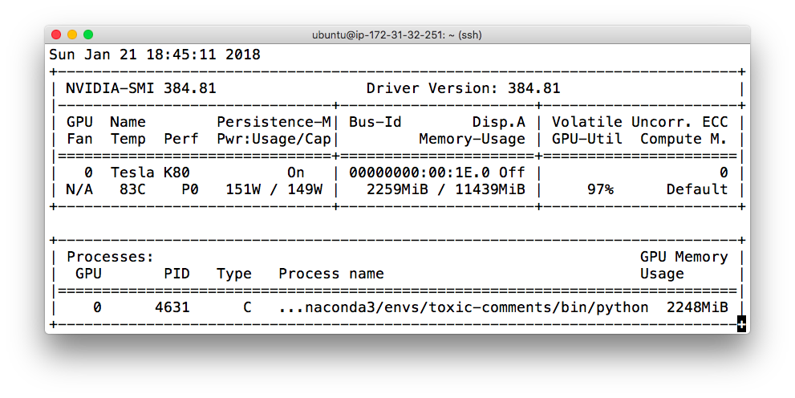

# Nvidia-smi

**NVIDIA’s System Management Interface (nvidia-smi)** is the de facto standard tool when it comes to monitoring the utilisation of NVIDIA GPUs. It is an application that queries the **NVML (NVIDIA Management Library)**.

# Perf

Perf is for "Performance State" and Perf with value "P0" means that the device is set up for maximum performance, rather than for lowest power consumption. States range from P0 (maxi- mum performance) to P12 (minimum performance).

# Persistence-M

Persistence-M stands for "Persistence Mode" where "On" means that the driver will remain loaded even when no apps are using the GPU.

This is particularly useful when you have a series of short jobs running. Persistence mode uses a few more watts per idle GPU, but prevents the fairly long delays that occur each time a GPU application is started. It is also necessary if you’ve assigned specific clock speeds or power limits to the GPUs (as those changes are lost when the NVIDIA driver is unloaded). Enable persistence mode on all GPUS by running:

`nvidia-smi -pm 1`

# Disp.A

Disp.A is for "Display Active" and "Off" means that there isn't a display using the device which again makes sense for a virtual machine.

# Bus-Id

Bus-Id is the GPU's PCI bus ID which can be used to filter nvidia-smi output and only show the stats for a particular device.

# Volatile Uncorr. ECC

Volatile Uncorr. ECC is a counter of uncorrectable ECC memory errors since the last driver load. 

# GPU-Util

GPU-Util indicates that over the last polling interval the GPU was utilised 96% of the time. A low value here can indicate that GPU is underused which can be the case if the code spends a lot of time in other places (reading mini-batches from disk for example).

# Compute M.

The compute mode flag indicates whether individual or multiple compute applications may run on the GPU. "Default" means multiple contexts are allowed per device.

# References

[Like top, but for GPUs](https://www.andrey-melentyev.com/monitoring-gpus.html)

[nvidia-smi: Control Your GPUs | Microway](https://www.microway.com/hpc-tech-tips/nvidia-smi_control-your-gpus/)

[What does "persistence mode" actually do which reduces CUDA startup time?](https://stackoverflow.com/questions/45360006/what-does-persistence-mode-actually-do-which-reduces-cuda-startup-time)

