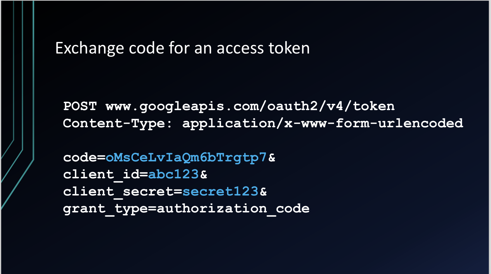
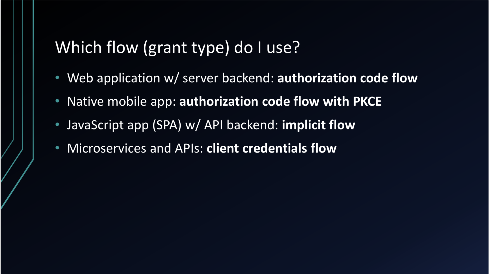

# OAuth 2.0

OAuth 2.0 is the industry-standard protocol for delegated authorization.

# Flow

- **Resource owner** on a **client** is redirected over to **authorization server**.
- Client passes along **redirect url**, **authorization grant type**, and **scope** to the authorization server.
- Authorization server redirects to the redirect URI with an **authorization code**.
- Client goes back to the authorization server and asks for the **access token**.
- Client requests user data from resource server and attach access token to the request.

## On http level

### Why authorization server gives Authorization Grant (code), not just Access Token?

Getting authorization grant happens on front channel (usually browser) and getting access token happens on back channel (usually application server) with client secret 

# Terminology

- Resource owner
- Client
- Autorization server
- Resource server
- Authorization grant
- Redirect URI
- Access token
- Scope
- Consent
- Back Channel (highly secure channel)
- Front channel (less secure channel)

# OpenID Connect

OAuth is not for authentication and there is no standard way of getting the user's information in OAuth. OpenID Connect is an extension on top of OAuth to make it work for the authentication use case as well.

It adds

- `openid` scope
- `ID token`
- Standard way to get more user info

# Grant type use cases

- Authorization code flow : standard way
- Authorization code flow with PKCE : provided by libraries for mobile apps
- Implicit flow : no authorization grant code, and communicates only with access token.
- Client credentials: machine communications

# Reference

[OAuth 2.0: An Overview](https://youtu.be/CPbvxxslDTU)

[https://www.youtube.com/watch?v=996OiexHze0](https://www.youtube.com/watch?v=996OiexHze0)

[OAuth_and_OpenID_Connect_in_plain_English_v1.6__KCDC_.pdf](images/OAuth_and_OpenID_Connect_in_plain_English_v1-44fdde36-2008-44c7-87cb-b7e6707782f4.6__KCDC_.pdf)