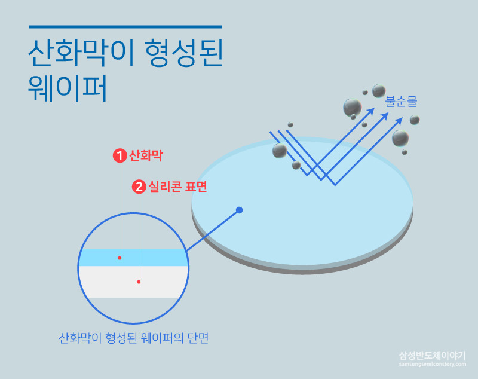
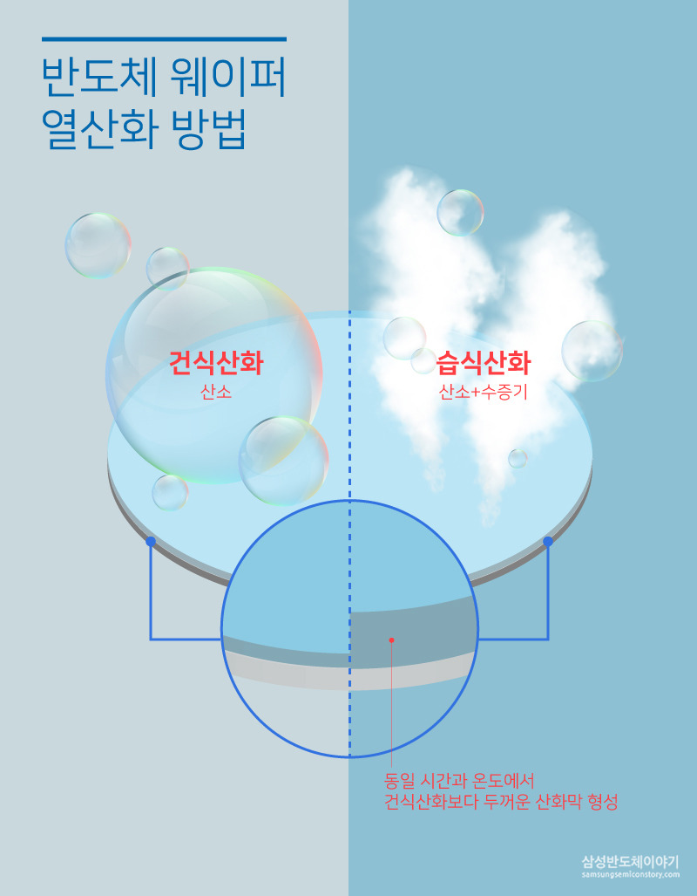

# Oxidation

산화 공정(Oxidation)이란 규소, 즉 실리콘(Si)에 열과 산화제(물, 산소)를 공급하여 이산화규소(SiO2)를 제조하는 공정이다.

# Why

- 웨이퍼에 절연막 역할을 하는 산화막(SiO₂)을 형성해 회로와 회로사이에 누설전류가 흐르는 것을 차단하기 위해
- 산화막은 이온주입공정에서 확산 방지막 역할을 하고, 식각공정에서는 필요한 부분이 잘못 식각되는 것을 막는 식각 방지막 역할도 함

# Types

- 열산화(Thermal Oxidation)
- 플라즈마 보강 화학적 기상 증착(PECVD)
- 전기 화학적 양극 처리

## 열산화(Thermal Oxidation)

- 800~1,200℃의 고온에서 얇고 균일한 실리콘 산화막을 형성
- 가장 보편적인 방법

### 건식산화(Dry Oxidation)

- 순수한 산소(O₂)만을 이용
- 산화막 성장속도가 느림
- 주로 얇은 막을 형성할 때 쓰임

### 습식산화(Wet Oxidation)

- 산소(O₂)와 함께 용해도가 큰 수증기(H₂O)를 함께 사용
- 산화막 성장속도가 빠르고 보다 두꺼운 막을 형성
- 건식 산화에 비해 산화층의 밀도가 낮음
- 보통 동일한 온도와 시간에서 습식산화를 통해 얻어진 산화막은 건식산화를 사용한 것보다 약 5~10배 정도 더 두꺼움

# References

[[반도체 8대 공정] 2탄, 웨이퍼 표면을 보호하는 산화공정](https://www.samsungsemiconstory.com/1515?category=779002)

[[반도체 공정] 2. 산화 공정 (Oxidation)](https://allgo77.tistory.com/59)