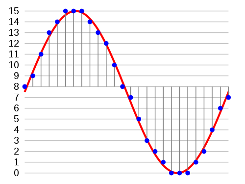
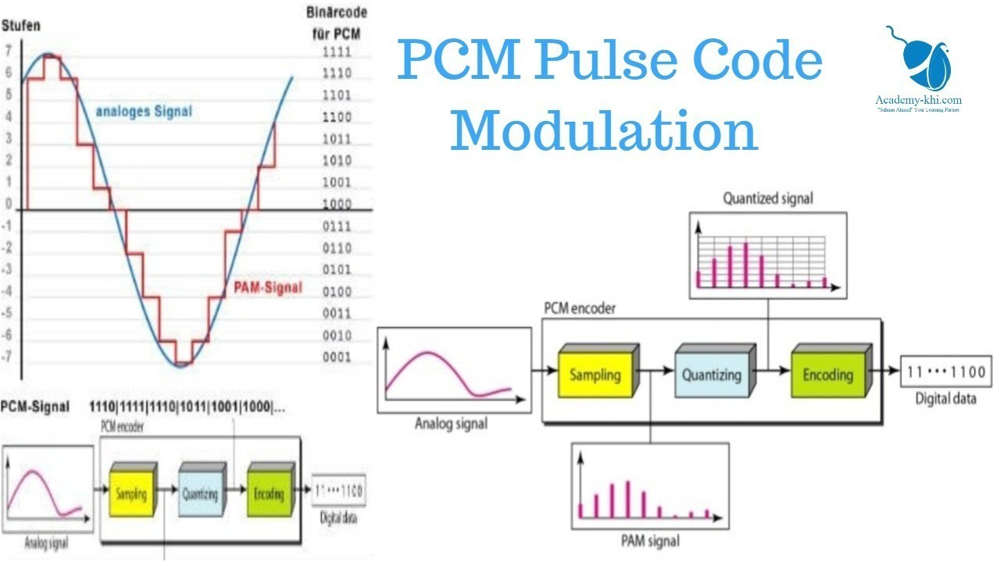

# PCM

**Pulse-code modulation (PCM)** is a method used to digitally represent sampled analog signals. In a PCM stream, the amplitude of the analog signal is sampled regularly at uniform intervals, and each sample is quantized to the nearest value within a range of digital steps.

# Two properties

A PCM stream has two basic properties that determine the stream's fidelity to the original analog signal: the **sampling rate**, which is the number of times per second that samples are taken; and the **bit depth**, which determines the number of possible digital values that can be used to represent each sample.

# Usage

Recording software initially uses the PCM format before converting audio into another format like MP3 or AAC. Additionally, compressed audio files like MP3s are decompressed back into PCM when being played back on speakers. PCM also supports mono, stereo and multi-channel recordings for sending different feeds to different speakers. The WAV, AIFF and AU recording file types contain the unprocessed PCM data.

# Process

PAM: Pulse Amplitude Modulation, 펄스진폭변조

# Alternative Technologies

Modern telephones can use Pulse Density Modulation instead of PCM to move audio from the microphone to the signal processor. PCM is easier to manipulate, but PDM benefits from picking up less noise and interference from other signals at a low cost. In the audio/video world, PCM competes against encoded formats including Dolby Digital, TrueHD, DTS and DTS-HD. It's common for audio/video technology to support more than one playback format. Sony's Super Audio CD technology uses a different recording technique called "Direct Stream Digital" which only records if the audio wave is moving up or down at sample points, rather than PCM's range of values.

# References

[Pulse-code modulation](https://en.wikipedia.org/wiki/Pulse-code_modulation)

[What Is PCM Audio? | Techwalla.com](https://www.techwalla.com/articles/what-is-pcm-audio)

[PCM [정보통신기술용어해설]](http://www.ktword.co.kr/abbr_view.php?m_temp1=582)

[What is Pulse Code Modulation (PCM)](https://www.youtube.com/watch?v=YJmUkNTBa8s)