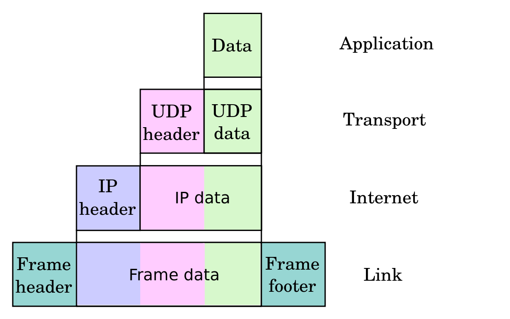
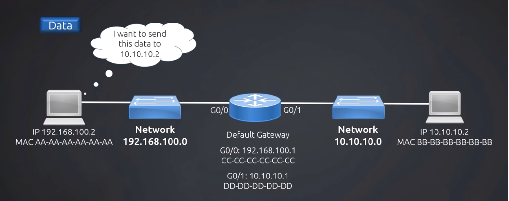
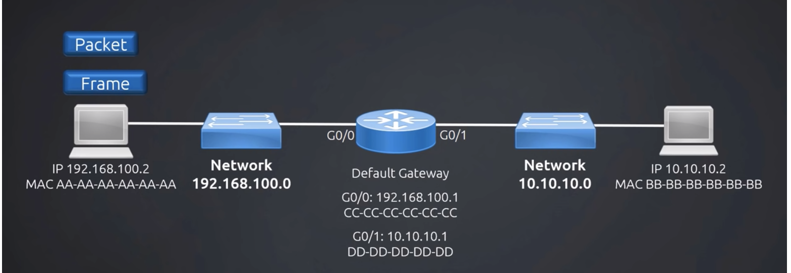

# Packets and Frames

Segments, Packets and Frames are the names given to Protocol data units (PDUs) at different network layers

- **Segments** are units of data in the *Transport Layer* (TCP/UDP in case of the Internet)
- **Packets** are units of data in the *Network Layer* (IP in case of the Internet)
- **Frames** are units of data in the *Link Layer* (e.g. Wifi, Bluetooth, Ethernet, etc).

# Packets to Frames example

- We have one network on the left, `192.168.100.0`.  We have another network on the right, `10.10.10.0`
- Routers also have IP addresses and MAC addresses assigned to each individual interface of the router.
- Host `192.168.100.2` wants to send data to host `10.10.10.2`

- First, it creates an IP packet. This IP packet includes the destination IP address, as well as its own IP address as the source.
- Next, It creates a frame. The frame has the destination MAC address. It doesn't know the MAC address of the destination host, but it knows the one of the gateway.
- Source host sends the data out onto the LAN to switch, then the switch opens up the frame header and decides to send it to the router.
- The router takes the frame, finds that the frame is for itself, then opens it up further. It reads the destination IP packet, then creates a new frame with destination MAC address of the destination host.
- The destination host receives the frame, opens it up, looks at the MAC header, and finds it matches its own MAC address. Then it opens the frame completely, gets into the IP packet, looks at the destination IP address, finds out it's for itself, then it takes the data out of the packet.

[https://www.youtube.com/watch?v=zhlMLRNY5-4](https://www.youtube.com/watch?v=zhlMLRNY5-4)

# Reference

[Difference between PACKETS and FRAMES](https://stackoverflow.com/questions/31446777/difference-between-packets-and-frames)