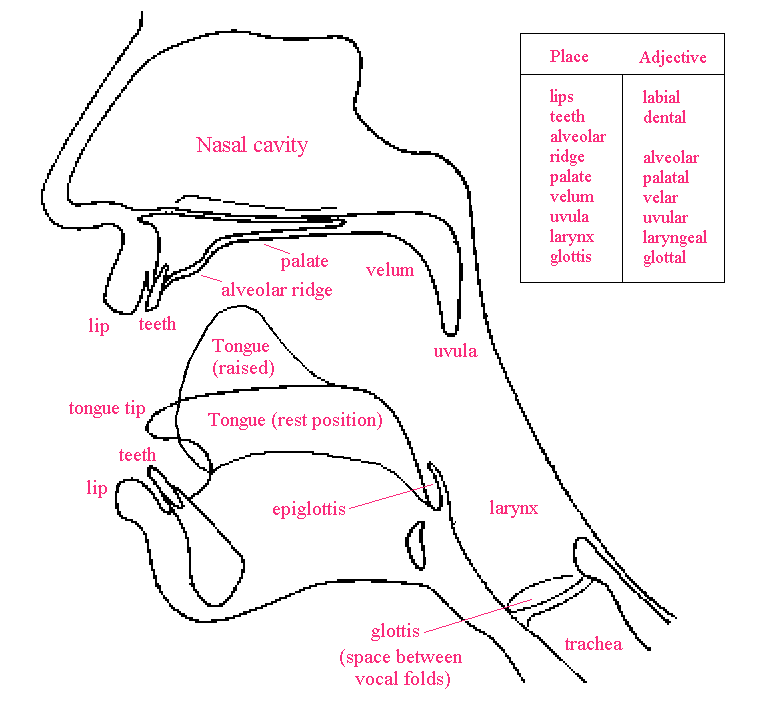
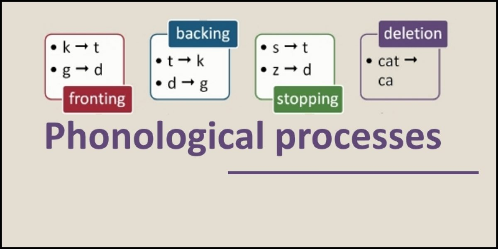

# Phonetics vs. Phonology

**Phonetics (음성학)** is the **physical** representation of a sound and **phonology (음운론)** is the **mental** representation of a sound.  Phonology is about how the brain categorizes those sounds.

> Phonetics gathers the raw material. Phonemics cooks it. - Pike, Kenneth. 1944.

# Phonetics (음성학)

Phonetics is a branch of linguistics that studies the sounds of human speech, or—in the case of sign languages—the equivalent aspects of sign. It is concerned with the physical properties of speech sounds or signs (phones): their physiological production, acoustic properties, auditory perception, and neurophysiological status, often without prior knowledge of the language being spoken.

## Branches

Phonetics as a research discipline has three main branches:

- **Articulatory phonetics (조음음성학)**: the articulation of speech.
- **Acoustic phonetics (음향음성학)**: the acoustics of speech. 모음과 자음의 진동, 강도, 지속의 차이점에 대한 연구.
- **Auditory phonetics (청음음성학)**: the perception of speech. 음성이 귀에 들어가는 과정에 대한 연구.

# Phonology (음운론)

Phonology is a branch of linguistics concerned with the systematic organization of sounds in spoken languages and signs in sign languages. It used to be only the study of the systems of phonemes in spoken languages (and therefore used to be also called **phonemics**, or **phonematics**), but it may also cover any linguistic analysis either at a level beneath the word (including syllable, onset and rime, articulatory gestures, articulatory features, mora, etc.) or at all levels of language where sound or signs are structured to convey linguistic meaning.

phonology describes the way sounds function within a given language or across languages to encode meaning. Phonology is about patterns of sounds, especially different patterns of sounds in different languages, or within each language, different patterns of sounds in different positions in words etc.

# Example

- Phonetics: [t] is a voiceless alveolar stop.
- Phonology: How do we differentiate between 'tuck', 'stuck', 'cut', and 'duck'

# References

[Phonetics vs Phonology](https://www.youtube.com/watch?v=Qj6f_wxz4YI)

[Phonetics vs. Phonology](http://www.phon.ox.ac.uk/jcoleman/PHONOLOGY1.htm)

[Uha : 네이버 블로그](https://blog.naver.com/uhwaworld/80148798456)

[Phonetics](https://en.wikipedia.org/wiki/Phonetics)

[Phonology](https://en.wikipedia.org/wiki/Phonology)

[Phonology](https://www.slideshare.net/febtimahani/phonology-61325609)

[Phonological Processes](https://www.sltinfo.com/phonological-processes/)

[PHY101 - Phonetics vs. Phonology](https://www.youtube.com/watch?v=De4iMKxSpgY)